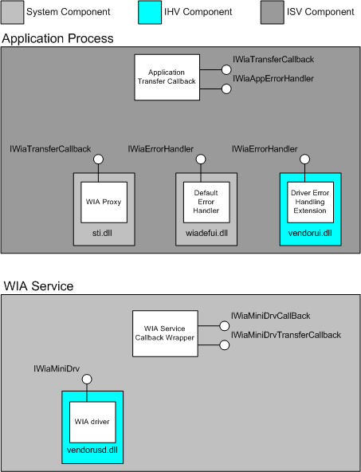
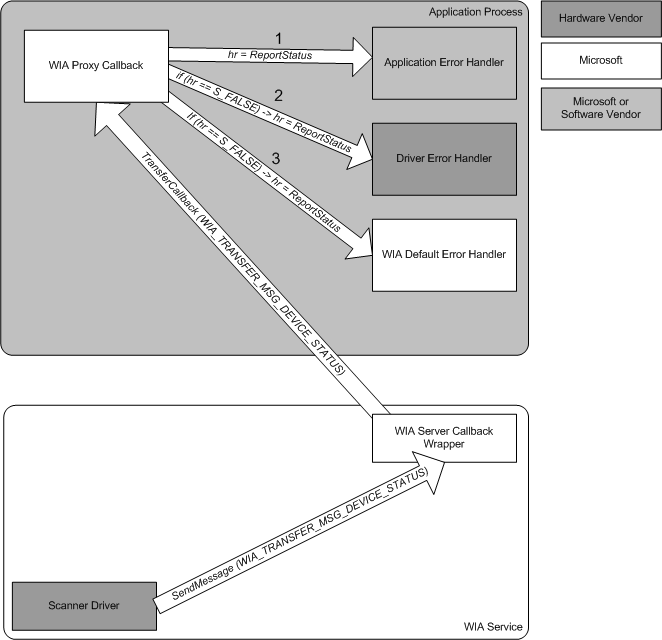

# WIA Error Handling Architecture

The WIA error handling architecture is composed of three parts. The operating system, the driver and the application. The error handling mechanism relies on stream-based data transfers. This transfer model is available in Windows Vista and later operating systems. WIA drivers must be written to make use of this transfer model if they are to support this new error handling methodology. Similarly, applications must also be written to support the stream based transfer model to be able to take their part in this new error handling architecture.

WIA error handling is comprised of system-supplied, IHV-supplied, and ISV-supplied components. The following diagram illustrates the supplier of each component.

There are three possible error handlers: the application error handler, the driver error handler, and the default error handler. These three error handlers are shown in the following diagram.

The image also shows the hierarchy in which these three error handlers are tried by the WIA Proxy callback.

In most aspects, these handlers are identical. There are however a couple of differences. The application error handler implements the **IWiaAppErrorHandler** interface whereas the driver error handing extension and the default error handler implement the **IWiaErrorHandler** interface. The application error handler will also use **IWiaTransferCallback**, which must be implemented in the callback object.

The device status code is passed into an error handler with the *hrStatus* parameter of **IWiaErrorHandler::ReportStatus**. This is the same value that the minidriver set in the *hrErrorStatus* parameter of the **IWiaTransferCallback::WiaTransferParams** method.

If the *hrStatus* parameter is set to SEVERITY\_SUCCESS, it represents a non-fatal delay. This means that the error handling UI should merely provide a modeless, informational dialog box, and a chance to cancel the transfer. The UI should be dismissed the next time the error handler receives a message with a different *hrStatus* value (whether the error handler supports this message).

**Note**   Only one modeless error handler dialog box can be shown at the same time.

 

An error handler should display modal UI in response to a device status message of SEVERITY\_ERROR.

There are four components involved in the WIA error handling:

**The WIA minidriver**  
The minidriver can now use the, new for Windows Vista, WIA\_TRANSFER\_MSG\_DEVICE\_STATUS device status message to indicate that something has happened at the device level. When the driver sends this message, it must also set the *hrErrorStatus* (and possibly also the *lPercentComplete*) parameter of the **IWiaTransferCallback::WiaTransferParams** method. The status code can be either an error or informational. In case of an error status code, user intervention is required to recover from the error, providing the error is recoverable. A driver can set *hrErrorStatus* to a predefined WIA HRESULT value, such as WIA\_STATUS\_WARMING\_UP, or create its own custom HRESULT.

**The application error handler**  
In order for an application to enable error handling, it must implement the **IWiaAppErrorHandler** interface. This interface is implemented by the application's callback object that it passed into the **IWiaTransfer::Download** and **IWiaTransfer::Upload** methods. This callback object is required to implement the **IWiaTransferCallback** interface. By implementing **IWiaAppErrorHandler**, an application indicates that it allows error handlers to be invoked during data transfers.

**The driver's error handler**  
The driver's error handler is a driver extension that must implement the [IWiaErrorHandler Interface](https://msdn.microsoft.com/library/windows/hardware/ff543907). The error handler can handle and display UI for any status code; these status codes include WIA-defined status codes as well as status codes specific to the driver.

**The default error handler**  
The default error handler is implemented by WIA. It handles and displays UI for a number of generic device status messages. These messages can be both informational and error, for example: WIA\_ERROR\_PAPER\_JAM and WIA\_STATUS\_WARMING\_UP.

The WIA proxy does not handle the error messages itself. Instead, the WIA proxy gives the error handlers a chance to handle a device status message.

The error handler provides the UI that allows the user to try to put the system in a state where the data transfer can be continued or canceled.

When receiving a WIA\_TRANSFER\_MSG\_DEVICE\_STATUS message, the WIA proxy first calls the application error handler's **IWiaAppErrorHandler::ReportStatus** method. If the application callback routine does not handle the device status code, the WIA proxy will invoke the driver error handler's [**IWiaErrorHandler::ReportStatus**](https://msdn.microsoft.com/library/windows/hardware/ff543909) implementation, and finally the WIA proxy will invoke the default error handler's **IWiaErrorHandler::ReportStatus** implementation. If a given handler does not exist (for example, the driver might not come with an error handling extension), or if the driver's device status handler returns WIA\_STATUS\_NOT\_HANDLED, indicating that the driver's handler does not support the device code, the next handler in the chain will be given a chance. Once a device status message is handled, either successfully or unsuccessfully, the WIA proxy callback will return. So, if the driver error handler's **ReportStatus** method returns S\_OK for every message, the default error handler will never get a chance to handle any of the device status messages.

If no error handler supports a device status message with SEVERITY\_ERROR (error message), the WIA proxy will return the status error back to the driver, which in turn should stop the transfer. The driver should return this HRESULT value from [**IWiaMiniDrv::drvAcquireItemData**](https://msdn.microsoft.com/library/windows/hardware/ff543956) and the application will receive this HRESULT from **IWiaTransfer::Download** or **IWiaTransfer::Upload**.

If no error handler handles a device status message with SEVERITY\_SUCCESS (informational message), the WIA proxy will return S\_OK to the driver.

**Note**  The application's callback routine, **IWiaTransferCallback::TransferCallback**, will never receive a message with *lMessage* set to WIA\_TRANSFER\_MSG\_DEVICE\_STATUS. Instead, these messages will be sent to the error handlers.

 

The **IWiaTransferCallback**,**IWiaAppErrorHandler**, and **IWiaTransfer** interfaces are described in the Microsoft Windows SDK documentation.

 

 

