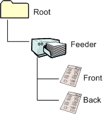

# WIA Feeder Scanner Compatibility for Windows XP and Windows Me

## 

This topic describes several compatibility issues that are related to feeder scanners in Windows Vista, Windows XP, and Windows Me.

### Changes from Windows XP to Windows Vista

There have been a number of changes to how scans are handled between Windows XP and Windows Vista. For example, in Windows Vista, each functional unit belongs to a separate category. These categories are represented in the [**WIA\_IPA\_ITEM\_CATEGORY**](https://msdn.microsoft.com/library/windows/hardware/ff551581) property as WIA\_CATEGORY\_FEEDER for the feeder and WIA\_CATEGORY\_FLATBED for the flatbed. If both of these items are present on a scanner in Windows Vista, both must be represented in the item tree. In Windows XP, there was a single scan item in the item tree that represented all of the scanners functional units.

The following figure displays the scanner item tree in Windows XP.

All of the transfers would occur off this item and would use all scan settings (for both feeder and flatbed).

In contrast, the following figure displays the scanner item tree for a scanner with both a flatbed and a feeder in Windows Vista.

This item tree represents both the function units as separate items in the item tree, a flatbed and a feeder. For more information about this type of scanner, see [Non-Duplex-Capable Document Feeder](non-duplex-capable-document-feeder.md).

If your scanner is capable of duplexing (that is, scanning both sides of a document), the Windows Vista item tree would look like the following figure.

The preceding figure shows an item tree that also represents a scanner with both a flatbed and a feeder.

The item tree for a scanner without a flatbed in Windows Vista would look like the following figure.

In the scanner item tree with duplexing and the feeder scanner item tree, data transfers always occur off of the feeder item. Scan settings are contained in both the feeder and child (both front and back) items.

A scan where the front and back items are set to the same settings is called a *basic duplex* scan. If the front and back items are set independent of each other, the scan is called an *advanced duplex* scan. For more information about these types of scans, see [Simple Duplex-Capable Document Feeder](simple-duplex-capable-document-feeder.md) and [Advanced Duplex-Capable Document Feeder](advanced-duplex-capable-document-feeder.md).

### Compatibility support in Windows Vista

The compatibility in Windows Vista for Windows XP drivers and applications is handled by the compatibility layer in the WIA service that is within Windows Vista. This layer allows older applications and drivers to be used in Windows Vista in the same way as they were used in Windows XP. However, there will be some loss of functionality in these older applications and drivers compared to Windows Vista applications and drivers.

### Compatibility support in Windows XP

There is very limited support for using Windows Vista drivers on a Windows XP computer. If your feeder scanner also supports flatbed scanning, the WIA flatbed scanner item must be the first WIA child item in the scanner item tree after the root item. This item tree is illustrated by the diagram in the [Non-Duplex-Capable Document Feeder](non-duplex-capable-document-feeder.md) topic. This configuration will allow some compatibility between Windows Vista drivers and Windows XP because Windows XP expects to find all of the scan settings on the first item in the tree.

For more information on the compatibility layer and Windows XP and Windows Me compatibility, see [WIA Flatbed Scanner Compatibility for Windows Me and Windows XP](wia-flatbed-scanner-compatibility-for-windows-xp-and-windows-me.md).

 

 

[Send comments about this topic to Microsoft](mailto:wsddocfb@microsoft.com?subject=Documentation%20feedback%20%5Bimage\image%5D:%20WIA%20Feeder%20Scanner%20Compatibility%20for%20Windows%20XP%20and%20Windows%20Me%20%20RELEASE:%20%288/17/2016%29&body=%0A%0APRIVACY%20STATEMENT%0A%0AWe%20use%20your%20feedback%20to%20improve%20the%20documentation.%20We%20don't%20use%20your%20email%20address%20for%20any%20other%20purpose,%20and%20we'll%20remove%20your%20email%20address%20from%20our%20system%20after%20the%20issue%20that%20you're%20reporting%20is%20fixed.%20While%20we're%20working%20to%20fix%20this%20issue,%20we%20might%20send%20you%20an%20email%20message%20to%20ask%20for%20more%20info.%20Later,%20we%20might%20also%20send%20you%20an%20email%20message%20to%20let%20you%20know%20that%20we've%20addressed%20your%20feedback.%0A%0AFor%20more%20info%20about%20Microsoft's%20privacy%20policy,%20see%20http://privacy.microsoft.com/default.aspx. "Send comments about this topic to Microsoft")

