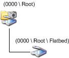

# WIA Scanner Item Tree Layout for Windows XP

A WIA scanner item tree for Windows XP consists of a root item and a single child item. The following diagram illustrates the WIA scanner item tree.

See [How the Application Creates the WIA Device](how-the-application-creates-the-wia-device.md) for an example on how to create an item tree. For additional information, see [Initializing the WIA Minidriver](initializing-the-wia-minidriver.md), **Building and Maintaining an Item Tree** in [WIA driver services library](wia-driver-services-library.md), and [**IWiaMiniDrv::drvInitializeWia**](https://docs.microsoft.com/windows-hardware/drivers/ddi/content/wiamindr_lh/nf-wiamindr_lh-iwiaminidrv-drvinitializewia). The root item in a scanner item tree contains information that is present in all WIA minidrivers, as well as scanner-specific properties. The scanner-specific properties include device optics information and document feeder support.

The child item represents the data-collecting functionality of the device and is used for transferring data. The child item for a scanner should be named to reflect the operations it can perform.

Microsoft requires the following names for Windows XP:

**Root**  
The item that represents the first element in a WIA item tree.

**Flatbed**  
The item that represents a flatbed scanner, with or without a document feeder.

**Feeder**  
The item that represents a scanner that has only a document feeder.

For Windows Me and Windows XP, an application must read WIA properties on the root item and on the first child item so that it can determine the functionality of the scanner device.

An application can use the WIA service to perform the following operations:

-   Query scanner capabilities.

-   Set scanner device properties.

-   Request a data transfer.

Applications typically expect flatbed scanners, including those with automatic document feeders (ADFs), to be represented by two items: a root item and a single child item. All data transfers are performed from the child item.
