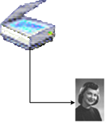
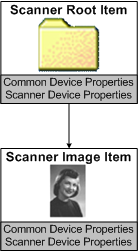

# WIA Scanner Tree

## 

The following figure shows a scanner and an image that it produced.

The next figure shows a Microsoft Windows Me or Windows XP scanner, or a scanner on Windows Vista if that scanner has no document feeder, duplexer or film scanner.

WIA represents the scanner and its image shown in the preceding figure as an item tree, as in the following figure.

The root item, which is the scanner itself, consists of common device properties (properties that are common to both cameras and scanners), and scanner-specific device properties. Similarly, each child item consists of properties common to both camera and scanner items, as well as properties that are specific to scanner items.

Through the WIA service, an application can request the following from a scanner item:

-   Query scanner capabilities.

-   Set scanner device properties.

-   Request a data transfer.

In Windows Me and Windows XP, directly below the root item, a typical scanner object has a single item, the scanner item, which represents the data-collecting functionality of the device. An application sets up a scan by setting the properties of the scanner item. The scan is executed when the application requests data, through the WIA service, from the item.

In Windows Me and Windows XP, applications typically expect flatbed scanners, including those with automatic document feeders (ADFs), to be represented by two items--a root item and a single child. All data transfers are performed from the child item. A driver may choose to create other items for its private use, and these items can be made transfer-capable. (To do so, set the WiaItemTypeTransfer bit of the item type flag in a call to [**wiasCreateChildAppItem**](https://msdn.microsoft.com/library/windows/hardware/ff549156). This constant is documented in the Microsoft Windows SDK documentation.) However, applications generally do not know about these private items, and do not know how to manipulate them. For a scanner with an ADF, in Windows Me or Windows XP, the ADF functionality is exposed and controlled by adding the WIA\_DPS\_DOCUMENT\_HANDLING\_*XXX* properties to the scanner's root item, rather than to the scanner's child item. For more information about these properties, see [WIA Properties](https://msdn.microsoft.com/library/windows/hardware/ff552739). For information about a scanner with an ADF in Windows Vista, see [WIA Feeder Scanners](wia-feeder-scanners.md).

If a device has a flatbed and an ADF, and can do DUPLEX scans, in Windows Me or Windows XP, a driver would report the [**WIA\_DPS\_DOCUMENT\_HANDLING\_CAPABILITIES**](https://msdn.microsoft.com/library/windows/hardware/ff551379) property as (FEED | FLAT | DUP). Make sure that the valid values for [**WIA\_DPS\_DOCUMENT\_HANDLING\_SELECT**](https://msdn.microsoft.com/library/windows/hardware/ff551384) are set correctly. Note that all documents scanned in a single scan job will exist in a single child item in the item tree. For information about a scanner with an ADF and a duplexer on Windows Vista, see [WIA Feeder Scanners](wia-feeder-scanners.md).

As an example, suppose that an application intends to perform a duplex scan of three pages from the ADF. To accomplish this, the application would set the WIA\_DPS\_DOCUMENT\_HANDLING\_SELECT property to (FEEDER | DUPLEX), and would set the [**WIA\_DPS\_PAGES**](https://msdn.microsoft.com/library/windows/hardware/ff551414) property to 3. If the application wants to scan the front of the page first, it should set the WIA\_DPS\_DOCUMENT\_HANDLING\_SELECT property to (FEEDER | DUPLEX | FRONT\_FIRST). After this is done, the application should navigate to the child item from which it would request a data transfer. The minidriver would report the front of the first page in the ADF as page 1, the back of that page as page 2, and the front of the second page in the ADF as page 3.

It is important to remember that if the device has an ADF, it must support the ADF properties.

 

 

--------------------
[Send comments about this topic to Microsoft](mailto:wsddocfb@microsoft.com?subject=Documentation%20feedback%20%5Bimage\image%5D:%20WIA%20Scanner%20Tree%20%20RELEASE:%20%288/17/2016%29&body=%0A%0APRIVACY%20STATEMENT%0A%0AWe%20use%20your%20feedback%20to%20improve%20the%20documentation.%20We%20don't%20use%20your%20email%20address%20for%20any%20other%20purpose,%20and%20we'll%20remove%20your%20email%20address%20from%20our%20system%20after%20the%20issue%20that%20you're%20reporting%20is%20fixed.%20While%20we're%20working%20to%20fix%20this%20issue,%20we%20might%20send%20you%20an%20email%20message%20to%20ask%20for%20more%20info.%20Later,%20we%20might%20also%20send%20you%20an%20email%20message%20to%20let%20you%20know%20that%20we've%20addressed%20your%20feedback.%0A%0AFor%20more%20info%20about%20Microsoft's%20privacy%20policy,%20see%20http://privacy.microsoft.com/default.aspx. "Send comments about this topic to Microsoft")

