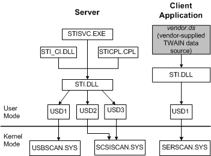

# Windows 2000 Core Components

The still image core components on Windows 2000 are shown in the following figure.

The still image core components on Windows 2000 are almost identical to the [Windows 98 Core Components](windows-98-core-components.md). The three differences between these operating systems are the following:

1.  *Stisvc.exe* replaces the Windows 98 *stimon.exe* component.

2.  The system provides a serial port kernel-mode driver, *serscan.sys*.

3.  *Scsimap.dll* does not exist for Windows 2000 and later.

 

 

