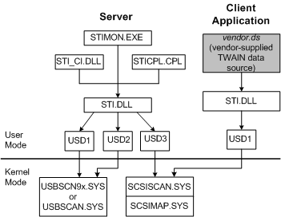

# Windows 98 Core Components

On MIcrosoft Windows 98, the still image core components are as shown in the following figure.

On the server side, three core components communicate with *sti.dll*: *stimon.exe*, *sti\_ci.dll*, and *sticpl.cpl*. These components are, respectively, the still image event monitor, the class installer, and the Scanners and Cameras Control Panel application. *Sti\_ci.dll* is invoked only when a new still image device is installed or removed, and *sticpl.cpl* is invoked only to do configuration chores.

*Stimon.exe* processes events and communicates with *sti.dll*, which in turn communicates with one or more user-mode still image drivers (USDs), which are labeled USD1, USD2, and USD3 on the left side of this figure. Each of the user-mode drivers communicates with one type of kernel-mode driver, depending on the device's bus connection. For a USB device, the user-mode still image driver communicates with *usbscn9x.sys* for composite usb devices and *usbscan.sys* for noncomposite usb devices; for a SCSI device, the user-mode driver communicates with both *scsiscan.sys* and *scsimap.sys*.

On the client application side, an IHV must supply a TWAIN data source, which is shown in the preceding figure as *vendor.ds*, a generic name for this component. The TWAIN data source is a component of the TWAIN Scanning architecture, and communicates with an instance of *sti.dll* on the client side. In turn, *sti.dll* communicates with a user-mode still image driver (USD1 in the figure), which communicates with one of the kernel-mode drivers discussed earlier.

 

 

