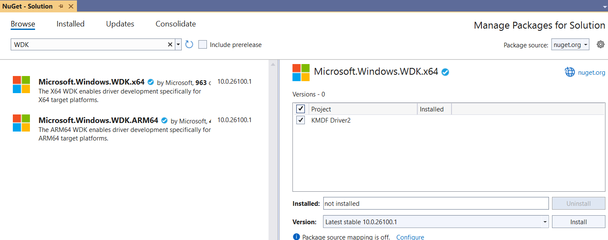
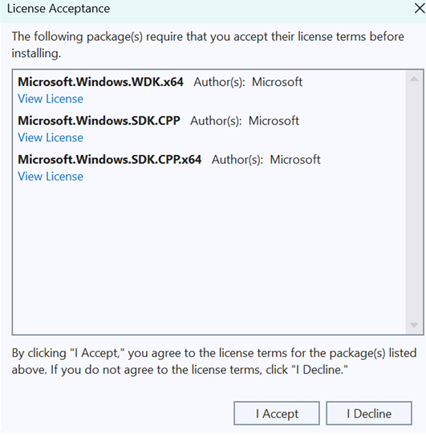
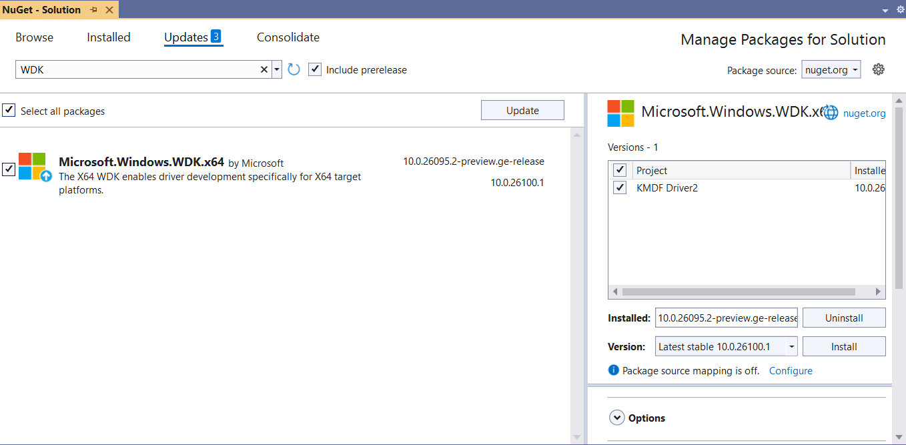
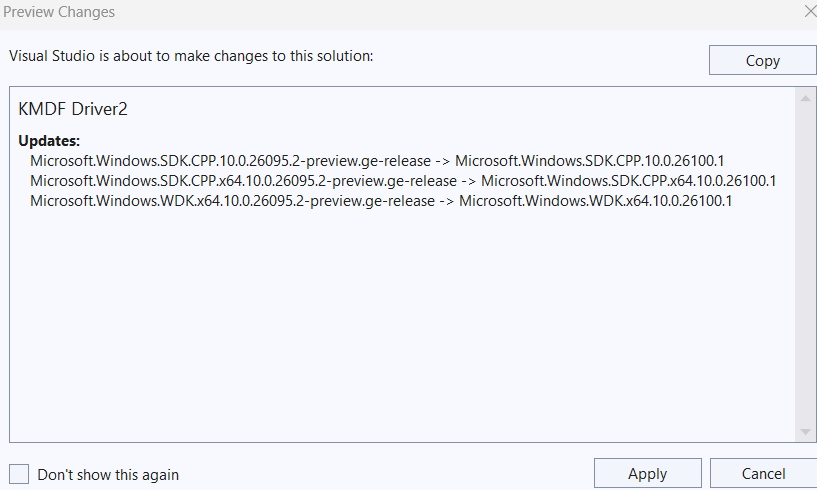

# Install the WDK using NuGet

This topic describes how to use NuGet to install the Windows Driver Kit on your computer. NuGet is a popular package manager, used for packaging and distributing software. For more information, see [What is NuGet?](/nuget/what-is-nuget/).

## Windows Drivers Kit Overview

Windows Driver Kit (WDK) is a software tool set used to develop, test and deploy Windows drivers. The content included in the WDK can be categorized into five unique types: Headers, Libraries, Samples, Tools and Templates.

The WDK is released in three different distributions, with different installation options.

**Windows Driver Kit (WDK)**: The WDK is available as a traditional msi based package. It requires Visual Studio to be installed and the WDK is installed to `%ProgramFiles(x86)%\Windows Kits\`. See [Download the Windows Driver Kit (WDK)](.\download-the-wdk.md) for information on downloading and installing the WDK.

**Enterprise Windows Drivers Kit (EWDK)**: This is shipped as a standalone ISO, which includes the command line compiler build tools, the SDK and the WDK. The EWDK is a standalone self-contained command-line environment. To get started, just mount the ISO and run LaunchBuildEnv. Visit [Download the Windows Driver Kit (WDK)](.\download-the-wdk.md) for details on how to download and use the EWDK.

**Windows Drivers Kit NuGet Package**: The WDK NuGet package consists of essential libraries, headers, DLL, tools and metadata used for building Windows drivers that can be shared and supported by modern CI/CD pipelines. The official release of the WDK NuGet package is now available on nuget.org. The latest release version is *10.0.26100.1591*. For information on the latest release of the WDK, SDK and Visual Studio, see [Kit versioning](./download-the-wdk.md#kit-versioning).

Users can access and consume the NuGet packages directly from nuget.org from within Visual Studio. Using NuGet with the WDK provides a lightweight solution for WDK acquisition for developers who need always up to date tools for building modern hardware drivers. For more information, see [Install and manage packages in Visual Studio using the NuGet Package Manager](/nuget/consume-packages/install-use-packages-visual-studio/).

The WDK NuGet packages are also available on the NuGet website.

x64: <https://www.nuget.org/packages/Microsoft.Windows.WDK.x64/>

ARM64: <https://www.nuget.org/packages/Microsoft.Windows.WDK.ARM64>

### Directions for building drivers in automated build systems

For directions on building drivers in large automated system, see [Building Locally](https://github.com/microsoft/Windows-driver-samples/blob/main/Building-Locally.md).

## Getting Started with WDK NuGet

### Prerequisites

- X64/ARM64 PC with Windows 11 or newer.

### Install Visual Studio 2022

The WDK NuGet requires Visual Studio. Download and install Visual Studio 2022 Community, Professional, or Enterprise edition.

[Download Visual Studio Tools](https://visualstudio.microsoft.com/downloads/)

When you install Visual Studio 2022, select the **Desktop development with C++** workload, then under Individual Components add:

- MSVC v143 - VS 2022 C++ ARM64/ARM64EC Spectre-mitigated libs (Latest)

- MSVC v143 - VS 2022 C++ x64/x86 Spectre-mitigated libs (Latest)

- C++ ATL for latest v143 build tools with Spectre Mitigations (ARM64/ARM64EC)

- C++ ATL for latest v143 build tools with Spectre Mitigations (x86 & x64)

- C++ MFC for latest v143 build tools with Spectre Mitigations (ARM64/ARM64EC)

- C++ MFC for latest v143 build tools with Spectre Mitigations (x86 & x64)

- Windows Driver Kit

## Use the WDK NuGet to develop a driver

Follow the following steps to acquire and install WDK NuGet package in Visual Studio.

1. Launch Visual Studio.

1. Create a new driver project, for example a "Kernel Mode Driver (KMDF)" C++ project.

1. Right Click the driver project solution file, and select **Manage NuGet packages**.

1. Click the drop down menu beside the package source and select `nuget.org`.

1. Search for "*WDK*".

1. Select `Microsoft.Windows.WDK.x64` or `Microsoft.Windows.WDK.ARM64` based on the platform architecture that you wish to develop for.

1. Leave other checkboxes set at their defaults.

1. Select **Install**.

1. The WDK takes dependencies on the SDK NuGet packages, and it will install the required packages.

1. Review and accept the license terms to complete the installation.

1. Build and test your WDK driver solution.

> [!NOTE]
> Use of the dotnet command line doesn't work with WDK, and its use is not recommended.

## Updating NuGet Packages in existing driver projects

To update NuGet Packages in existing driver projects, follow these steps.

1. Open the existing driver project in Visual Studio.

1. Right Click the driver project solution file, and select **Manage NuGet packages**.

1. Click on the **Updates** tab.

1. Click on the Include prerelease box, if you wish to use prerelease WDK packages.

1. Select the packages you wish to update in the list.

1. Select **Install**.

1. Select **Apply**.

1. Review and accept the license terms to complete the installation.

## See also

[What is NuGet?](/nuget/what-is-nuget/)

[Use command-line parameters to install, update, and manage Visual Studio](/visualstudio/install/use-command-line-parameters-to-install-visual-studio)

[Download Visual Studio Tools](https://visualstudio.microsoft.com/downloads/)

### Related downloads

[Download current version of the WDK and Enterprise WDK manually](download-the-wdk.md)

[Download previous versions of the WDK manually](other-wdk-downloads.md)

[Download the Windows Debugging Tools (WinDbg)](./debugger/debugger-download-tools.md)
