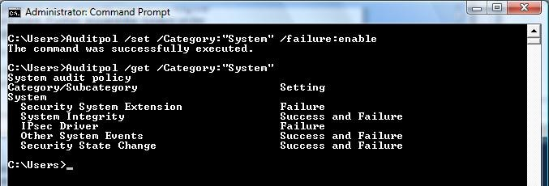

# Appendix 3: Enable Code Integrity Event Logging and System Auditing


## Enable Code Integrity Event Logging and System Auditing


*Excerpt from* [Code Integrity Event Logging and System Auditing](enabling-code-integrity-event-logging-and-system-auditing.md):

Code Integrity is the kernel-mode component that implements driver signature verification. It generates system events that are related to image verification and logs the information in the Code Integrity log:

-   The Code Integrity operational log view shows only image verification error events.

-   The Code Integrity verbose log view shows the events for successful signature verifications.

The following procedure shows how to enable Code Integrity verbose event logging to view all successful operating system loader and kernel-mode image verification events:

## To enable Code Integrity verbose event logging


*Excerpt from* [Enabling the System Event Audit Log](enabling-the-system-event-audit-log.md):

To enable verbose logging, follow these steps:

1.  Open an elevated Command Prompt window.

2.  Run *Eventvwr.exe* on the command line.

3.  Under the **Event Viewer** folder in the left pane of the Event Viewer, expand the following sequence of subfolders:

    1.  **Applications and Services Logs**

    2.  **Microsoft**

    3.  **Windows**

4.  Expand the **Code Integrity** subfolder under the **Windows** folder to display its context menu.

5.  Select **View**.

6.  Select **Show Analytic and Debug Logs**. Event Viewer will then display a subtree that contains an **Operational** folder and a **Verbose** folder.

7.  Right-click **Verbose** and then select **Properties** from the pop-up context menu.

8.  Select the **General** tab on the **Properties** dialog box, and then select the **Enable Logging** option near the middle of the property page. This will enable verbose logging.

9.  Restart the computer for the changes to take effect.

System event records can also be enabled, which include Code Integrity image verification failure events. These events are generated when the Windows kernel fails to load a driver because of a signature failure. Similar events are also recorded in the Code Integrity operational event log view

## To enable the audit policy to generate audit events in the system category for failed operations


To enable security audit policy to capture load failures in the audit logs, follow these steps:

1.  Open an elevated Command Prompt window. To open an elevated Command Prompt window, create a desktop shortcut to *Cmd.exe*, right-click the *Cmd.exe* shortcut, and select **Run as administrator**.

2.  In the elevated Command Prompt window, run the following command:

    ```cpp
    Auditpol /set /Category:System /failure:enable
    ```

3.  Restart the computer for the changes to take effect.

The following screen shot shows an how to use Auditpol to enable security auditing.



 

 


