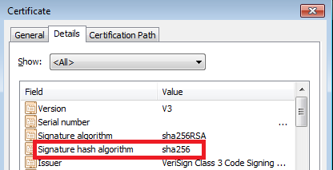

# Appendix 4: Driver Signing Issues


Two known driver signing issues are described below.

## Signing issue with previous OS


Every new release of Windows and subsequently in the released Service Packs, root certificates from Microsoft certified CA vendors, new or existing vendors with new certificates are added to the OS image. For example, Vista, XP, etc. OSes may have unknown signing issues or driver not signed issues if the computer under test is not connected to the internet. If the computer under test is connected to the internet, then the new certificates are automatically downloaded when a driver is installed and there will not be any issues. Sometimes the CA vendors are also able to help out in resolving the issues when the computer under test is not connected to the internet.

## Code 52 error


There is a known bug for Windows 7 x64 OS, when a catalog file (.cat) is signed using a new VeriSign released signing certificate which uses the SHA256 has algorithm. If you open the signed cat file and view signature and select the Details tab you will notice the following:



To resolve the issue, you may ask VeriSign to provide a replacement certificate at no cost signed with the SHA1 hash algorithm.

Alternatively, you can buy another SHA1 certificate and sign the file with two signatures as shown below if you want to keep both certificates. Note that only .sys files can be dual signed because they are PE files.

```cpp
Signtool sign /fd sha256 /ac C:\MyCrossCert\Crosscert.cer /s my /n “MyCompany Inc. “ /ph /as /sha1 XX...XX C:\DriverDir\toaster.SYS
```

Where XX...XX is the hash of the certificate you are using for the secondary signature. Add /tr to timestamp signing.

**Note**  Please review Microsoft Security Advisory ([2880823](https://technet.microsoft.com/library/security/2880823)) "Deprecation of SHA-1 Hashing Algorithm for Microsoft Root Certificate Program" which describes a policy change wherein Microsoft will no longer allow root certificate authorities to issue X.509 certificates using the SHA-1 hashing algorithm for the purposes of SSL and code signing after January 1, 2016.

 

Use of SHA1 certificate will be deprecated by Microsoft starting from January 1, 2016. All CA vendors must to issue signing certificates with the SHA256 hash algorithm.

Windows will stop accepting SHA1 code signing certificates without time stamps after 1 January 2016.

 

 


