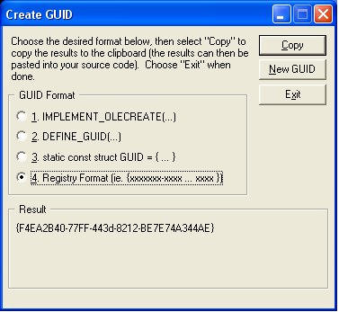

# Building Device Metadata Packages


This topic provides guidelines on how to build device metadata packages.

### <a href="" id="device-metadata-package-file-names"></a> Device metadata package file names

Before you create the device metadata package file, you must first create a globally unique identifier (GUID) for the metadata package. To do this, use the Guidgen tool *(Guidgen.exe*) that is described in the [GUID Generation](http://go.microsoft.com/fwlink/p/?linkid=145426) website.

The file name of the device metadata package must use the following naming convention:

```cpp
<GUID>.devicemetadata-ms
```

For example, if you create a GUID that has the value of {20f001a99-4675-8707-248ca-187dfd9}, you use that GUID to create the following device metadata package file:

```cpp
20f001a99-4675-8707-248ca-187dfd9.devicemetadata-ms
```

**Note**  The operating system recognizes device metadata packages only if it has a suffix of .*devicemetadata-ms*.

 

The following rules apply to device metadata package files:

-   The GUID for each metadata package file name must be unique. When you create a new or revised metadata package, you must create a new GUID, even if the changes are minor.

-   Each metadata package can support only one locale. If you support more than one locale for your device, you must create separate metadata packages for each locale, with each metadata package having its own GUID. For more information, see [**Locale XML element**](https://msdn.microsoft.com/library/windows/hardware/ff548647).

    **Note**  If you require multiple locale-specific device metadata package files for your device, you can group all the files by creating a language-neutral identifier. This identifier is a GUID, and the same GUID can be specified in the [**LanguageNeutralIdentifier**](https://msdn.microsoft.com/library/windows/hardware/ff548617) XML element within all metadata packages for the same device.

     

-   The *&lt;GUID&gt;* prefix of the device metadata package file name must specify the GUID without the '{' or '}' delimiters.

### Creating a device metadata package file

The [components of a device metadata package](device-metadata-package-components.md) are stored in a file compressed by using the Cabarc (*Cabarc.exe*) tool. For more information about this tool, refer to the [Cabarc Overview](http://go.microsoft.com/fwlink/p/?linkid=145395) website.

The following code example shows how to use the Cabarc tool to create a device metadata package file. In this example, the components of the metadata package are located in a local directory named *MyMetadataPackage*. The following list shows the subdirectories and files within the *MyMetadataPackage* directory:

```cpp
.\MyMetadataPackages
.\MyMetadataPackage\PackageInfo.xml
.\MyMetadataPackage\DeviceInformation\DeviceInfo.xml
.\MyMetadataPackage\DeviceInformation\MyIcon.ico
.\MyMetadataPackage\WindowsInformation\WindowsInfo.xml
```

First, a GUID with the value of {f4ea2b40-77ff-443d-8212-be7e74a344ae} is created for the device metadata package. The following figure shows how to use the Guidgen tool to create the GUID:



Then, the following command uses the Cabarc tool to create a new device metadata package file in a local directory named *MyDeviceMetadataPackage*:

```cpp
Cabarc.exe -r -p -P .\MyMetadataPackage\ 
    N .\MyDeviceMetadataPackage\f4ea2b40-77ff-443d-8212-be7e74a344ae.devicemetadata-ms 
    .\MyMetadataPackage\PackageInfo.xml 
    .\MyMetadataPackage\DeviceInformation\DeviceInfo.xml 
    .\MyMetadataPackage\DeviceInformation\MyIcon.ico 
    .\MyMetadataPackage\WindowsInformation\WindowsInfo.xml
```

**Note**  Each metadata package can support only one locale. If you support more than one locale for your device, you must create separate metadata packages for each locale, with each metadata package having its own GUID.

 

 

 


