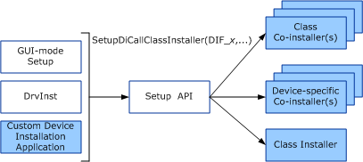
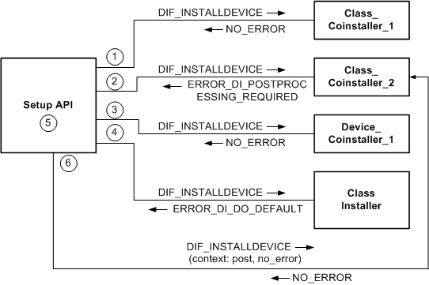

# Co-installer Operation

Co-installers are called by SetupAPI, as shown in the following figure.

The unshaded boxes represent the components that the operating system supplies for the [system-supplied device setup classes](./system-defined-device-setup-classes-reserved-for-system-use.md). The shaded boxes represent the components that you can provide. If you create a custom device setup class, you can also supply a class installer. However, you rarely need to create a new device setup class, because almost every device can be associated with one of the system-supplied device setup classes. For more information about Windows components, see [Device Installation Overview](overview-of-device-and-driver-installation.md).

Co-installers can be provided for a specific device (*device-specific co-installer*) or for a device setup class (*class co-installer*). SetupAPI calls a device-specific co-installer only when installing the device for which the co-installer is registered. The operating system and vendors can register zero or more device-specific co-installers for a device. SetupAPI calls a class co-installer when installing any device of the device setup class for which the co-installer is registered. The operating system and vendors can register one or more class co-installers for a device setup class. In addition, a class co-installer can be registered for one or more setup classes.

Windows and [custom device installation applications](writing-a-device-installation-application.md) install devices by calling [**SetupDiCallClassInstaller**](/windows/win32/api/setupapi/nf-setupapi-setupdicallclassinstaller) with [device installation function codes](/previous-versions/ff541307(v=vs.85)) (DIF codes).

During GUI-mode setup, the operating system calls [**SetupDiCallClassInstaller**](/windows/win32/api/setupapi/nf-setupapi-setupdicallclassinstaller) with DIF codes to detect non-PnP devices that are present in the system. An IHV would typically provide a co-installer to perform this action for non-PnP devices that the IHV releases.

For each DIF request, **SetupDiCallClassInstaller** calls any class co-installers registered for the device's setup class, any device co-installers registered for the specific device, and then the Class Installer supplied by the system for the device's setup class, if there is one.

Custom device installation applications must call **SetupDiCallClassInstaller** rather than calling a co-installer or class installer directly. This function ensures that all registered co-installers are called appropriately.

Class co-installers are typically registered prior to device installation, and device-specific co-installers are registered as part of the device's installation. Class co-installers are therefore typically added to the co-installer list when it is first built and are called for all DIF requests during device installation.

The operating system adds device-specific co-installers to the co-installer list after a [**DIF_REGISTER_COINSTALLERS**](./dif-register-coinstallers.md) request has been completed for the device (or [**SetupDiRegisterCoDeviceInstallers**](/windows/win32/api/setupapi/nf-setupapi-setupdiregistercodeviceinstallers) has been called). Device-specific co-installers do not participate in the following DIF requests:

[**DIF_ALLOW_INSTALL**](./dif-allow-install.md)

[**DIF_INSTALLDEVICEFILES**](./dif-installdevicefiles.md)

[**DIF_SELECTBESTCOMPATDRV**](./dif-selectbestcompatdrv.md)

Only a class co-installer (not a device-specific co-installer) can respond to the following DIF requests:

[**DIF_DETECT**](./dif-detect.md)

[**DIF_FIRSTTIMESETUP**](./dif-firsttimesetup.md)

[**DIF_NEWDEVICEWIZARD_PRESELECT**](./dif-newdevicewizard-preselect.md)

[**DIF_NEWDEVICEWIZARD_SELECT**](./dif-newdevicewizard-select.md)

[**DIF_NEWDEVICEWIZARD_PREANALYZE**](./dif-newdevicewizard-preanalyze.md)

[**DIF_NEWDEVICEWIZARD_POSTANALYZE**](./dif-newdevicewizard-postanalyze.md)

A device co-installer is not appropriate in these contexts, either because a particular device has not yet been identified or at this early stage of installation, or the device co-installers have not yet been registered.

The following figure shows the order in which **SetupDiCallClassInstaller** calls co-installers and a class installer after any device-specific co-installers have been registered.

In the example illustrated by the previous figure, two class co-installers are registered for this device's setup class and one device-specific co-installer is registered for the device. The following steps correspond to the circled numbers in the previous figure:

1.  **SetupDiCallClassInstaller** calls the first class co-installer, specifying a DIF code that indicates the install request being processed ([**DIF_INSTALLDEVICE**](./dif-installdevice.md), in this example). The co-installer has the option of participating in the install request. In this example, the first registered class co-installer returns NO_ERROR.

2.  **SetupDiCallClassInstaller**, in turn, calls any additional registered class co-installers. In this example, the second class co-installer returns ERROR_DI_POSTPROCESSING_REQUIRED, which requests that the co-installer be called later for postprocessing.

3.  **SetupDiCallClassInstaller** calls any registered device-specific co-installers.

4.  After all registered co-installers have been called, **SetupDiCallClassInstaller** calls the system-supplied Class Installer, if there is one for the device's setup class. In this example, the class installer returns ERROR_DI_DO_DEFAULT, which is a typical return value for class installers.

5.  **SetupDiCallClassInstaller** calls the default handler for the installation request, if there is one. DIF_INSTALLDEVICE has a default handler, [**SetupDiInstallDevice**](/windows/win32/api/setupapi/nf-setupapi-setupdiinstalldevice), which is part of SetupAPI.

6.  **SetupDiCallClassInstaller** calls any co-installers that requested postprocessing. In this example, the second class co-installer requested postprocessing.

Co-installer postprocessing is similar to driver [**IoCompletion**](/windows-hardware/drivers/ddi/wdm/nc-wdm-io_completion_routine) routines, except that the co-installer is called a second time at its single entry point. When **SetupDiCallClassInstaller** calls a co-installer for postprocessing, it sets *PostProcessing* to **TRUE** and *InstallResult* to the appropriate value in the *Context* parameter. In this example, *Context*.*InstallResult* is NO_ERROR because the default handler executed successfully.

For postprocessing, **SetupDiCallClassInstaller** calls co-installers in reverse order. If all the co-installers in the previous figure had returned ERROR_DI_POSTPROCESSING_REQUIRED, **SetupDiCallClassInstaller** would call Device_Coinstaller_1 first for postprocessing, followed by Class_Coinstaller_2, and then Class_Coinstaller_1. Class Installers do not request postprocessing; only co-installers do.

A co-installer that requests postprocessing is called even if a previous co-installer failed the install request.

