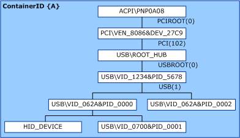
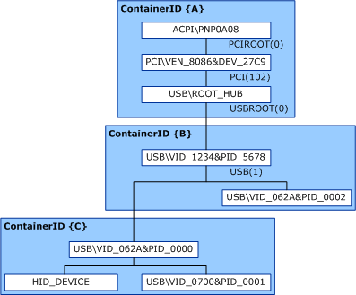

# Container IDs Generated from a Removable Device Capability Override


Starting with Windows 7, new devices should provide a bus-specific unique ID (as described in [Container IDs Generated from a Bus-Specific Unique ID](container-ids-generated-from-a-bus-specific-unique-id.md)).

Alternatively, devices and bus drivers must set the removable device capability correctly (as described in [Container IDs Generated from the Removable Device Capability](container-ids-generated-from-the-removable-device-capability.md)). For more information about the removable device capability, see [Overview of the Removable Device Capability](overview-of-the-removable-device-capability.md).

Windows 7 and later versions of Windows also support a mechanism to override the reported removable device capability. This mechanism is useful for legacy devices that report the removable device capability incorrectly.

Although the override mechanism does not change the value of the removable device capability, it forces the PnP manager to use the override setting and not the value of the removable device capability when generating container IDs for devices.

Through this override mechanism, a container ID can be generated through a registry-based method. As soon as the container ID is generated for the topmost (parent) device node ([*devnode*](https://msdn.microsoft.com/library/windows/hardware/ff556277#wdkgloss-devnode)) of a device, the same container ID is inherited by each child devnode of the device through the heuristic described in [Container IDs Generated from the Removable Device Capability](container-ids-generated-from-the-removable-device-capability.md).

The override mechanism is a registry-based lookup table that consists of registry keys that map to specific devices. This override table is maintained under the [DeviceOverrides registry key](deviceoverrides-registry-key.md), and consists of the following registry keys and subkeys.

<table>
<colgroup>
<col width="33%" />
<col width="33%" />
<col width="33%" />
</colgroup>
<thead>
<tr class="header">
<th align="left">Table level</th>
<th align="left">Registry key/subkey name</th>
<th align="left">Description</th>
</tr>
</thead>
<tbody>
<tr class="odd">
<td align="left"><p>1</p></td>
<td align="left"><p><a href="deviceoverrides-registry-key.md" data-raw-source="[DeviceOverrides](deviceoverrides-registry-key.md)">DeviceOverrides</a></p></td>
<td align="left"><p>Parent key for all removable device capability overrides.</p></td>
</tr>
<tr class="even">
<td align="left"><p>2</p></td>
<td align="left"><p><a href="hardwareid-registry-subkey.md" data-raw-source="[HardwareID](hardwareid-registry-subkey.md)">HardwareID</a></p></td>
<td align="left"><p>Specifies the <a href="hardware-ids.md" data-raw-source="[hardware ID](hardware-ids.md)">hardware ID</a> of a device to which the removable device capability override applies.</p>
<p>The name of this subkey is the actual hardware ID, with all backslash (&#39;&#39;) characters replaced by number (&#39;#&#39;) characters.</p></td>
</tr>
<tr class="odd">
<td align="left"><p>2</p></td>
<td align="left"><p><a href="compatibleid-registry-subkey.md" data-raw-source="[CompatibleID](compatibleid-registry-subkey.md)">CompatibleID</a></p></td>
<td align="left"><p>Specifies the <a href="compatible-ids.md" data-raw-source="[compatible ID](compatible-ids.md)">compatible ID</a> of a device to which the removable device capability override applies.</p>
<p>The name of this subkey is the actual hardware ID, with all backslash (&#39;&#39;) characters replaced by number (&#39;#&#39;) characters.</p></td>
</tr>
<tr class="even">
<td align="left"><p>3</p></td>
<td align="left"><p><a href="locationpaths-registry-subkey.md" data-raw-source="[LocationPaths](locationpaths-registry-subkey.md)">LocationPaths</a></p></td>
<td align="left"><p>Specifies that only the location path of the device&#39;s parent device node (<a href="https://msdn.microsoft.com/library/windows/hardware/ff556277#wdkgloss-devnode" data-raw-source="[&lt;em&gt;devnode&lt;/em&gt;](https://msdn.microsoft.com/library/windows/hardware/ff556277#wdkgloss-devnode)"><em>devnode</em></a>) will have the removable device capability override applied.</p></td>
</tr>
<tr class="odd">
<td align="left"><p>3</p></td>
<td align="left"><p><a href="childlocationpaths-registry-subkey.md" data-raw-source="[ChildLocationPaths](childlocationpaths-registry-subkey.md)">ChildLocationPaths</a></p></td>
<td align="left"><p>Specifies that the location path of the device&#39;s child devnodes will have the removable device capability override applied.</p>
<div class="alert">
<strong>Note</strong>  The parent devnode of the specified device are not affected by the removable device capability override, unless a <a href="locationpaths-registry-subkey.md" data-raw-source="[LocationPaths](locationpaths-registry-subkey.md)">LocationPaths</a> registry subkey is also specified or a <strong>ChildLocationPaths</strong> registry subkey is specified for the parent devnode.
</div>
<div>
 
</div></td>
</tr>
<tr class="even">
<td align="left"><p>4</p></td>
<td align="left"><p><a href="locationpath-registry-subkey.md" data-raw-source="[LocationPath](locationpath-registry-subkey.md)">LocationPath</a></p></td>
<td align="left"><p>Specifies the discrete location path of the devnode to which the removable device capability override applies.</p>
<p>The name of this subkey is the actual location path for a single devnode instance of a device installed in the computer.</p></td>
</tr>
<tr class="odd">
<td align="left"><p>4</p></td>
<td align="left"><p><a href="--registry-subkey.md" data-raw-source="[*](--registry-subkey.md)">*</a></p></td>
<td align="left"><p>Specifies that the removable device capability override applies to all devnodes for the specified device.</p></td>
</tr>
</tbody>
</table>

 

Within the [LocationPath](locationpath-registry-subkey.md) and [\*](--registry-subkey.md) registry subkeys, a DWORD value (**Removable**) specifies whether the applicable devnodes are considered removable (1) or not removable (0).

### <a href="" id="example-1"></a> Example 1

The following shows a device override for a devnode that matches a [HardwareID](hardwareid-registry-subkey.md) registry subkey in addition to a location path that is specified through the [LocationPaths](locationpaths-registry-subkey.md) registry subkey.

In this example, the override will disable the removable device capability, and is applied to all devnodes that have a [hardware ID](hardware-ids.md) of USB\\VID_1234&PID_5678 at the location path PCIROOT(0)\#PCI(102)\#USBROOT(0)\#USB(1).

The following is an example of the registry table format for this override.

```cpp
HKEY_LOCAL_MACHINE\SYSTEM\CurrentControlSet\Control\DeviceOverrides
    USB#VID_1234&PID_5678
        LocationPaths
            PCIROOT(0)#PCI(102)#USBROOT(0)#USB(1)
                Removable=0
```

In this example, `USB#VID_1234&PID_5678 `is the name of the [HardwareID](hardwareid-registry-subkey.md) registry subkey, and `PCIROOT(0)#PCI(102)#USBROOT(0)#USB(1)` is the name of the [LocationPath](locationpath-registry-subkey.md) registry subkey.

This override changes the Plug and Play (PnP) manager's interpretation of the device topology. Notice that the devnode with a [hardware ID](hardware-ids.md) value of USB\\VID_1234&PID_5678 was marked as not removable in the registry. A new container ID is not generated for this devnode, because the PnP manager interprets the devnode as not being removable from its parent. Instead, USB\\VID_1234&PID_5678 (and all its children) inherit the container ID (ContainerID {A}) of its parent.

The result of this override is a single device grouping because all the devnodes in the tree have the same container ID. The device USB\\VID_1234&PID_5678 is interpreted as being integrated with the computer.

The following diagram shows the resulting device topology and associated container ID assignment.



The previous example shows a frequently encountered devnode topology: portable computers with devices hardwired to specific bus locations that incorrectly report themselves as removable. Devices that are physically integrated with a computer, such as a Webcam or a biometric (fingerprint) sensor, should not be reported as removable because a user cannot physically separate them from the computer. The removable override lets an independent hardware vendor (IHV) or original equipment manufacturer (OEM) change how the PnP manager interprets the removable device capability, and thereby affects the container ID assignment for the device.

### Example 2

The following shows a removable device capability override for all devnodes that matches a specific [hardware ID](hardware-ids.md) value.

In this example, the override will enable the removable device capability, and the override is applied to devnodes that have a hardware ID value of USB\\VID_062A&PID_0000.

The following is a high-level description of the registry table format for this override.

```cpp
HKEY_LOCAL_MACHINE\SYSTEM\CurrentControlSet\Control\DeviceOverrides
    USB#VID_062A&PID_00001
        LocationPaths
            *
                Removable=1
```

1 The name of the [HardwareID](hardwareid-registry-subkey.md) registry subkey.

In this example, the devnode with a [hardware ID](hardware-ids.md) of USB\\VID_1234&PID_5678 reports the device removable capability correctly. The PnP manager generates a container ID (ContainerID {B}) for it and all its child devnodes.

However, the child devnode with a [hardware ID](hardware-ids.md) of USB\\VID_062A&PID_0000 matches the override. As a result, the PnP manager generates another contained ID (ContainerID {C}) for this devnode and all its child devnodes.

As before, this override changes the PnP manager's interpretation of the device topology. The physical device is assigned two container IDs, and is seen by Windows as two devices. Notice that the devnode with the [hardware ID](hardware-ids.md) of USB\\VID_062A&PID_0000 is interpreted as removable in grouping the devnodes into devices. This does not change the value reported by the devnode for the device removable capability.

Additionally, the \* registry subkey was specified to indicate that this override should be applied to all devnodes on the computer that have the [hardware ID](hardware-ids.md) of USB\\VID_062A&PID_0000.

The following diagram shows the resulting device topology and associated container ID assignment.



 

 


