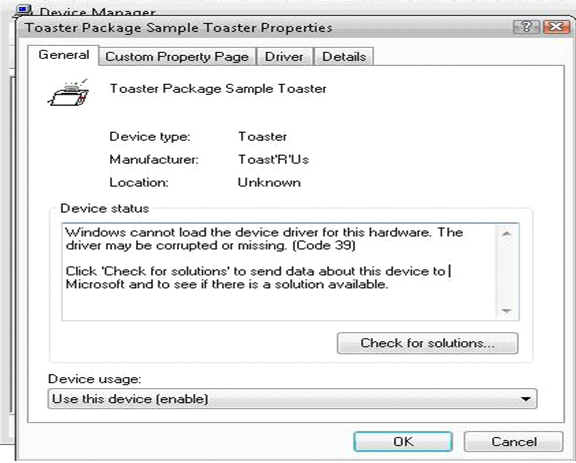

# Detecting Driver Load Errors

To detect whether a driver loaded, check the status of the device in Device Manager. If the [kernel-mode code signing policy](kernel-mode-code-signing-policy--windows-vista-and-later-.md) blocks a driver from loading because the driver is not correctly signed, the device status message will indicate that Windows could not load the driver and that the driver might be corrupted or missing. If this occurs, you can use [Code Integrity diagnostic system log events](code-integrity-diagnostic-system-log-events.md) to further diagnose the problem.

The following screen shot shows the type of device status message that indicates that Windows could not load a driver for a device and that the driver might be corrupted or missing.

 

 

