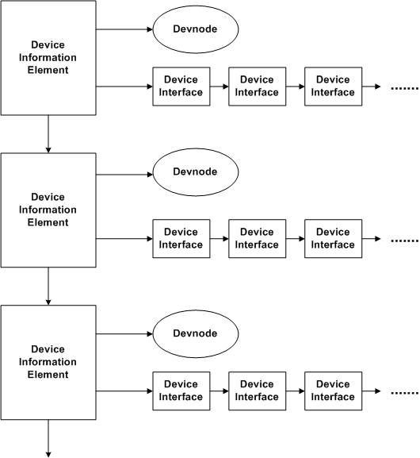

# Device Information Sets

In user mode, devices that belong to either [device setup classes](device-setup-classes.md) or [device interface classes](device-interface-classes.md) are managed by using *device information elements* and *device information sets.* A device information set consists of device information elements for all the devices that belong to some device setup class or device interface class.

Each device information element contains a handle to the device's [*devnode*](https://msdn.microsoft.com/library/windows/hardware/ff556277#wdkgloss-devnode), and a pointer to a linked list of all the device interfaces associated with the device described by that element. If a device information set describes members of a setup class, the element might not point to any device interfaces, since setup class members are not necessarily associated with an interface.

The following diagram shows the internal structure of a device information set.

### Creating a Device Information Set

After creating a device information set with [**SetupDiCreateDeviceInfoList**](https://msdn.microsoft.com/library/windows/hardware/ff550956), device information elements can be created and added to the list one at a time using [**SetupDiCreateDeviceInfo**](https://msdn.microsoft.com/library/windows/hardware/ff550952). Alternatively, [**SetupDiGetClassDevs**](https://msdn.microsoft.com/library/windows/hardware/ff551069) can be called to create a device information set composed of all devices associated with a specified device setup class or device interface class.

### Enumerating Device Information

Once a device information set is created, both the devices and the device interfaces that belong to the set can be enumerated, but different operations are required for each type of enumeration. [**SetupDiEnumDeviceInfo**](https://msdn.microsoft.com/library/windows/hardware/ff551010) enumerates all devices that belong to the information set that meet certain criteria. Each call to **SetupDiEnumDeviceInfo** extracts a [**SP_DEVINFO_DATA**](https://msdn.microsoft.com/library/windows/hardware/ff552344) structure that roughly corresponds to a device information element. SP_DEVINFO_DATA contains the GUID of the class that the device belongs to and a *device instance* handle that points to the devnode for the device. The principal difference between an SP_DEVINFO_DATA structure and a complete device element is that SP_DEVINFO_DATA does *not* contain the linked list of interfaces associated with the device. Therefore, **SetupDiEnumDeviceInfo** cannot be used to enumerate the interfaces in the device information set.

To enumerate the device interfaces in a device information set, call [**SetupDiEnumDeviceInterfaces**](https://msdn.microsoft.com/library/windows/hardware/ff551015). This routine steps through all the device information elements in the device information set, extracts the interfaces in the interface list of each element, and returns one interface with each call. If **SetupDiEnumDeviceInterfaces** is passed an SP_DEVINFO_DATA structure as input in its second parameter, it constrains the enumeration to only those interfaces that are associated with the device indicated by SP_DEVINFO_DATA.

**SetupDiEnumDeviceInterfaces** returns an [**SP_DEVICE_INTERFACE_DATA**](https://msdn.microsoft.com/library/windows/hardware/ff552342) structure. SP_DEVICE_INTERFACE_DATA contains the interface class GUID and other information about the interface, including a reserved field that has encoded information that can be used to obtain the name of the interface. To get the interface name, one further step is required: [**SetupDiGetDeviceInterfaceDetail**](https://msdn.microsoft.com/library/windows/hardware/ff551120) must be called. **SetupDiGetDeviceInterfaceDetail** returns a structure of type [**SP_DEVICE_INTERFACE_DETAIL_DATA**](https://msdn.microsoft.com/library/windows/hardware/ff552343) that contains the path in the system object tree that defines the interface.

 

 

