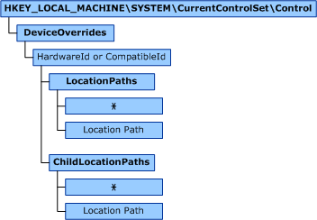

# DeviceOverrides Registry Key

Beginning with Windows 7, the **DeviceOverrides** registry key specifies that one or more removable device capability overrides exist in the system. For more information about the removable device capability, see [Overview of the Removable Device Capability](overview-of-the-removable-device-capability.md).

The Plug and Play (PnP) manager uses a new ID ([container IDs](container-ids.md)) to group one or more device nodes ([*devnodes*](https://msdn.microsoft.com/library/windows/hardware/ff556277#wdkgloss-devnode)) that originated from and belong to each instance of a particular physical device installed in the computer. For legacy devices, the PnP manager generates container IDs through the removable device capability. For more information about how the PnP manager generates container IDs, see [How Container IDs are Generated](how-container-ids-are-generated.md).

Removable device capability overrides let the independent hardware vendor (IHV) or original equipment manufacturer (OEM) change the interpreted value of the removable device capability on a devnode or group of devnodes.

Removable device capability overrides through the **DeviceOverrides** registry key are useful for legacy devices or third-party hardware components that may not report the removable device capability correctly. This causes the PnP manager to incorrectly generate a container ID used to group the devnodes enumerated from a physical device.

These overrides do not actually change the global state of the removable device capability reported by a devnode. Instead, these overrides cause the PnP manager to ignore the reported device capability and use the registry-based setting when generating a [container ID](container-ids.md) for devnodes that match an override. Additional subkeys under the DeviceOverrides registry subkey provide more details about which devnodes to override.

The following table defines the **DeviceOverrides** registry key's format and requirements.

<table>
<colgroup>
<col width="20%" />
<col width="20%" />
<col width="20%" />
<col width="20%" />
<col width="20%" />
</colgroup>
<thead>
<tr class="header">
<th align="left">Registry key name</th>
<th align="left">Required/optional</th>
<th align="left">Format requirements</th>
<th align="left">Parent key</th>
<th align="left">Child subkeys</th>
</tr>
</thead>
<tbody>
<tr class="odd">
<td align="left">
<strong>DeviceOverrides</strong>
</td>
<td align="left">
Optional
</td>
<td align="left">
None
</td>
<td align="left">
None
</td>
<td align="left">
<a href="hardwareid-registry-subkey.md" data-raw-source="[HardwareID](hardwareid-registry-subkey.md)">HardwareID</a> or <a href="compatibleid-registry-subkey.md" data-raw-source="[CompatibleID](compatibleid-registry-subkey.md)">CompatibleID</a>
</td>
</tr>
</tbody>
</table>

 

Each removable device capability override is specified through either the **HardwareID** or **ContainerID** registry subkeys.

The **DeviceOverrides** registry key is created and maintained under the [HKLM\\SYSTEM\\CurrentControlSet\\Control registry tree](hklm-system-currentcontrolset-control-registry-tree.md). Within this registry key, one or more removable device capability overrides are created or maintained.

Removable device capability overrides are specific to individual devices specified through either the [HardwareID](hardwareid-registry-subkey.md) or [CompatibleID](compatibleid-registry-subkey.md) registry subkeys. Additional subkeys define the paths of devnodes enumerated for the specified devices. Generally, the most specific device hardware ID should be used to identify a device, instead of a less specific hardware or compatible ID. This ensures that the removable device capability override is not applied to any unintended devices that share the same hardware or compatible ID as the intended target device.

The following figure shows the topology of the **DeviceOverrides** registry key and its related subkeys.

The **DeviceOverrides** registry key must be created for the first removable device capability override that is added to the system. It may not exist by default on a clean operating system installation.

**Note**  The existence of a removable device capability registry override does not change the global state of the removable device capability on a devnode.

 

 

 

