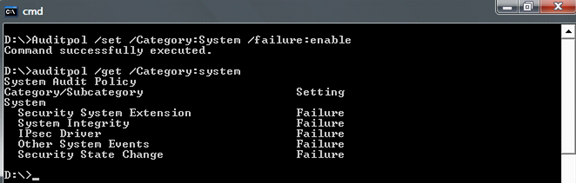

# Enabling the System Event Audit Log


This topic includes the following information:

[How to Enable Security Audit Policy](#how-to-enable-security-audit-policy)

[How to Enable Verbose Logging of Code Integrity Diagnostic Events](#how-to-enable-verbose-logging-of-code-integrity-diagnostic-events)

### <a href="" id="how-to-enable-security-audit-policy"></a> How to Enable Security Audit Policy

To enable security audit policy to capture load failures in the audit logs, follow these steps:

1.  Open an elevated Command Prompt window. To open an elevated Command Prompt window, create a desktop shortcut to *Cmd.exe*, right-click the *Cmd.exe* shortcut, and select **Run as administrator**.

2.  In the elevated Command Prompt window, run the following command:

    ```cpp
    Auditpol /set /Category:System /failure:enable
    ```

3.  Restart the computer for the changes to take effect.

The following screen shot shows an how to use Auditpol to enable security auditing.



### <a href="" id="how-to-enable-verbose-logging-of-code-integrity-diagnostic-events"></a> How to Enable Verbose Logging of Code Integrity Diagnostic Events

To enable verbose logging, follow these steps:

1.  Open an elevated Command Prompt window.

2.  Run *Eventvwr.exe* on the command line.

3.  Under the **Event Viewer** folder in the left pane of the Event Viewer, expand the following sequence of subfolders:

    1.  **Applications and Services Logs**

    2.  **Microsoft**

    3.  **Windows**

4.  Expand the **Code Integrity** subfolder under the **Windows** folder to display its context menu.

5.  Select **View**.

6.  Select **Show Analytic and Debug Logs**. Event Viewer will then display a subtree that contains an **Operational** folder and a **Verbose** folder.

7.  Right-click **Verbose** and then select **Properties** from the pop-up context menu.

8.  Select the **General** tab on the **Properties** dialog box, and then select the **Enable Logging** option near the middle of the property page. This will enable verbose logging.

9.  Restart the computer for the changes to take effect.

 

 


