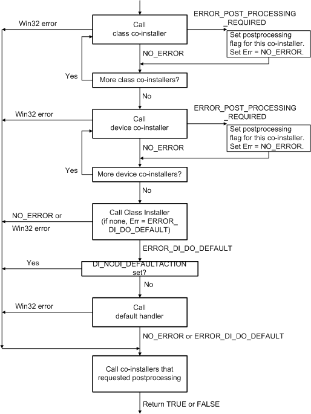

# Handling DIF Codes

[*Device installation applications*](https://msdn.microsoft.com/library/windows/hardware/ff556277#wdkgloss-device-installation-application) send [device installation function codes](https://msdn.microsoft.com/library/windows/hardware/ff541307) (DIF codes) to installers by calling [**SetupDiCallClassInstaller**](https://msdn.microsoft.com/library/windows/hardware/ff550922). This function, in turn, calls the installer's entry point function. For a description of installer entry points, see:

[Co-installer Interface](co-installer-interface.md)

The reference page for each DIF code contains the following sections:

**When Sent**  
Describes the typical times when, and reasons why, a device installation application sends this DIF request.

**Who Handles**  
Specifies which installers are allowed to handle this request. The installers include class installers, class co-installers (setup-class-wide co-installers), and device co-installers (device-specific co-installers).

**Installer Input**  
Besides the DIF code, **SetupDiCallClassInstaller** supplies additional information relevant to the particular request. See the reference page for each DIF code for details on the information that is supplied with each request. The following list contains a general description of the additional input parameters, and lists the [device installation functions](https://msdn.microsoft.com/library/windows/hardware/ff541299) (**SetupDi*Xxx*** functions) that installers can call to handle the parameters:

*DeviceInfoSet*  
Supplies a handle to the device information set.

The handle is opaque. Use the handle, for example, to identify the device information set in calls to **SetupDi*Xxx*** functions.

The *DeviceInfoSet* might have an associated [device setup class](device-setup-classes.md). If so, call [**SetupDiGetDeviceInfoListClass**](https://msdn.microsoft.com/library/windows/hardware/ff551101) to get the class GUID.

*DeviceInfoData*  
Optionally supplies a pointer to an [**SP_DEVINFO_DATA**](https://msdn.microsoft.com/library/windows/hardware/ff552344) structure that identifies a device in the device information set.

*Device Installation Parameters*   
These indirect parameters supply information for the device installation in an [**SP_DEVINSTALL_PARAMS**](https://msdn.microsoft.com/library/windows/hardware/ff552346) structure. If *DeviceInfoData* is not **NULL**, there are device installation parameters associated with the *DeviceInfoData*. If *DeviceInfoData* is **NULL**, the device installation parameters are associated with the *DeviceInfoSet*.

Call [**SetupDiGetDeviceInstallParams**](https://msdn.microsoft.com/library/windows/hardware/ff551104) to get the device installation parameters.

*Class Installation Parameters*  
The optional indirect parameters are specific to the particular DIF request. These are essentially "DIF request parameters." For example, the class installation parameters for a DIF_REMOVE installation request are contained in an SP_REMOVEDEVICE_PARAMS structure.

Each SP_*XXX*_PARAMS structure starts with a fixed-sized SP_CLASSINSTALL_HEADER structure.

Call [**SetupDiGetClassInstallParams**](https://msdn.microsoft.com/library/windows/hardware/ff551083) to get the class installation parameters.

If a DIF request has class installation parameters, there is a set of parameters associated with the *DeviceInfoSet* and another set of parameters associated with the *DeviceInfoData* (if the DIF request specifies *DeviceInfoData*). **SetupDiGetClassInstallParams** returns the most specific parameters available.

*Context*  
Co-installers have an optional context parameter.

**Installer Output**  
Describes the output expected for this DIF code.

If an installer modifies the device installation parameters, the installer must call [**SetupDiSetDeviceInstallParams**](https://msdn.microsoft.com/library/windows/hardware/ff552141) to apply the changes before returning. Similarly, if an installer modifies the class installation parameters for the DIF code, the installer must call [**SetupDiSetClassInstallParams**](https://msdn.microsoft.com/library/windows/hardware/ff552122).

**Installer Return Value**  
Specifies the appropriate return values for the DIF code. See the following figure for more information about return values.

**Default DIF Code Handler**  
Specifies the **SetupDi*Xxx*** function that carries out the system-defined default operations for the DIF code. Not all DIF codes have a default handler. Unless a co-installer or class installer takes steps to prevent the default handler from being called, **SetupDiCallClassInstaller** calls the default handler for a DIF code after it calls the class installer (but before it calls any co-installers that are registered for postprocessing).

If a class installer successfully handles a DIF code and **SetupDiCallClassInstaller** should subsequently call the default handler, the class installer returns ERROR_DI_DO_DEFAULT.

If the class installer successfully handles a DIF code, including directly calling the default handler, the class installer should return NO_ERROR and **SetupDiCallClassInstaller** will not subsequently call the default handler again. Note that the class installer can directly call the default handler, but the class installer should never attempt to supersede the operations of the default handler.

If the class installer encounters an error, the installer should return an appropriate Win32 error code and **SetupDiCallClassInstaller** will not subsequently call the default handler.

Co-installers should *not* call default DIF code handlers.

**Installer Operation**  
Describes typical steps that an installer might take to handle the DIF request.

**See Also**  
Lists sources of related information.

The following figure shows the sequence of events in **SetupDiCallClassInstaller** for processing a DIF code.

The operating system performs some operations for each DIF code. Vendor-supplied co-installers and class installers can participate in the installation activities. Note that **SetupDiCallClassInstaller** calls co-installers that registered for postprocessing even if the DIF code fails.

 

 

