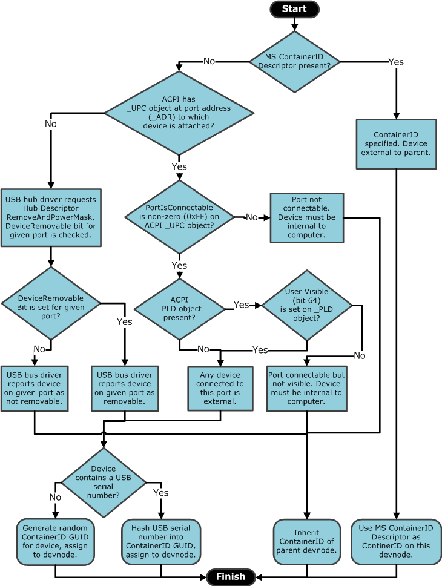

# How USB Devices are Assigned Container IDs

For a device that is connected to the computer through the Universal Serial Bus (USB), the following flowchart shows the heuristic used to assign a container ID to a USB device node ([*devnode*](https://msdn.microsoft.com/library/windows/hardware/ff556277#wdkgloss-devnode)).

This heuristic uses information from several sources to determine whether one of the following is true about a USB devnode:

-   Does the devnode represents a new device on the USB bus? If this is true, the devnode would receive a new container ID.

-   Is the devnode a child devnode of an existing device? If this is true, the devnode would inherit the container ID of the parent devnode.

A container ID for a USB device is generated in several ways. This decision is based on information that is contained in the device. This information is retrieved from ACPI settings, the USB bus driver and the USB hub.

This heuristic follows these steps for each devnode that the Plug and Play (PnP) manager enumerates on the USB bus.

1.  When queried by the USB bus driver, the USB device can report a container ID through the Microsoft operating system (OS) **ContainerID** descriptor.

    Starting with Windows 7, the operating system supports the Microsoft OS **ContainerID** descriptor. Through this descriptor, the independent hardware vendor (IHV) can precisely specify the container ID for a device. Therefore, the device's container ID is unique and does not change on every computer the device is installed in. Also, if it reports a Microsoft OS **ContainerID** descriptor, the device indicates to the operating system that all enumerated devnodes are part of the same physical device.

    The Microsoft OS **ContainerID** descriptor is intended to be used in devices that support simultaneous connection of the device through multiple system buses. For example, a printer may support simultaneous USB and IP network connections by using Plug and Play Extensions (PnP-X). By using a single Microsoft OS **ContainerID** descriptor, the same container ID is reported on both transports. Therefore, the PnP manager determines that the devnodes enumerated by each bus are part of the same physical device.

    For more information about the Microsoft OS **ContainerID** descriptor, see the [Microsoft OS Descriptors](http://go.microsoft.com/fwlink/p/?linkid=142397).

2.  If the USB device does not report a Microsoft OS **ContainerID** descriptor, the USB hub driver queries ACPI to determine whether the device is attached to an external-facing port.

    The operating system tries to locate an ACPI address (**_ADR**) object that matches the address of the USB port to which the device is connected. If a matching address object is found, the operating system performs the following steps:

    -   The USB port capabilities (**_UPC**) object is queried and the **PortIsConnectable** value is checked. If **PortIsConnectable** has a nonzero value of 0xFF, the port can be used to connect external devices. Therefore, any device connected to this port must be external to the computer.

    -   If the computer implements ACPI 3.0 and the **PortIsConnectable** byte is nonzero, the operating system additionally queries the physical location description (**_PLD**) object. The operating system checks if the **UserVisible** bit (bit 64) is set on the **_PLD** object. It does this as an additional check to ensure that the port is both connectable and externally visible to the user.

    If the information that is collected from ACPI indicates that the device is external, the PnP manager generates a container ID for the device. The **ContainedID** value is either a hash of the device's USB serial number or a randomly generated value. The devnode is assigned this container ID.

    **Note**  If the operating system determines that the device is internal to the computer, the devnode will inherit the container ID of the parent devnode, which (in this case) is the container ID of the computer itself.

     

3.  If ACPI does not return an **_ADR** object that matches the USB port address to which the device is connected, the PnP manager generates a container ID based on the removable status of the devnode.

    The USB hub driver queries the USB **RemoveAndPowerMask** descriptor from the hub, and checks whether the **DeviceRemovable** bit is set for the port to which the device is connected. If the **DeviceRemovable** bit is set, devices attached to the port are removable from the hub. If the **DeviceRemovable** bit is not set, devices attached to the port are not-removable from the hub.

    The USB bus driver reports the port removable/not-removable status to the PnP manager, which generates a **ContainerId** for the devnode through the following steps:

    -   If the hub indicates that devices attached to the given port are removable from the hub, the PnP manager determines that devices attached to this port are external to the computer. The container ID it generates for the devnode is either a hash of the USB serial number of the device, or is a randomly generated value.

    -   If the hub indicates that devices attached to the given port are not removable from the hub, the PnP manager determines that devices attached to this port are sub-functions of a multifunction device. In this case, the devnode inherits the container ID of the parent devnode.

For more information about the ACPI 3.0 interface, see [Advanced Configuration and Power Interface Specification Revision 3.0b](http://go.microsoft.com/fwlink/p/?linkid=145427).

 

 

