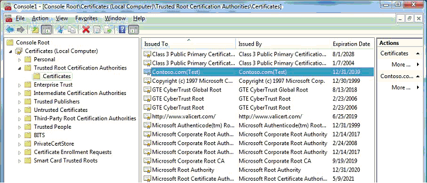

# Installing Test Certificates


To successfully install a test-signed [driver package](driver-packages.md) on a test computer, the computer must be able to verify the signature. To do that, the test computer must have the certificate for the certificate authority (CA) that issued the package's test certificate installed in the computer's Trusted Root Certification Authorities certificate store

The CA certificate must be added to the Trusted Root Certification Authorities certificate store only once. Once added, it can then be used to verify the signature of all drivers or driver packages, which were digitally signed with the certificate, before the driver package is installed on the computer.

The simplest way to add a test certificate to the Trusted Root Certification Authorities certificate store is through the [**CertMgr**](https://msdn.microsoft.com/library/windows/hardware/ff543411) tool. This topic will describe the procedure for installing the test certificate, Contoso.com(test). This certificate is stored within the *ContosoTest.cer* file. For more information about how this certificate was created, see [Creating Test Certificates](creating-test-certificates.md).

The following command-line uses Certmgr.exe to install, or add, the Contoso.com(test) certificate to the test computer's Trusted Root Certification Authorities certificate store:

```cpp
certmgr.exe /add ContosoTest.cer /s /r localMachine root
```

Where:

-   The /add option specifies that the certificate in the *ContosoTest.cer* file is to be added to the specified certificate store.

-   The **/s** option specifies that the certificate is to be added to a system store.

-   The /r option specifies the system store location, which is either *currentUser* or *localMachine*.

-   *Root* specifies the name of the destination store for the local computer, which is either ***root*** to specify the Trusted Root Certification Authorities certificate store or ***trustedpublisher*** to specify the Trusted Publishers certificate store.

After the certificate is copied to the Trusted Root Certification Authorities certificate store, you can view it through the Microsoft Management Console (MMC) Certificates snap-in, as described in [Viewing Test Certificates](viewing-test-certificates.md).

The following screen shot shows the Contoso.com(Test) certificate in the Trusted Root Certification Authorities certificate store.



For more information about CertMgr and its command-line arguments, see [**CertMgr**](https://msdn.microsoft.com/library/windows/hardware/ff543411).

For more information about how to install test certificates, see [Installing a Test Certificate on a Test Computer](installing-a-test-certificate-on-a-test-computer.md).

 

 


