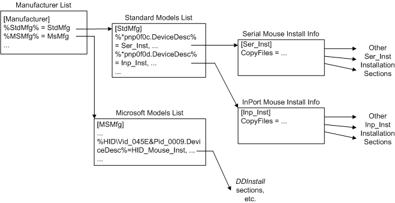

# Looking at an INF File


The following example shows selected fragments from a system-supplied class installer's INF file to show how any INF file is made up of sections, each of which contains zero or more lines, some of which are entries that reference additional INF-writer-defined sections:

```cpp
[Version]
Signature="$Windows NT$"
Class=Mouse
ClassGUID={4D36E96F-E325-11CE-BFC1-08002BE10318}
Provider=%Provider% ; defined later in Strings section
DriverVer=09/28/1999,5.00.2136.1
 
[DestinationDirs]
DefaultDestDir=12 ; DIRID_DRIVERS
 
; ... [ControlFlags] section omitted here
 
[Manufacturer]
%StdMfg%    =StdMfg         ; (Standard types)
%MSMfg%     =MSMfg          ; Microsoft
; ... %otherMfg% entries omitted here
 
[StdMfg]  ; per-Manufacturer Models section 
; Std serial mouse
%*pnp0f0c.DeviceDesc%= Ser_Inst,*PNP0F0C,SERENUM\PNP0F0C,SERIAL_MOUSE
; Std InPort mouse
%*pnp0f0d.DeviceDesc%      = Inp_Inst,*PNP0F0D
     ; ... more StdMfg entries and following
     ; MSMfg and xxMfg Models sections omitted here
 
     ; per-Models DDInstall (Ser_Inst, Inp_Inst, etc.)
     ; sections also omitted here
 
[Strings] 
; where INF %strkey% tokens are defined as user-visible (and
; possibly as locale-specific) strings.
Provider = "Microsoft"
; ...
StdMfg   = "(Standard mouse types)"
MSMfg    = "Microsoft"
 
; ...
*pnp0f0c.DeviceDesc   = "Standard Serial Mouse"
*pnp0f0d.DeviceDesc   = "InPort Adapter Mouse"
; ... 
HID\Vid_045E&Pid_0009.DeviceDesc = "Microsoft USB Intellimouse"
; ... 
```

A few sections within the previous INF file have system-defined names, such as **Version**, **DestinationDirs**, **Manufacturer**, and **Strings**. Some named sections like **Version**, **DestinationDirs**, and **Strings** have only simple entries. Others reference additional INF-writer-defined sections, as shown in the previous example of the **Manufacturer** section.

Note the implied hierarchy of related sections for mouse device driver installations starting with the **Manufacturer** section in the previous example. The following figure shows the hierarchy of some sections in the INF file.



Note the following about the implied hierarchy of an INF file:

- Each **%**<em>xx</em>Mfg<strong>%</strong> entry in the **Manufacturer** section references a per-manufacturer *Models* section (StdMfg, MSMfg) elsewhere in the INF file.

  The entries in the previous example use %*strkey*% tokens.

- Each *Models* section specifies some number of entries; in the example they are **%**<em>xxx</em>.DeviceDesc<strong>%</strong> tokens.

  Each such **%**<em>xxx</em>.DeviceDesc<strong>%</strong> token references some number of per-models *DDInstall* sections (Ser_Inst and Inp_Inst) for that manufacturer's product line, with each entry identifying a single device (\*PNP0F0C and \*PNP0F0D, hence the "DeviceDesc" shown here) or a set of compatible models of a device.

- Each such *DDInstall*-type *Xxx*_Inst section, in turn, can have certain system-defined extensions appended and/or can contain directives that reference additional INF-writer-defined sections. For example, the full INF file that is shown as fragments in the previous example also has a Ser_Inst<strong>.Services</strong> section, and its Ser_Inst section has a **CopyFiles** directive that references a Ser_CopyFiles section elsewhere in this INF file.

 

 


