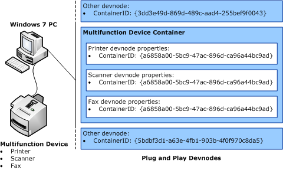

# Overview of Container IDs

In the Windows family of operating systems, devices are basically a collection of functional device instances, each of which represents a functional endpoint that enables some form of communication to the device.

The term *device node* ([*devnode*](https://msdn.microsoft.com/library/windows/hardware/ff556277#wdkgloss-devnode)) refers to the [*driver stack*](https://msdn.microsoft.com/library/windows/hardware/ff556277#wdkgloss-driver-stack) for such a functional endpoint, in addition to the properties that describe the endpoint and its associated state. For example, a multifunction device that supports printer, scanner, and fax functionality can have multiple devnodes, one for each functional endpoint in the device.

Before Windows 7, each functional endpoint had a devnode that is associated with it. Windows platform components and third-party applications can query devnodes for device status and information, and can communicate with device hardware though interfaces that functional endpoints expose.

For a single-function device, a single devnode contains all the information that relates to device's functional endpoint. Similarly, a multifunction device has multiple devnodes that are associated with each of the device's functional endpoints. However, Windows cannot recognize that a group of devnodes originated from the same physical device. Each devnode that belongs to the same multifunction device does not include any identification information that enables the Plug and Play (PnP) manager to group several devnodes as a single device. Therefore, it is not possible to have a holistic view of the device and the functions that a single physical device provides.

Starting with Windows 7, the operating system uses a new ID (*container ID*) to group one or more devnodes that originated from and belong to each instance of a particular physical device. The container ID is a property of every devnode, and is specified through a globally unique identifier ([*GUID*](https://msdn.microsoft.com/library/windows/hardware/ff556283#wdkgloss-guid)) value.

Each instance of a physical device that is installed in the computer has a unique container ID. All devnodes that represent a function on that instance of the physical device share the same container ID. The following figure shows an example of that relationship.

There is one container ID with a special meaning for bus drivers: NULL_GUID which is defined as: {00000000-0000-0000-0000-000000000000}.

In general, do not return NULL_GUID as the default case when reporting a container ID. Instead, do not handle IRP_MN_QUERY_ID for the BusQueryContainerIDs case and let PnP apply its default logic.

When returning NULL_GUID as a container ID, a bus driver declares to PnP that the device must not be part of any container, thus returning NULL_GUID is appropriate only in very special cases. For example, a [*devnode*](https://msdn.microsoft.com/library/windows/hardware/ff556277#wdkgloss-devnode) such as a volume device may span multiple disks in multiple containers but do not belong to any container. Such a device will have a [**DEVPKEY_Device_BaseContainerId**](https://msdn.microsoft.com/library/windows/hardware/ff542360) equal to NULL_GUID, and it will not have a [**DEVPKEY_Device_ContainerId**](https://msdn.microsoft.com/library/windows/hardware/ff542400) at all.

Aside from very special cases, a bus driver should never return NULL_GUID when reporting a hardware device and bus drivers should guard against faulty hardware that reports a NULL_GUID value from their bus. In these cases the bus driver should either threat this as a device error, or treat it as if the device did not report a value.

 

 

