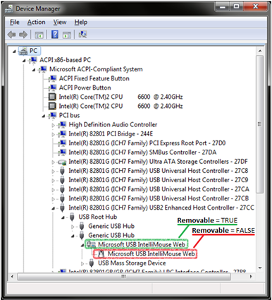

# Overview of the Removable Device Capability

The removable device capability is a bit (**Removable**) that bus drivers set in the [**DEVICE_CAPABILITIES**](https://msdn.microsoft.com/library/windows/hardware/ff543095) structure in response to the [**IRP_MN_QUERY_CAPABILITIES**](https://msdn.microsoft.com/library/windows/hardware/ff551664) function code for a specified device node ([*devnode*](https://msdn.microsoft.com/library/windows/hardware/ff556277#wdkgloss-devnode)).

Bus drivers set the removable device capability for a devnode when the devnode and all its child devnodes make up a device that can be physically removed, disconnected, or unplugged from its parent devnode while the computer is running. Typically, a devnode should be marked as removable if it is the topmost devnode in a devnode topology.

Setting the removable device capability correctly on a devnode is important. If a bus driver cannot provide a container ID for a devnode that it is enumerating, the Plug and Play (PnP) manager uses the removable device capability to generate a container ID for all devnodes enumerated for the device.

For example, suppose that a single-function device, such as a mouse, is connected to the computer through USB. In this case, the USB bus driver detects the new device, detects that it is a USB human interface device (HID), and creates a USB HID devnode for the device. The HID devnode also detects that the HID device is a mouse and creates a child devnode for a HID-compliant mouse. At this point, the mouse is installed and is functional on the computer. Both of the new devnodes use independent [*driver stacks*](https://msdn.microsoft.com/library/windows/hardware/ff556277#wdkgloss-driver-stack).

As a general rule, the topmost (parent) devnode of the device should be set as removable, while each of its child devnodes should not be set as removable. In the previous example, the USB bus driver sets the **Removable** bit to **TRUE** for the USB HID devnode, and sets the **Removable** bit to **FALSE** for the child HID-compliant mouse devnode.

The following Device Manager screen shot shows the devnode topology for a generic USB mouse, and shows which devnodes of the mouse are marked as removable.

 

 

