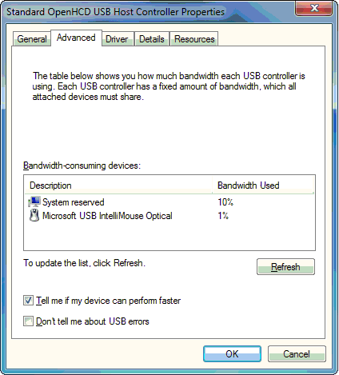

# Sample Custom Property Page

The following dialog box contains a sample custom property page:

In the previous dialog box, a provider supplies a property page named Properties. By default, the system supplies the **General**, **Driver**, and **Details** tabs shown in the dialog box. When appropriate, the system also provides **Resources** and **Power** tabs.

**Note**  A setup component can define more than one property page for its device or device class. Each tab should have a name that concisely describes the purpose of the page. The system does not check to make sure that the names are unique.

 

 

 

