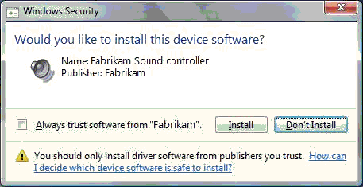
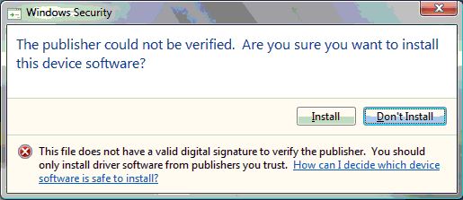

# Signature Categories and Driver Installation

Before Windows Vista and later versions of Windows stage a [driver package](driver-packages.md) into the [Driver Store](driver-store.md) and install the driver package on a device, the operating system analyzes the driver package's signature. If a signature is present, Windows validates all the driver package's files against that signature. Based on the results of this analysis, Windows puts the driver package in one of the following categories:

**Signed by a Microsoft Windows signing authority.**   
These driver packages are either inbox, signed by WHQL, or signed by Windows Sustained Engineering.

**Signed by a trusted publisher.**   
These driver packages were signed by a third-party, and the user has explicitly selected to always trust signed driver packages from this publisher.

**Signed by an untrusted publisher.**   
These driver packages were signed by a third-party, and the user has explicitly selected to never trust driver packages from this publisher.

**Signed by publisher of unknown trust.**   
These driver packages were signed by a third-party, and the user has not indicated whether to trust this publisher.

**Altered.**   
These driver packages are signed, but Windows has detected that at least one file in the [driver package](driver-packages.md) was altered since the package was signed.

**Unsigned.**   
These driver packages are either unsigned or have an invalid signature. Valid signatures must be created by using a certificate that was issued by a trusted Certificate Authority (CA).

After the driver package is categorized, Windows determines whether it should be staged into the [Driver Store](driver-store.md) and installed on a device. The process depends on the type of user that initiated the driver package action. For non-administrative and standard users, Windows does not prompt the user. It automatically installs driver packages signed through either a Windows signing authority or a trusted publisher, and silently refuses to install all others.

Administrative users have more flexibility:

-   If a driver package is signed by a Windows signing authority or a trusted publisher, Windows stages and installs the driver package without prompting the user.

-   If the driver package is signed by an untrusted publisher, Windows does not install the driver pacakge. Windows does not prompt the user in this case, but logs an error to *Setupapi.dev.log*.

-   If the driver package was signed by a publisher of unknown trust, Windows prompts the user with the following Windows Security dialog box.

    

    The user must explicitly select whether to install this driver package. The user is also able to add the publisher to the list of trusted publishers on the user's system. If the user selects this option, all future driver packages from this publisher are treated as trusted when installed on the user's system. If the user does not select this option, the publisher remains in the unknown trust category and administrative users continue to receive this prompt if they attempt to install additional driver packages from this publisher.

-   If the driver package lacks a valid signature or was altered, Windows prompts administrators with the following Windows Security dialog box. Again, the user must explicitly select whether to install the driver package.

    

**Note**  On Windows Vista and later versions of Windows, in order for users to play next-generation premium content, such as HD DVD and other formats that are licensed under the *Advanced Access Content System (AACS) Specification*, all kernel-mode components on their system must be signed. That means that, if an administrative user selects to install an unsigned or altered driver package, the system is not allowed to play premium content. For more information about how to protect media components in Windows Vista, see [Code Signing for Protected Media Components in Windows Vista](https://download.microsoft.com/download/a/f/7/af7777e5-7dcd-4800-8a0a-b18336565f5b/pmp-sign.doc).
