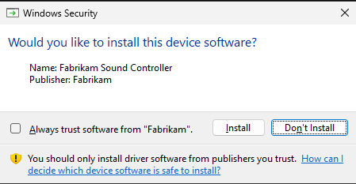
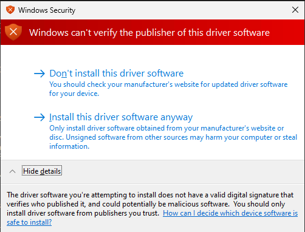

# Signature Categories and Driver Installation

Before Windows Vista and later versions of Windows installs a driver, the operating system analyzes the driver's signature. If a signature is present, Windows validates all the driver's files against that signature. Based on the results of this analysis, Windows puts the driver in one of the following categories:

**Signed by a Microsoft Windows signing authority.**   
These drivers are either inbox, signed by WHQL, or signed by Windows Sustained Engineering.

**Signed by a trusted publisher.**   
These drivers were signed by a third-party, and the user has explicitly selected to always trust signed drivers from this publisher.

**Signed by an untrusted publisher.**   
These drivers were signed by a third-party, and the user has explicitly selected to never trust drivers from this publisher.

**Signed by publisher of unknown trust.**   
These drivers were signed by a third-party, and the user has not indicated whether to trust this publisher.

**Altered.**   
These drivers are signed, but Windows has detected that at least one file in the [driver package](driver-packages.md) was altered since the package was signed.

**Unsigned.**   
These drivers are either unsigned or have an invalid signature. Valid signatures must be created by using a certificate that was issued by a trusted Certificate Authority (CA).

After the driver is categorized, Windows determines whether it should be installed. The process depends on the type of user. For nonadministrative and standard users, Windows does not prompt the user. It automatically installs drivers signed through either a Windows signing authority or a trusted publisher, and silently refuses to install all others.

Administrative users have more flexibility:

-   If a driver is signed by a Windows signing authority or a trusted publisher, Windows installs the driver without prompting the user.

-   If the driver is signed by an untrusted publisher, Windows does not install the driver. Windows does not prompt the user in this case, but logs an error to *Setupapi.dev.log*.

-   If the driver was signed by a publisher of unknown trust, Windows prompts the user with the following Windows Security dialog box.

    

    The user must explicitly select whether to install this driver. The user is also able to add the publisher to the list of trusted publishers on the user's system. If the user selects this option, all future drivers from this publisher are treated as trusted when installed on the user's system. If the user does not select this option, the publisher remains in the unknown trust category and administrative users continue to receive this prompt if they attempt to install additional drivers from this publisher.

-   If the driver lacks a valid signature or was altered, Windows prompts administrators with the following Windows Security dialog box. Again, the user must explicitly select whether to install the driver.

    

**Note**  On Windows Vista and later versions of Windows, in order for users to play next-generation premium content, such as HD DVD and other formats that are licensed under the *Advanced Access Content System (AACS) Specification*, all kernel-mode components on their system must be signed. That means that, if an administrative user selects to install an unsigned or altered driver, the system is not allowed to play premium content. For more information about how to protect media components in Windows Vista, see [Code Signing for Protected Media Components in Windows Vista](http://go.microsoft.com/fwlink/p/?linkid=74262).

 

 

 

[Send comments about this topic to Microsoft](mailto:wsddocfb@microsoft.com?subject=Documentation%20feedback%20%5Bdevinst\devinst%5D:%20Signature%20Categories%20and%20Driver%20Installation%20%20RELEASE:%20%287/22/2016%29&body=%0A%0APRIVACY%20STATEMENT%0A%0AWe%20use%20your%20feedback%20to%20improve%20the%20documentation.%20We%20don't%20use%20your%20email%20address%20for%20any%20other%20purpose,%20and%20we'll%20remove%20your%20email%20address%20from%20our%20system%20after%20the%20issue%20that%20you're%20reporting%20is%20fixed.%20While%20we're%20working%20to%20fix%20this%20issue,%20we%20might%20send%20you%20an%20email%20message%20to%20ask%20for%20more%20info.%20Later,%20we%20might%20also%20send%20you%20an%20email%20message%20to%20let%20you%20know%20that%20we've%20addressed%20your%20feedback.%0A%0AFor%20more%20info%20about%20Microsoft's%20privacy%20policy,%20see%20http://privacy.microsoft.com/default.aspx. "Send comments about this topic to Microsoft")

