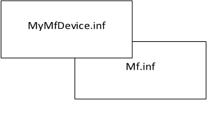

# Source Media for INF Files


The methods that you should use to specify source media for device files depend on whether your INF files ship separately from the operating system or are included with the operating system.

### Source Media for INF Files

INF files for drivers specify where the files are located by using [**SourceDisksNames**](inf-sourcedisksnames-section.md) and [**SourceDisksFiles**](inf-sourcedisksfiles-section.md) sections. If such an INF contains **Include** and **Needs** entries in the [***DDInstall***](inf-ddinstall-section.md) section to reference other INF files and sections, those files and sections may specify additional possible source locations.

If an INF has **SourceDisksNames** and **SourceDisksFiles** sections and no **Include** entries, the **SourceDisksNames** and **SourceDisksFiles** sections must list all the source media and source files in the driver package except for the catalog and INF files.

Catalog files must be in the same location as the INF file. Catalog files must not be compressed. If the installation media includes multiple disks, then *a separate copy of the INF and catalog files must be included on every disk*. This is because the INF and catalog files must continue to be accessible throughout the entire installation.

### Source Media and INF Files that Contain Include and Needs Entries

If an INF has [**SourceDisksNames**](inf-sourcedisksnames-section.md) and [**SourceDisksFiles**](inf-sourcedisksfiles-section.md) sections and **Include** and **Needs** entries, Windows uses the main INF file plus any of the included INF files to locate source media. It is especially important with included files to be as precise as possible when specifying source media and source file locations.

Consider the hierarchy of included INF files that are shown in the following figure:



This figure shows an INF file (*MyMfDevice.inf)* for a multifunction device. This INF file includes the system-supplied *Mf.inf* file. When Windows searches for source media from which to copy a file referenced in *MyMfDevice.inf*, it looks for a **SourceDisksFiles** section in *MyMfDevice.inf* and in any included INF files that reference the file to be copied. Windows searches *MyMfDevice.inf* first, but it does not guarantee the order in which it searches the included INF files.

Decorated **SourceDisksFiles** sections take precedence over undecorated sections, even if the [*decorated INF section*](https://msdn.microsoft.com/library/windows/hardware/ff556277#wdkgloss-decorated-inf-section) is in an included file. For example, for the INF files that are shown in the previous figure, if *Mf.inf* contains a **\[SourceDisksFiles.x86\]** section and *MyMfDevice*.*inf* contains only an undecorated **\[SourceDisksFiles\]** section, Windows uses the decorated section from *Mf.inf* first when it installs on an x86 computer. Therefore, an INF that includes other INF files should contain section names that use platform extensions.

Typically, a vendor-supplied INF should specify the location of the files in its [driver package](driver-packages.md) and should not cause Windows to search included INF files for file locations. In other words, a vendor INF that copies files should specify both a **SourceDisksNames** and a **SourceDisksFiles** section, those sections should be decorated with platform extensions, and those sections should contain information for all the files directly copied by the INF.

Vendor file names should be as vendor-specific as possible to avoid potential filename conflicts.

Please note that **Includes** entries can only be used to specify system-supplied INF files.

An INF file that uses a section in another INF file by using the **Include** and **Needs** entries might have to use an accompanying section to maintain consistency. For example, if an INF file references the installation section (*DDInstall*) of another INF file in order to install the driver, it must reference an [**INF *DDInstall*.Services section**](inf-ddinstall-services-section.md) to install the accompanying service. Such an INF file might have the following sections:

```cpp
[DDInstall]
Include = AnotherINFFile.inf
Needs = AnotherINFFileDDInstall

[DDInstall.Services]
Include = AnotherINFFile.inf
Needs = AnotherINFFileDDInstall.Services
```

Also note that each section that specifies a **Needs** directive must also specify an **Include** directive, even if the same INF file was specified in an **Include** directive elsewhere in the INF.

 

 


