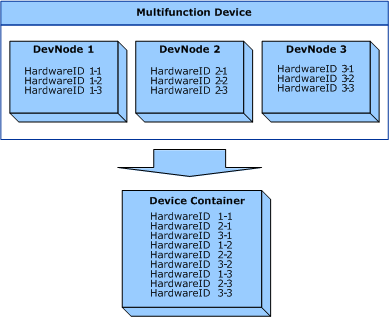

# Specifying Hardware IDs for a Multifunction Device


You can specify more than one [**HardwareID**](https://msdn.microsoft.com/library/windows/hardware/ff546114) element for a physical device. This is done by specifying multiple **HardwareID** element values within the parent [**HardwareIDList**](https://msdn.microsoft.com/library/windows/hardware/ff546121) element. Each value must specify a unique [hardware ID](hardware-ids.md) for the device.

For example, consider a single-function USB printer from the company Contoso, Ltd. The following **HardwareID** elements can be used to define the device:

```cpp
<HardwareIDList>
  <HardwareID>DOID:USB\VID_1234&PID_1234&REV_0000</HardwareID>
  <HardwareID>DOID:USB\VID_1234&PID_1234</HardwareID>
  <HardwareID>DOID:USBPRINT\Contoso_Ltd_Co9999/HardwareID>
</HardwareIDList>
```

If the device is a multifunction device, a device container combines all the [hardware IDs](hardware-ids.md) from the device nodes ([*devnodes*](https://msdn.microsoft.com/library/windows/hardware/ff556277#wdkgloss-devnode)) for each hardware function on the device. For more information about device containers and container IDs, see [Container IDs](container-ids.md).

The following figure shows the relationship between a multifunction device's devnodes and device container.



Depending on your multifunction device, you can decide which [hardware ID](hardware-ids.md) values are specified by using separate [**HardwareID**](https://msdn.microsoft.com/library/windows/hardware/ff546114) elements in the [**HardwareIDList**](https://msdn.microsoft.com/library/windows/hardware/ff546121) element. Multiple hardware IDs can be specified in any order in the **HardwareIDList** element. However, you should be aware of the following points:

-   Within a given devnode, the ranking of hardware IDs by the operating system is deterministic. For example, in the previous figure, *HardwareID1-1* is always ranked higher than *HardwareID1-2* and *HardwareID1-3*.

-   The operating system does not consistently rank a hardware ID from one devnode higher than a hardware ID from another devnode. For example, in the previous figure, the operating system might not always rank *HardwareID1-1* higher than *HardwareID2-1*.

Therefore, make sure that your metadata package does not rely on the order or ranking of [hardware IDs](hardware-ids.md) across the devnodes for a device. You should use all relevant hardware IDs for your multifunction device in the [**HardwareIDList**](https://msdn.microsoft.com/library/windows/hardware/ff546121) element of your device metadata package. This guarantees that the operating system selects your metadata package regardless of the ranking of hardware IDs.

Based on the [*devnode*](https://msdn.microsoft.com/library/windows/hardware/ff556277#wdkgloss-devnode) topology shown in the previous figure, consider the following suggestions:

-   Specify *HardwareID1-1*, *HardwareID2-1,* and *Hardware ID3-1* in a new device metadata package if you have already published another metadata package that specifies only *HardwareID2-1*.

    If the operating system ranks *HardwareID2-1* higher than *HardwareID1-1* and finds that*HardwareID2-1* is specified in both the old and new metadata package, the operating system selects the metadata package based on the value of the [**LastModifiedDate**](https://msdn.microsoft.com/library/windows/hardware/ff548624) XML element. In this case, the operating system selects the new metadata package.

-   If your new metadata package lists only *HardwareID1-1*, the operating system will not select the new package if *HardwareID2-1* is ranked higher than *HardwareID1-1.*

For more information about metadata package selection and ranking, see [How the DMRC Selects a Device Metadata Package](how-the-dmrc-selects-a-device-metadata-package.md).

 

 


