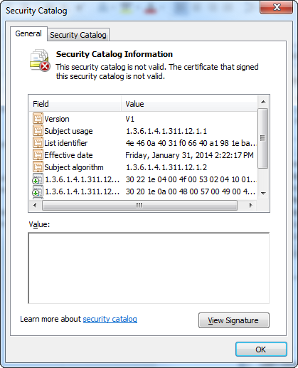

# Test Signing


Starting with Windows Vista, x64-based versions of Windows required all software running in kernel mode, including drivers, to be digitally signed in order to be loaded. Initially you could use the F8 switch (on each boot, before Windows loads) to temporarily disable the load-time enforcement of requiring a valid signature in your driver. But this will become tedious after the first few uses. You can attach a kernel debugger to your test computer which will disable the same load-time enforcement checks after you use the correct BCDEdit commands. However, eventually it will become necessary to test-sign your driver during its development, and ultimately release-sign your driver before publishing it to users.

## Installing an Unsigned Driver during Development and Test


*Excerpt from* [Installing an Unsigned Driver during Development and Test](installing-an-unsigned-driver-during-development-and-test.md):

By default, 64-bit versions of Windows Vista and later versions of Windows will load a kernel-mode driver only if the kernel can verify the driver signature. However, this default behavior can be disabled to during early driver development and for non-automated testing. Developers can use one of the following mechanisms to temporarily disable load-time enforcement of a valid driver signature. However, to fully automate testing of a driver that is installed by Plug and Play (PnP), the [catalog file](catalog-files.md) of the driver must be signed. Signing the driver is required because Windows Vista and later versions of Windows display a driver signing dialog box for unsigned drivers that require a system administrator to authorize the installation of the driver, potentially preventing any user without the necessary privileges from installing the driver and using the device. This PnP driver installation behavior cannot be disabled on Windows Vista and later versions of Windows.

### **Use the F8 Advanced Boot Option**

Windows Vista and later versions of Windows support the F8 Advanced Boot Option -- "Disable Driver Signature Enforcement" -- that disables load-time signature enforcement for a kernel-mode driver only for the current system session. This setting does not persist across system restarts.

The following boot option screen will appear during reboot providing the option to disable the driver signature enforcement. This provision will allow installation of an unsigned driver for test purpose.


### <a href="" id="attach-a-kernel-debugger-to-disable-signature-verification"></a> Attach a Kernel Debugger to Disable Signature Verification

Attaching an active kernel debugger to a development or test computer disables load-time signature enforcement for kernel-mode drivers. To use this debugging configuration, attach a debugging computer to a development or test computer, and enable kernel debugging on the development or test computer by running the following command:

```cpp
bcdedit -debug on
```

To use BCDEdit, the user must be a member of the Administrators group on the system and run the command from an elevated command prompt. To open an elevated Command Prompt window, create a desktop shortcut to *Cmd.exe*, right-click the shortcut, and select **Run as administrator**.

However, be aware that there are also situations in which a developer might have to attach a kernel debugger, yet also need to maintain load-time signature enforcement. See [Appendix 1: Enforcing Kernel-Mode Signature Verification in Kernel Debugging Mode](appendix-1--enforcing-kernel-mode-signature-verification-in-kernel-debugging-mode.md) for how to accomplish this.

## Test Sign a Driver Package


Instead of using the above two methods to bypass driver signing enforcement requirements, the best approach is to test sign a driver package. Test signing and driver installation can be done on the development computer, but you may want to have two computers, one for development and signing, and the other for testing.

*Excerpt from* [How to Test-Sign a Driver Package](how-to-test-sign-a-driver-package.md):

<a href="" id="signing-computer"></a>**Signing computer**  
This is the computer that is used to test-sign a driver package for Windows Vista and later versions of Windows. This computer must be running Windows XP SP2 or later versions of Windows. In order to use the [driver signing tools](https://msdn.microsoft.com/library/windows/hardware/ff552958), this computer must have the Windows Vista and later versions of the Windows Driver Kit (WDK) installed. This can also be the development computer.

<a href="" id="test-computer"></a>**Test computer**  
This is the computer that is used to install and test the test-signed driver package. This computer must be running Windows Vista or later versions of Windows.

## Test Signing Procedure


Driver packages will contain the driver binary, the INF file, the CAT file and any other necessary files. A driver package may contain sub directories like x86, AMD64, IA64, if the driver is built for more than one target processor type. Perform these steps using your development/signing computer.

The following procedure describes the steps to test sign a driver package:

1.  Build the driver for the target. If you are building a driver for Windows 8.0 or Windows 8.1, then use Visual Studio 2012 or Visual Studio 2013 with the corresponding WDK, installed e.g., Windows 8.0 or 8.1 WDK respectively.

    All the command tools described below should be used from the corresponding tool/build command window Visual Studio 2012 or Visual Studio 2013.

    **Note**  The command tools for Visual Studio are located in the install directory, C:\\Program Files (x86)\\Microsoft Visual Studio 12.0\\Common7\\Tools\\Shortcuts


Any of the five shortcuts for command prompt will have, makecert.exe, inf2cat.exe, signtool.exe, certmgr.exe, etc., commands.

You may choose the most general, “Developer Command Prompt for VS2013”. The shortcuts can be pinned down to the Task Bar for easy access.

**Note**  Please note that with Visual Studio, instead of the command tool approach of driver signing, you can also use the Visual Studio 2013 development environment (also known as the IDE) to sign a driver package. Please refer to [Appendix 2: Signing Drivers with Visual Studio](appendix-2--signing-drivers-with-visual-studio.md) for more information.


2.  Create a driver package folder and copy the driver files, maintaining any sub directories needed, for example C:\\DriverTestPackage.
3.  Create an inf file for the driver package. Make sure that the date on the inf file is not prior to 08/21/2006 for Vista and similarly later dates for Windows 8.0, Windows 8.1, Windows 7.0 and Windows 7.1. It is advisable that you test the inf file using the chkinf.bat tool from WDK on the inf file so that no error is reported. If it is a printer driver, then test the inf file with the tool chkinf.bat and INFGate.exe from WDK.
4.  *Excerpt from* [Creating Test Certificates](creating-test-certificates.md):

    The following command-line example uses MakeCert to complete the following tasks:

    -   Create a self-signed test certificate named *Contoso.com(Test)*. This certificate uses the same name for the subject name and the certificate authority (CA).

    -   Put a copy of the certificate in an output file that is named *ContosoTest.cer*.

    -   Put a copy of the certificate in a certificate store that is named *PrivateCertStore*. Putting the test certificate in *PrivateCertStore* keeps it separate from other certificates that may be on the system.

    Use the following MakeCert command to create the *Contoso.com(Test)* certificate:

    ```cpp
    makecert -r -pe -ss PrivateCertStore -n CN=Contoso.com(Test) ContosoTest.cer
    ```

    Where:

    -   The **-r** option creates a self-signed certificate with the same issuer and subject name.

    -   The **-pe** option specifies that the private key that is associated with the certificate can be exported.

    -   The **-ss** option specifies the name of the certificate store that contains the test certificate (*PrivateCertStore*).

    -   The **-n CN=** option specifies the name of the certificate, Contoso.com(Test). This name is used with the [**SignTool**](https://msdn.microsoft.com/library/windows/hardware/ff551778) tool to identify the certificate.

    -   *ContosoTest.cer* is the file name that contains a copy of the test certificate, Contoso.com(Test). The certificate file is used to add the certificate to the Trusted Root Certification Authorities certificate store and the Trusted Publishers certificate store.

    *Excerpt from* [Viewing Test Certificates](viewing-test-certificates.md):

    After the certificate is created and a copy is put in the certificate store, the Microsoft Management Console (MMC) Certificates snap-in can be used to view it. Do the following to view a certificate through the MMC **Certificates** snap-in:

    1.  Click **Start** and then click Start Search.

    2.  To start the Certificates snap-in, type Certmgr.msc and press the **Enter** key.

    3.  In the left pane of the Certificates snap-in, expand the PrivateCertStore certificate store folder and double-click Certificates.

    The following screen shot shows the Certificates snap-in view of the **PrivateCertStore** certificate store folder.

    

    To view the details about the Contoso.com(Test) certificate, double-click the certificate in the right pane. The following screen shot shows the details about the certificate.

    

    Notice that the Certificate dialog box states: "This CA Root certificate is not trusted. To enable trust, install this certificate in the Trusted Root Certification Authorities store." This is the expected behavior. The certificate cannot be verified because Windows does not trust the issuing authority, "Contoso.com(Test)" by default.

5.  Create a catalog file (.cat extension). Use the inf2cat tool as shown below to create the catalog file. Please note that no space is allowed for the switches, /driver:&lt;no space&gt;&lt;full path&gt;, /os: :&lt;no space&gt;&lt;os1 name&gt;,:&lt;no space&gt;&lt;os2 name&gt;.

    ```cpp
    inf2cat  /v  /driver:C:\DriverTestPackage  /os:7_64,7_x86 ,XP_X86
    ```

    This creates a catalog file with the name given in the driver’s .inf file. Additional comma separated OSes can be added selectively or all as shown below with no spaces.

    ```cpp
    /os:2000,XP_X86,XP_X64,Server2003_X64,Vista_X64,Vista_X86,7_x86,7_64,Server2008_x86,Server2008_x64,Sever2008_IA64,Server2008R2_x86,Server2008R2_x64,Server2008R2_IA64,8_x86,8_x64, 8_ARM, Server8_x64
    ```

    The updated inf2cat from the new 8.1 WDK has /os option values of 6_3_X86, 6_3_X64, 6_3_ARM and SERVER_6_3_X64.

    Example of INF file for the Version section.

    ```cpp
    [Version]
    Signature="$WINDOWS NT$"
    Class=TOASTER
    ClassGuid={B85B7C50-6A01-11d2-B841-00C04FAD5171}
    Provider=%ToastRUs%
    DriverVer=09/21/2006,6.0.5736.1
    CatalogFile.NTx86  = tostx86.cat
    CatalogFile.NTIA64 = tostia64.cat
    CatalogFile.NTAMD64 = tstamd64.cat
    ```

    The /driver (or /drv) option specifies the directory which contains one or more INF files. Within this directory, catalog files are created for those INF files that contain one or more CatalogFile directives. The catalog file name is not restricted to 8.3 name.

    Inf2Cat creates the catalog file tstamd64.cat if the command-line argument /os:7_X64 is used. Similarly, the tool creates the catalog file toastx86.cat if the /os:XP_X86, option is used, similarly for Server2008R2_IA64. In case, only one catalog file is desired, then only one entry in the INF file as shown below will suffice.

    ```cpp
    CatalogFile.NT  = toaster.cat
    ```

    Or,

    ```cpp
    CatalogFile = toaster.cat
    ```

    If the date in the INF file is not greater than the OS release date, then the following error will be reported by the inf2cat tool if the /os parameter was for Windows 7 and date set in the INF file was an earlier date.

    ```cpp
    Signability test failed.
    Errors:
    22.9.7: DriverVer set to incorrect date (must be postdated to 4/21/2009 for newest OS) in \toaster.inf
    ```

    The inf2cat tool is very strict on checking each folder and sub-folder about the presence of every file which has an entry in the INF file. There will be meaningful error messages on such missing entries.

    The cat file can be opened from explorer by double click or right clicking on the file and selecting Open. The Security tab will show some entries with GUID values. Selecting a GUID value will display details including the driver files of the driver package and the OSes added as shown below:

    ```cpp
    OSAttr  2:5.1,6.1
    ```

    The number 5.1 is the version number for XP OS and 6.1 for Windows 7.0 OS.

    It is advisable that the cat file is checked to verify the inclusion of the driver files and the selected OSes. At any time if any driver file is added or removed, the INF file has been modified, the cat file must be recreated and signed again. Any omission here will cause installation errors which are reported on the setup log file (setupapi.dev.log for Vista and above or setupapi.log file for XP).

6.  *Excerpt from* [Test-Signing a Driver Package's Catalog File](test-signing-a-driver-package-s-catalog-file.md):

    The following command line shows how to run SignTool to do the following:

    -   Test-sign the *tstamd64.cat* catalog file of the *ToastPkg* sample [driver package](driver-packages.md). For more information about how this [catalog file](catalog-files.md) was created, see [Creating a Catalog File for Test-Signing a Driver Package](creating-a-catalog-file-for-test-signing-a-driver-package.md).

    -   Use the Contoso.com(Test) certificate from the PrivateCertStore for the test signature. For more information about how this certificate was created, see [Creating Test Certificates](creating-test-certificates.md).

    -   Timestamps the digital signature through a time stamp authority (TSA).

    To test-sign the *tstamd64.cat* catalog file, run the following command line:

    ```cpp
    Signtool sign /v /s PrivateCertStore /n Contoso.com(Test) /t http://timestamp.verisign.com/scripts/timstamp.dll tstamd64.cat
    ```

    Where:

    -   The **sign** command configures SignTool to sign the specified catalog file, tstamd64.cat.

    -   The **/v** option enables verbose operations, in which SignTool displays successful execution and warning messages.

    -   The **/s** option specifies the name of the certificate store (*PrivateCertStore)* that contains the test certificate.

    -   The **/n** option specifies the name of the certificate (*Contoso.com(Test))* that is installed in the specified certificate store.

    -   The **/t** option specifies URL of the TSA (*http://timestamp.verisign.com/scripts/timstamp.dll*) which will time stamp the digital signature.
        **Important**   Including a time stamp provides the necessary information for key revocation in case the signer's code signing private key is compromised.


-   *tstamd64.cat* specifies the name of the catalog file, which will be digitally-signed.

tstamd64.cat specifies the name of the catalog file, which will be digitally-signed. You can open the cat file as described before


7.  *Modified excerpt from* [Test-Signing a Driver through an Embedded Signature](test-signing-a-driver-through-an-embedded-signature.md):

    -   In 64-bit versions of Windows Vista and later versions of Windows, the [kernel-mode code signing requirements](kernel-mode-code-signing-requirements--windows-vista-and-later-.md) state that a [*boot-start driver*](https://msdn.microsoft.com/library/windows/hardware/ff556272#wdkgloss-boot-start-driver) must have an embedded signature. This is required regardless of whether the driver's driver package has a digitally-signed catalog file.

    Below is the command to embed sign a kernel mode driver binary file.

    ```cpp
    signtool sign  /v  /s  PrivateCertStore  /n  Contoso.com(Test)  /t http://timestamp.verisign.com/scripts/timestamp.dll   amd64\toaster.sys
    ```

    amd64\\toaster.sys specifies the name of the kernel-mode binary file which will be embed-signed.

    Within the WDK 7.1 installation directory, the toaster sample is located in the src\\general\\toaster\\toastpkg\\toastcd\\ directory. The Windows 8 or 8.1 WDK samples are to be downloaded from the Microsoft download site. The samples do not come with the Windows 8 or 8.1 Windows Driver Kit.

    The catalog file when opened by double clicking the file in Windows Explorer, you will see the following screen shot. Note that “View Signature” is now highlighted.

    

    If you click on “View Signature”, you will see the screen shot below providing the next viewing option from “View Certificate”, which then will give the option of “Install Certificate” from the dialog itself. Although we are providing below the preferred command line option of installing the certificate using the certmgr.exe tool.

    

    

The driver can now be tested either on the signing computer or the test computer. If you are using the test computer, copy the driver package to the machine keeping the file structure intact. The tool certmgr.exe also has to be copied to the test computer. When using a test computer, copy the test-signed Toastpkg driver package to the c:\\toaster temporary folder.

The following procedure describes the steps to use on either machine to test the driver:

1.  In an elevated command window run the following command:

    ```cpp
    bcdedit  /set  testsigning  on
    ```

    Reboot the computer.

2.  *Selected excerpts from* [Using CertMgr to Install Test Certificates on a Test Computer](using-certmgr-to-install-test-certificates-on-a-test-computer.md):

    Copy the certificate (*.cer*) file, which was used to [test-sign](test-signing-driver-packages.md) drivers, to the test computer. You can copy the certificate file to any directory on the test computer.

    The following CertMgr command adds the certificate in the certificate file *CertificateFileName.cer* to the Trusted Root Certification Authorities certificate store on the test computer:

    ```cpp
    CertMgr.exe /add CertificateFileName.cer /s /r localMachine root
    ```

    The following CertMgr command adds the certificate in the certificate file *CertificateFileName.cer* to the Trusted Publishers certificate store on the test computer:

    ```cpp
    CertMgr.exe /add CertificateFileName.cer /s /r localMachine trustedpublisher
    ```

    Where (*excerpts from* [**CertMgr**](https://msdn.microsoft.com/library/windows/hardware/ff543411)):

    /add CertificateName

    Adds the certificate in the specified certificate file to the certificate store.

    /s

    Specifies that the certificate store is a system store.

    /r RegistryLocation

    Specifies that the registry location of the system store is under HKEY_LOCAL_MACHINE.

    CertificateStore

    Specifies the certificate store, trustedpublisher, similarly for “localMachine root".

    Reboot the computer. You can now run Certmgr.msc and verify that the ContosoTest.cer is visible in the above two locations. If it is not visible, then another way to install the certificate is to open the certificate and install it on the above two nodes and verify again.

3.  Verify signing of the cat file and the sys file. Open an elevated command window, and assuming the signtool.exe is available in the computer, go to the driver package directory where the cat, inf and the sys file is located. Execute the following commands at the appropriate directory

    From [Verifying the SPC Signature of a Catalog File](verifying-the-spc-signature-of-a-catalog-file.md):

    ```cpp
    signtool  verify  /v  /kp  /c  tstamd64.cat  toaster.inf
    ```

    To check for embed sign, execute the following command.

    From [Verifying the Signature of a Release-Signed Driver File](verifying-the-signature-of-a-release-signed-driver-file.md):

    ```cpp
    signtool  verify  /v  /kp  toaster.sys
    ```

    The two commands above will generate one error as it is test signed and the certificate was not a trusted certificate.

    ```cpp
    SignTool Error: A certificate chain processed, but terminated in a root certificate which is not trusted by the trust provider.
    ```

    The above two verification commands will be very useful in release signing which will be discussed later.

    The driver is now ready to be installed and tested in the test computer. It is always advisable that the following registry key is set correctly to gather verbose logs in setupapi.dev.log file (for Windows Vista and later operating systems) during the installation process.

    ```cpp
    HKEY_LOCAL_MACHINE\SOFTWARE\Microsoft\Windows\CurrentVersion\Setup\Loglevel=0x4800FFFF
    ```

    In %SystemRoot%\\inf file, rename the setupapi.dev.log file before installing the driver. After install, a new log setupapi.dev.log file will be created which will contain valuable information encountered during installation.

    Once driver is successfully installed, the testing of the driver can be carried on in the development computer, or in the test computer.

## Installing, Uninstalling and Loading the Test-Signed Driver Package


After the system has rebooted in Step 2, the test-signed driver package can be installed and loaded. There are four ways to install a driver package:

1.  By using the Dpinst (dpinst.exe) tool, which is a WDK command line tool for installing drivers and is redistributable.
2.  By using the Devcon (devcon.exe) tool, which is a WDK command line tool for installing drivers, but not redistributable. The sample code of Devcon tool is provided in the WDK. To redistribute you can implement your own Devcon tool from the sample code and can redistribute your version of the tool.
3.  By using the OS provided Pnputil (pnputil.exe) tool.
4.  By using the Windows Add Hardware Wizard.

Dpinst and Pnputil pre installs the driver package, whereas with Devcon and Windows Add Hardware Wizard, the driver as well as the device can be installed. Pre installing a driver helps the OS find the driver when a device is connected to the computer.

**To install (and uninstall) the driver package by using DPInst**

1.  Open an elevated command window and set the default directory to c:\\toaster.
2.  Dpinst.exe is provided in the WDK redist directory the x86 version, the amd64 version and the ia64 version. Copy the relevant version to the c:\\toaster directory and run the following command.

    ```cpp
    dpinst.exe  /PATH  c:\toaster
    ```

    The above command will install all the drivers corresponding to all the inf files. You can also use “.” Without the quotes from the current directory. “dpinst.exe /?” shows all the switches for this tool.

    The /U switch on the driver inf file will remove the driver package from the DriverStore’s FileRepository (%SystemRoot%\\System32\\ DriverStore\\FileRepository) directory provided the device associated with the driver has been removed. With Dpinst tool a driver can be removed just by referring to the inf file of the driver.

    ```cpp
    dpinst.exe  /U  toaster.inf
    ```

**To install the driver package by using DevCon**

1.  Open an elevated command window and set the default directory to c:\\toaster.
2.  Devcon.exe is provided in the WDK tool directory the x86 version, the amd64 version and the ia64 version. Copy the relevant version to the c:\\toaster directory and run the following command. This command will install the driver as well as the device.

    ```cpp
    devcon.exe  install <inf> <hwid>
    ```

    It is advisable to use quotes around &lt;hwid&gt;. For the toaster sample, it will be:

    ```cpp
    devcon.exe  install  c:\toaster\toaster.inf  “{b85b7c50-6a01-11d2-b841-00c04fad5171}\MsToaster”
    ```

    A device can be removed using the Devcon tool using the “remove” switch. “devcon.exe /?” shows all the switches for this tool. To get specific information, on using a switch “help” should be added as shown below for the “remove” switch.

    ```cpp
    devcon.exe help remove
    ```

    The above commands provides the following information.

    Removes devices with the specified hardware or instance ID. Valid only on the local computer. (To reboot when necessary, Include -r .)

    ```cpp
    devcon [-r] remove <id> [<id>...]
    devcon [-r] remove =<class> [<id>...]
    <class>      Specifies a device setup class.
    Examples of <id>:
     *              - All devices
     ISAPNP\PNP0501 - Hardware ID
     *PNP*          - Hardware ID with wildcards  (* matches anything)
     @ISAPNP\*\*    - Instance ID with wildcards  (@ prefixes instance ID)
     &#39;*PNP0501      - Hardware ID with apostrophe (&#39; prefixes literal match - matches exactly as typed, including the asterisk.)
    ```

    After a device has been removed, to remove the driver, two commands are necessary. Use the first command with “dp_enum” switch to find the driver inf file name corresponding to the driver package installed in the computer.

    ```cpp
    devcon  dp_enum
    ```

    This command will show the list of all oemNnn.inf files corresponding to a driver package, where Nnn is a decimal number with the Class information and the Provide information as shown below.

    ```cpp
    oem39.inf
        Provider: Intel
        Class: Network adapters
    oem4.inf
        Provider: Dell
        Class: ControlVault Device
    ```

    To remove the corresponding driver package from the DriverStore, use the next command shown below for the Intel “Network Adapters” driver:

    ```cpp
    devcon.exe dp_delete oem39.inf
    ```

**To install the driver package by using PnpUtil**

1.  Open an elevated command window and set the default directory to c:\\toaster.
2.  Run the following command which will show all the available switches. Use of the switches is self-explanatory, no need to show any examples.
    ```cpp
    C:\Windows\System32\pnputil.exe /?

    Microsoft PnP Utility
    Usage:
    ------
    pnputil.exe [-f | -i] [ -? | -a | -d | -e ] <INF name>
    Examples:
    pnputil.exe -a a:\usbcam\USBCAM.INF      -> Add package specified by USBCAM.INF
    pnputil.exe -a c:\drivers\*.inf          -> Add all packages in c:\drivers\
    pnputil.exe -i -a a:\usbcam\USBCAM.INF   -> Add and install driver package
    pnputil.exe -e                           -> Enumerate all 3rd party packages
    pnputil.exe -d oem0.inf                  -> Delete package oem0.inf
    pnputil.exe -f -d oem0.inf               -> Force delete package oem0.inf
    pnputil.exe -?                           -> This usage screen
    ```

**To install the driver package by using the Add Hardware Wizard**

1.  Open an elevated command window
2.  Run hdwwiz.cpl to start the Add Hardware Wizard, and click Next to go to the second page
3.  Select Advanced Option and click Next
4.  Select Show all devices from the list box and click Next
5.  Select the Have Disk option
6.  Enter the path to the folder that contains the C:\\toaster driver package
7.  Select the inf file and click Open
8.  Click OK
9.  Click Next in the next two pages, and then click Finish to complete the installation

**Verify that the Test-Signed Driver Is Operating Correctly**

To verify that Toastpkg is operating correctly:

1.  Start Device Manager
2.  Select Toaster from the list of devices. For an example, see screen shot below.

    

3.  To open the driver's Properties dialog box, double-click Toaster Package Sample Toaster
4.  To confirm that Toaster is working properly, on the General tab, check the Status box

Device Manger can be used to uninstall the device and the driver from the Properties dialog box.

**How to Troubleshoot Test-Signed Drivers**

See [Troubleshooting Driver Signing Installation](troubleshooting-driver-signing-installation.md) if you encounter any difficulties with these procedures.


