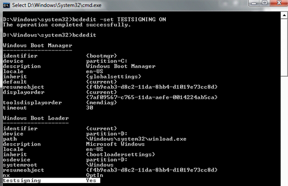

# The TESTSIGNING Boot Configuration Option


The TESTSIGNING boot configuration option determines whether Windows Vista and later versions of Windows will load any type of test-signed kernel-mode code. This option is not set by default, which means test-signed kernel-mode drivers will not load by default on 64-bit versions of Windows Vista and later versions of Windows.

**Note**  For 64-bit versions of Windows Vista and later versions of Windows, the kernel-mode code signing policy requires that all kernel-mode code have a digital signature. However, in most cases, an unsigned driver can be installed and loaded on 32-bit versions of Windows Vista and later versions of Windows. For more information, see [Kernel-Mode Code Signing Policy (Windows Vista and Later)](kernel-mode-code-signing-policy--windows-vista-and-later-.md).

 

The TESTSIGNING boot configuration option is enabled or disabled through the BCDEdit command. To enable test-signing, use the following BCDEdit command:

```cpp
Bcdedit.exe -set TESTSIGNING ON
```

To disable test-signing, use the following BCDEdit command:

```cpp
Bcdedit.exe -set TESTSIGNING OFF
```

**Note**  After you change the TESTSIGNING boot configuration option, restart the computer for the change to take effect.

 

**Caution**  Administrative privileges are required to use BCDEdit to modify BCD. Changing some boot entry options using the **BCDEdit /set** command could render your computer inoperable. As an alternative, use the System Configuration utility (MSConfig.exe) to change boot settings.

**Note**  Before setting BCDEdit options you might need to disable or suspend BitLocker and Secure Boot on the computer.

 

 

To use BCDEdit, you must be a member of the Administrators group on the system and run the command from an elevated command prompt. To open an elevated Command Prompt window, create a desktop shortcut to *Cmd.exe*, right-click the *Cmd.exe* shortcut, and select **Run as administrator**.

The following screen shot shows the result of using the BCDEdit command-line tool to enable test-signing.



When the BCDEdit option for test-signing is enabled, Windows does the following:

-   Displays a watermark with the text "Test Mode" in all four corners of the desktop, to remind users the system has test-signing enabled.
    **Note**  Starting with Windows 7, Windows displays this watermark only in the lower left-hand corner of the desktop.

     

-   The operating system loader and the kernel load drivers that are signed by any certificate. The certificate validation is not required to chain up to a trusted root certification authority. However, each driver image file must have a digital signature.

 

 


