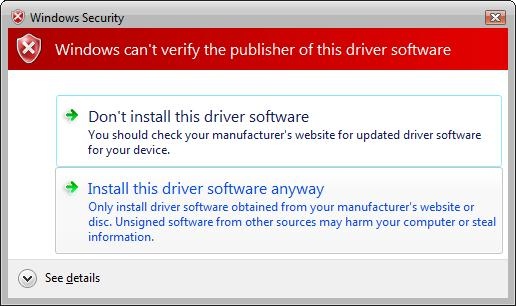
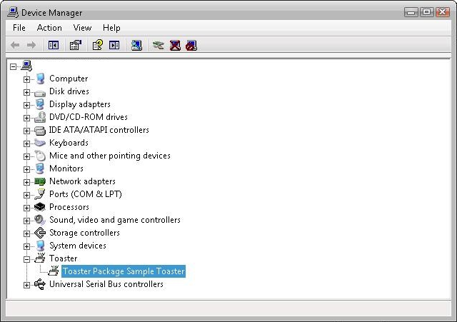
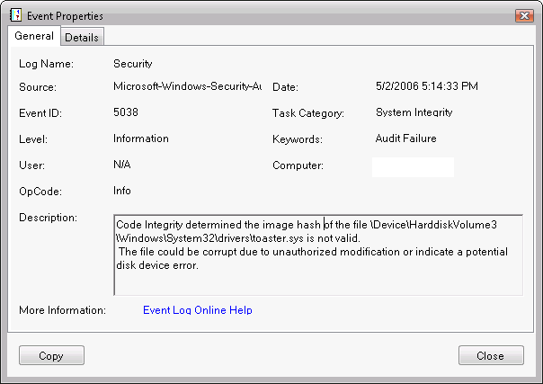
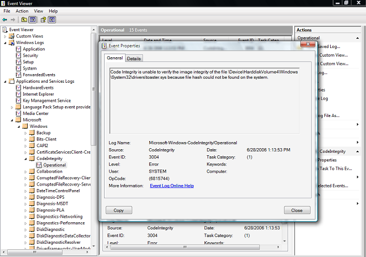

# Troubleshooting Driver Signing Installation


Installing a release-signed driver is the same as described in **Installing, Uninstalling and Loading the Test-Signed Driver Package** in [Test Signing](test-signing.md), except for two additional steps needed when installing using any of the four methods described there. Using the Add Hardware Wizard to install a release-signed driver shows the additional two steps, including some common installation issues.

1.  Open an elevated command window
2.  Run hdwwiz.cpl to start the Add Hardware Wizard, and click Next to go to the second page
3.  Select Advanced Option and click Next
4.  Select Show all devices from the list box and click Next
5.  Select the Have Disk option
6.  Enter the path to the folder that contains the C:\\toaster driver package
7.  Select the inf file and click Open
8.  Click OK
9.  Click Next in the next two pages, and then click Finish to complete the installation
10. Click Install on the dialog box that asks “Would you like to install this device software?”
11. Click Finish to complete the installation.

Step 10 shows the following Windows Security dialog box.


Selecting the check box will not show this dialog box again in the computer if the driver is installed again if the driver is removed for any reason.

**Note**  The system verifies that publisher information is accurate based on the SPC that was used to sign the catalog. If the publisher trust level is unknown—as will be true for Contoso.com—the system displays the dialog box. For the installation to proceed, the user must click Install. For more information on trust and driver installation, see [Code-Signing Best Practices](https://msdn.microsoft.com/library/windows/hardware/dn653556).

 

An unsigned driver on the other hand will show the following dialog, which allows a user to install an unsigned driver, which may not work in x64 version of Windows.



## Verify that the Release-Signed Driver is Operating Correctly


Use Device Manager to view the driver Properties as described before with respect to the test-signed driver. Below is the screen shot to show if the driver is working.



## Troubleshoot Release-Signed Drivers


The following list gives several common ways to troubleshoot problems with loading signed or test signed drivers:

-   Use the Add Hardware Wizard or Device Manager to check whether the driver is loaded and signed, as described in **Verify that the Test-Signed Driver Is Operating Correctly** of [Test Signing](test-signing.md).
-   Open the setupapi.dev.log file created in the Windows\\inf directory after driver install. Refer to the section on setting the registry entry and renaming of the setupapi.dev.log file before installing the driver.
-   Check the Windows security audit log and Code Integrity event logs.

## Analyzing the Setupapi.dev.log File


As explained before, any driver installation information will be logged (appended) on the setupapi.dev.log file in the Windows\\inf directory. If the file is renamed before a driver is installed, a new log file will be generated. A new log file will be easier to look for important logs for a new driver install. The log file opens in Notepad application.

The first left most column may have a single exclamation mark “!” or multiple exclamation marks “!!!”. The single mark is kind of a warning message, but the triple exclamation mark will be an indication of a failure.

You will see the following single exclamation mark when you install a driver package release signed with a CA vendor provided SPC certificate. These are just warnings to indicate that the cat file has not been verified yet.

```cpp
!    sig:                Verifying file against specific (valid) catalog failed! (0x800b0109)
!    sig:                Error 0x800b0109: A certificate chain processed, but terminated in a root certificate which is not trusted by the trust provider.
     sig:                Success: File is signed in Authenticode(tm) catalog.
     sig:                Error 0xe0000242: The publisher of an Authenticode(tm) signed catalog has not yet been established as trusted.
```

If you now refer to step 10 of driver install and click on the “Install” button, you will see the below log after which in most cases the driver will install and load fine. The Device Manager will not report any errors or a yellow bang for the driver.

```cpp
!    sto:           Driver package signer is unknown but user trusts the signer.
```

Despite getting up to the above point the driver may not be loaded if you also see the following error log in the log file.

The setupapi.dev.log file has also reported the following error:

```cpp
!!!  dvi:                          Device not started: Device has problem: 0x34: CM_PROB_UNSIGNED_DRIVER.
```

Note that 0x34 is Code 52.

At this point you may go back in the log file and try to find if any driver binary has been signaled with any exclamation marks. That may provide some clue. Even otherwise, you should run the “signtool verify” command described before on the cat file and other embed signed binaries to make sure that there is no issues in signing the driver.

Most of the time the log file information is sufficient to resolve the issue. If the above checking fails to find the root cause, then the next approach is to check the Windows security audit log and code Integrity event logs which is described in the next section.

The setupapi.dev.log file also helps tracking driver file copy and commit time information in case if it is found that a driver service failed to start as the service binary file copy has not been committed but the OS tries to start the service. But a restart successfully starts the service. See the sequence of operation below in the log file.

```cpp
>>>  Section start 2014/02/08 14:54:56.463
```

Next at a later time:

```cpp
!    inf:                     Could not start service &#39;toaster&#39;.
```

Then we have the file copy operation:

```cpp
<snip>
flq:                {FILE_QUEUE_COPY}
     flq:                     CopyStyle      - 0x00000000
     flq:                     SourceRootPath - &#39;C:\Windows\System32\DriverStore\FileRepository\Toaster.inf_amd64_d9b35403a0fe4391\&#39;
     flq:                     SourceFilename - &#39;toaster.exe&#39;
     flq:                     TargetDirectory- &#39;C:\Windows\System32\drivers&#39;
     flq:                     TargetFilename - &#39;toaster.exe&#39;
```

The file is committed next. Compare the end time with the start time.

```cpp
flq:           {_commit_file_queue} 14:54:56.711
<snip>
     flq:                     {_commit_copyfile}
     flq:                          Copying &#39;C:\Windows\System32\DriverStore\FileRepository\Toaster.inf_amd64_d9b35403a0fe4391\o2flash.exe&#39; to &#39;C:\Windows\System32\drivers\o2flash.exe&#39;.
     flq:                          CopyFile: &#39;C:\Windows\System32\DriverStore\FileRepository\Toaster.inf_amd64_d9b35403a0fe4391\o2flash.exe&#39; to &#39;C:\Windows\System32\drivers\SETDA81.tmp&#39;
     flq:                          MoveFile: &#39;C:\Windows\System32\drivers\SETDA81.tmp&#39; to &#39;C:\Windows\System32\drivers\toaster.exe&#39;
     cpy:                          Applied &#39;OEM Legacy&#39; protection on file &#39;C:\Windows\System32\drivers\toaster.exe&#39;.
     flq:                          Caller applied security to file &#39;C:\Windows\System32\drivers\toaster.exe&#39;.
     flq:                     {_commit_copyfile exit OK}
<snip>
     sto:      {Configure Driver Package: exit(0x00000bc3)}
     ndv:      Restart required for any devices using this driver.
<snip>
<<<  Section end 2014/02/08 14:54:57.024
<<<  [Exit status: SUCCESS]
```

The above was case of driver update which worked fine in Windows 7, but failed in Windows 8.0 and 8.1, which led to a discovery of a bug.

## Using the Windows Security Audit Log


If the driver failed to load because it lacked a valid signature, audit failure events are recorded in the Windows security log indicating that Code Integrity could not verify the image hash of the driver file. The log entries include the driver file's full path name. The security log audit events are generated only if the local security audit policy enables logging of system failure events.

**Note**  The security audit log must be explicitly enabled. For more information, see [Appendix 3: Enable Code Integrity Event Logging and System Auditing](appendix-3--enable-code-integrity-event-logging-and-system-auditing.md).

 

To examine the security log:

1.  Open an elevated command window.
2.  To start Windows Event Viewer, run Eventvwr.exe. Event Viewer can also be started from the Control Panel Computer Management application.
3.  Open the Windows security audit log.
4.  Check the log for system integrity events, which have an event ID of 5038.
5.  Double-click the log entry to display its Event Properties dialog box, which provides a detailed description of the event.

The screen shot below shows the Event Properties dialog box for a security audit log event that was caused by an unsigned Toaster.sys file.



## Using the Code Integrity Event Operational Event Log


If the driver failed to load because it was not signed or generated an image verification error, Code Integrity records the events in the Code Integrity operational event log. Code Integrity operational events are always enabled.

The Code Integrity events can be viewed with Event Viewer.

## To examine the Code Integrity operational log


1.  Open an elevated command window.
2.  To start Windows Event Viewer, run Eventvwr.exe. Event Viewer can also be started from the Computer Management Control Panel application.
3.  Open the Windows Code Integrity log.
4.  Double-click a log entry to display its Event Properties dialog box, which provides a detailed description of the event.

The screen shot below shows the Event Properties dialog box for a Code Integrity operational log event that was caused by an unsigned Toaster.sys file.



## Using the Informational Events in the Code Integrity Verbose Log


The Code Integrity informational log's verbose view tracks events for all kernel-mode image verification checks. These events show successful image verification of all drivers that are loaded on the system.

To enable the Code Integrity verbose view:

1.  Start Event Viewer, as in the previous example.
2.  Click the Code Integrity node to give it focus.
3.  Right-click Code Integrity and select the View item from the shortcut menu.
4.  Select Show Analytic and Debug Logs. This creates a sub tree with two additional nodes: Operational and Verbose.
5.  Right-click the Verbose node and select the Properties from the shortcut menu.
6.  On the General tab, select Enable Logging to enable the verbose logging mode.
7.  Reboot the system to reload all kernel-mode binaries.
8.  After rebooting, open the MMC Computer Management snap-in and view the Code Integrity verbose event log.

A few additional known driver signing issues are described in [Appendix 4: Driver Signing Issues](appendix-4--driver-signing-issues.md).

 

 


