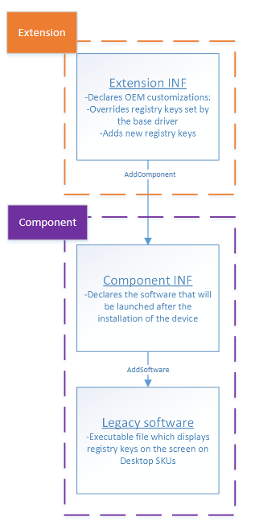
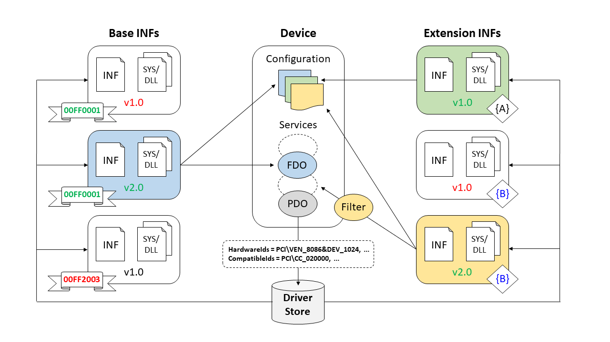

# Using an Extension INF File

Prior to Windows 10, Windows selected a single driver package to install for a given device.  This resulted in large, complex driver packages that included code for all scenarios and configurations, and each minor update required an update to the entire driver package.  Starting in Windows 10, you can split INF functionality into multiple components, each of which can be serviced independently.

To extend a base driver package INF file's functionality, provide an extension INF in a separate driver package.  An extension INF:

* Can be provided by a different company and updated independently from the base INF.
* Uses the same INF syntax as a base INF, but can extend the base INF for customization or specialization.
* Enhances the value of the device, but is **not** necessary for the base driver package to work. In the absence of the extension INF, the system must be able to boot and connect to the network with just the base driver package. Input devices built into the system, such as a keyboard, must be able to function with at least basic functionality without any extension INFs.
* Must be a [universal INF file](../install/using-a-universal-inf-file.md).

Every device must have one base INF installed on it, and can optionally have one or more extension INFs associated with it. An extension INF will not be able to install on a device if there is no base INF present to also install on the device.

Typical scenarios where you might use an extension INF include:

* Modifying settings provided in a base INF, such as customizing the device friendly name or modifying a hardware configuration setting.
* Creating one or more software components by specifying the [INF AddComponent directive](inf-addcomponent-directive.md) and providing a [component INF file](using-a-component-inf-file.md).
* Providing settings specific to the model or form factor of the system that enhances the experience or functionality of the device, such as hardware calibration data.
* Adding a filter driver to the device stack.

You can find sample code for some of these scenarios in the examples below.  Also see [DCH-Compliant Driver Package Example](../develop/dch-example.md), which describes how the [DCHU universal driver sample](https://github.com/Microsoft/Windows-driver-samples/tree/master/general/DCHU) uses extension INFs.

In the following diagram, two different companies have created separate driver packages for the same device, which are shown in the dotted lines.  The first contains just an extension INF, and the second contains a component INF and a legacy software module.  The diagram also shows how an extension INF can reference a component INF, which can in turn reference software modules to install.



## How extension INF and base INF work together

During a device installation, settings in an extension INF are applied after settings in a base INF. As a result, if an extension INF and a base INF specify the same setting, the version in the extension INF is applied. Similarly, if the base INF changes, the extension INF remains and is applied over the new base INF.  If multiple extension INFs are installed on the same device, there is no predetermined ordering that the extension INFs will be applied in, so one extension INF cannot deterministically override values provided by a different extension INF.  Distinct extension INFs targeted at the same devices should not attempt to alter the same settings.

It is helpful to include comments in the base INF describing which entries can be overridden by an extension INF, as well as applicable parameter value ranges and constraints.

## Specifying ExtensionId

When you write an extension INF, you generate a special GUID called the **ExtensionId**, which is an entry in the INF's **\[Version\]** section.

The system identifies possible extension INFs for a specific device by matching the hardware ID and compatible IDs of the device to those specified in an extension INF in a [**Models**](inf-models-section.md) section that applies to that system.

Among all possible extension INFs that specify the same **ExtensionId** value, the system selects only one to install and applies its settings over those of the base INF.  The driver date and driver version specified in the INF are used, in that order, to choose the single INF between multiple extension INFs with the same **ExtensionId**.

To illustrate, consider the following scenario that includes a hypothetical device for which there are three extension INFs:



The **ExtensionId** values `{A}`, `{B}`, and `{C}` are shown in curly brackets, and each driver's [rank](how-setup-ranks-drivers--windows-vista-and-later-.md) is shown in the banner ribbons.

First, the system selects the driver package with the best rank and highest version.

Next, the system processes the available extension INFs.  Two have **ExtensionId** value `{B}`, and one has **ExtensionId** value `{A}`.  From the first two, let's say that driver date is the same.  The next tiebreaker is driver version, so the system selects the extension INF with v2.0.

The extension INF with the unique **ExtensionId** value is also selected.  The system applies the base INF for the device, and then applies the two extension INFs for that device.

Note that extension INF files are always applied after the base INF, but that there is no determined order in which the extension INFs are applied.

## Creating an extension INF

Here are the entries you need to define an INF as an extension INF.

1.  Specify these values for **Class** and **ClassGuid** in the [**Version**](inf-version-section.md) section. For more info on setup classes, see [System-Defined Device Setup Classes Available to Vendors](./system-defined-device-setup-classes-available-to-vendors.md).

    ```cpp
    [Version]
    ...
    Class       = Extension
    ClassGuid   = {e2f84ce7-8efa-411c-aa69-97454ca4cb57}
    ```

2.  Provide an **ExtensionId** entry in the [**\[Version\]**](inf-version-section.md) section. Generate a new GUID for the initial version of an extension INF, or reuse the last GUID for subsequent updates of the initial extension INF.

    ```cpp
    ExtensionId = {zzzzzzzz-zzzz-zzzz-zzzz-zzzzzzzzzzzz} ; replace with your own GUID
    ```

Note that an organization may only use an **ExtensionID** that it owns.  For information on registering an Extension ID, see [Managing hardware submissions in the Windows Hardware Dev Center dashboard](../dashboard/manage-your-hardware-submissions.md).     

3.  If you are updating an extension INF, keep the **ExtensionId** the same and increment the version and date specified by the [**DriverVer**](inf-driverver-directive.md) directive. For a given **ExtensionId** value, PnP selects the INF with the highest **DriverVer**.

>[!NOTE]
> If your extension INF targets Windows 10 S, see [Windows 10 in S mode Driver Requirements](./windows10sdriverrequirements.md) for information about driver installation on that version of Windows.

4.  In the [**INF Models section**](inf-models-section.md), specify one or more hardware and compatible IDs that match those of the target device.  Note that these hardware and compatible IDs do not need to match those of the base INF.  Typically, an extension INF lists a more specific hardware ID than the base INF, with the goal of further specializing a specific driver configuration.  For example, the base INF might use a two-part PCI hardware ID, while the extension INF specifies a four-part PCI hardware ID, like the following:
    
    ```cpp
    [DeviceExtensions.NTamd64]
    %Device.ExtensionDesc% = DeviceExtension_Install, PCI\VEN_XXXX&DEV_XXXX&SUBSYS_XXXXXXXX&REV_XXXX
    ```

    Alternatively, the extension INF might list the same hardware ID as the base INF, for instance if the device is already very narrowly targeted, or if the base INF already lists the most specific hardware ID.
    
    In some cases, the extension INF might provide a less specific device ID, like a compatible ID, in order to customize a setting across a broader set of devices.

    [CHID targeting](../bringup/target-a-system-using-chid.md) can be used if a four-part hardware ID is not possible or is not restrictive enough.

5.  Do not define a service with `SPSVCINST_ASSOCSERVICE`.  However, an extension INF can define other services, such as a filter driver for the device.  For more info about specifying services, see [**INF AddService Directive**](inf-addservice-directive.md).

In most cases, you'll submit an extension INF driver package to the Hardware Dev Center separately from the base driver package.  For examples on how to package extension INFs, as well as links to sample code, see [DCH-Compliant Driver Package Example](../develop/dch-example.md).

The driver validation and submission process is the same for extension INFs as for regular INFs. For more info, see [Windows HLK Getting Started](/windows-hardware/test/hlk/getstarted/windows-hlk-getting-started).

## Uninstalling an extension driver

To remove an extension driver package from the system and uninstall it from any devices using it, use PnPUtil's `delete-driver` command with the `uninstall` flag. This allows the extension driver package to be uninstalled from devices without removing the base driver package.

Find the oem<#>.inf name of the driver package to uninstall and use `pnputil /delete-driver oem<#>.inf /uninstall`. 

`pnputil /enum-drivers` can be used to help identify the appropriate oem<#>.inf name.

## Example 1: Using an extension INF to set the device friendly name

In one common scenario, a device manufacturer (IHV) provides a base driver package, and then a system builder (OEM) provides an extension INF that supplements and in some cases overrides the configuration and settings of the base driver package.  The following snippet is a complete extension INF that shows how to set the device friendly name.

```cpp
[Version]
Signature   = "$WINDOWS NT$"
Class       = Extension
ClassGuid   = {e2f84ce7-8efa-411c-aa69-97454ca4cb57}
Provider    = %CONTOSO%
ExtensionId = {zzzzzzzz-zzzz-zzzz-zzzz-zzzzzzzzzzzz} ; replace with your own GUID
DriverVer   = 05/28/2013,1.0.0.0
CatalogFile = delta.cat

[Manufacturer]
%CONTOSO% = DeviceExtensions,NTamd64

[DeviceExtensions.NTamd64]
%Device.ExtensionDesc% = DeviceExtension_Install, PCI\VEN_XXXX&DEV_XXXX&SUBSYS_XXXXXXXX&REV_XXXX

[DeviceExtension_Install]
; No changes

[DeviceExtension_Install.HW]
AddReg = FriendlyName_AddReg

[FriendlyName_AddReg]
HKR,,FriendlyName,, "New Device Friendly Name"

[Strings]
CONTOSO              = "Contoso"
Device.ExtensionDesc = "Sample Device Extension"
```

## Example 2: Using an extension INF to install additional software

The following snippet is a complete extension INF that is included in the [Driver package installation toolkit for universal drivers](https://github.com/Microsoft/Windows-driver-samples/tree/master/general/DCHU).  This example uses [INF AddComponent directive](inf-addcomponent-directive.md) to create components that install a service and an executable.  For more info about what you can do in a component INF, see [Using a Component INF File](using-a-component-inf-file.md).

To access this file online, see [`osrfx2_DCHU_extension.inx`](https://github.com/Microsoft/Windows-driver-samples/blob/master/general/DCHU/osrfx2_DCHU_extension_loose/osrfx2_DCHU_extension/osrfx2_DCHU_extension.inx).

```cpp
;/*++
;
;Copyright (c) Microsoft Corporation.  All rights reserved.
;
;   THIS CODE AND INFORMATION IS PROVIDED "AS IS" WITHOUT WARRANTY OF ANY
;   KIND, EITHER EXPRESSED OR IMPLIED, INCLUDING BUT NOT LIMITED TO THE
;   IMPLIED WARRANTIES OF MERCHANTABILITY AND/OR FITNESS FOR A PARTICULAR
;   PURPOSE.
;
;Module Name:
;
;    osrfx2_DCHU_extension.INF
;
;Abstract:
;
;    Extension inf for the OSR FX2 Learning Kit
;
;--*/

[Version]
Signature = "$WINDOWS NT$"
Class = Extension
ClassGuid = {e2f84ce7-8efa-411c-aa69-97454ca4cb57}
Provider = %ManufacturerName%
ExtensionId = {3846ad8c-dd27-433d-ab89-453654cd542a}
CatalogFile = osrfx2_DCHU_extension.cat
DriverVer = 05/16/2017,15.14.36.721

[Manufacturer]
%ManufacturerName% = OsrFx2Extension, NT$ARCH$

[OsrFx2Extension.NT$ARCH$]
%OsrFx2.ExtensionDesc% = OsrFx2Extension_Install, USB\Vid_045e&Pid_94aa&mi_00
%OsrFx2.ExtensionDesc% = OsrFx2Extension_Install, USB\Vid_0547&PID_1002

[OsrFx2Extension_Install.NT]
CopyInf=osrfx2_DCHU_usersvc.inf

[OsrFx2Extension_Install.NT.HW]
AddReg = OsrFx2Extension_AddReg
AddReg = OsrFx2Extension_COMAddReg

[OsrFx2Extension_AddReg]
HKR, OSR, "OperatingParams",, "-Extended"
HKR, OSR, "OperatingExceptions",, "x86"

; Add all registry keys to successfully register the
; In-Process ATL COM Server MSFT Sample.
[OsrFx2Extension_COMAddReg]
HKCR,AppID\ATLDllCOMServer.DLL,AppID,,"{9DD18FED-55F6-4741-AF25-798B90C4AED5}"
HKCR,AppID\{9DD18FED-55F6-4741-AF25-798B90C4AED5},,,"ATLDllCOMServer"
HKCR,ATLDllCOMServer.SimpleObject,,,"SimpleObject Class"
HKCR,ATLDllCOMServer.SimpleObject\CLSID,,,"{92FCF37F-F6C7-4F8A-AA09-1A14BA118084}"
HKCR,ATLDllCOMServer.SimpleObject\CurVer,,,"ATLDllCOMServer.SimpleObject.1"
HKCR,ATLDllCOMServer.SimpleObject.1,,,"SimpleObject Class"
HKCR,ATLDllCOMServer.SimpleObject.1\CLSID,,,"{92FCF37F-F6C7-4F8A-AA09-1A14BA118084}"
HKCR,CLSID\{92FCF37F-F6C7-4F8A-AA09-1A14BA118084},,,"SimpleObject Class"
HKCR,CLSID\{92FCF37F-F6C7-4F8A-AA09-1A14BA118084}\InprocServer32,,%REG_EXPAND_SZ%,"%%SystemRoot%%\System32\ATLDllCOMServer.dll"
HKCR,CLSID\{92FCF37F-F6C7-4F8A-AA09-1A14BA118084}\InprocServer32,ThreadingModel,,"Apartment"
HKCR,CLSID\{92FCF37F-F6C7-4F8A-AA09-1A14BA118084}\ProgID,,,"ATLDllCOMServer.SimpleObject.1"
HKCR,CLSID\{92FCF37F-F6C7-4F8A-AA09-1A14BA118084}\Programmable,,%FLG_ADDREG_KEYONLY%
HKCR,CLSID\{92FCF37F-F6C7-4F8A-AA09-1A14BA118084}\TypeLib,,,"{9B23EFED-A0C1-46B6-A903-218206447F3E}"
HKCR,CLSID\{92FCF37F-F6C7-4F8A-AA09-1A14BA118084}\VersionIndependentProgID,,,"ATLDllCOMServer.SimpleObject"

[OsrFx2Extension_Install.NT.Components]
AddComponent = osrfx2_DCHU_component,,OsrFx2Extension_ComponentInstall
AddComponent = osrfx2_DCHU_usersvc,,OsrFx2Extension_ComponentInstall_UserSvc

[OsrFx2Extension_ComponentInstall]
ComponentIds=VID_045e&PID_94ab

[OsrFx2Extension_ComponentInstall_UserSvc]
ComponentIds=VID_045e&PID_94ac

[Strings]
ManufacturerName = "Contoso"
OsrFx2.ExtensionDesc = "OsrFx2 DCHU Device Extension"
REG_EXPAND_SZ = 0x00020000
FLG_ADDREG_KEYONLY = 0x00000010
```
For info on how to use an Extension INF to install a filter driver, see [Device filter driver ordering](../develop/device-filter-driver-ordering.md).

To improve extensibility, we recommend that an IHV put optional functionality in an [extension INF template](using-an-extension-inf-file-template.md).

## Backward compatibility

Any change to the base INF must be thoroughly tested to ensure that it does not break backward compatibility for existing extension INFs.

When managing a base INF, follow these best practices:

* Document parameter value ranges and constraints both in code comments and in a design document. Future changes must conform to the specified ranges.
* To support new ranges, add an optional parameter (no default value).

##  Submitting an extension INF for certification

For detailed information on how to work with Extension INFs on the Hardware Dev Center, please see [Working with Extension INFs in the Windows Hardware Dev Center Dashboard](../dashboard/submit-dashboard-extension-inf-files.md).

## Related topics

* [Working with Extension INFs in the Partner Center](../dashboard/submit-dashboard-extension-inf-files.md)
* [DCH-Compliant Driver Package Example](../develop/dch-example.md)
* [Using a Universal INF File](using-a-universal-inf-file.md)
* [Getting Started with Windows Drivers](../develop/getting-started-with-windows-drivers.md)
* [Driver package installation toolkit for universal drivers](https://github.com/Microsoft/Windows-driver-samples/tree/master/general/DCHU)
