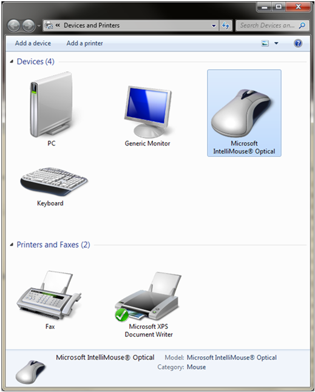

# Verifying the Implementation of Container IDs

Starting with Windows 7, you can see all the devices that are connected to the computer in the Devices and Printers user interface (UI). Devices appear as they physically appear to users, which is as a single "piece of plastic" that supports one or more functions. The icon that is displayed in the UI represents the primary function for the device.

To take advantage of the new capabilities that the Devices and Printers UI provides, devices must correctly implement container IDs.

The simplest way to verify that a device complies with the container ID requirements is to open the Devices and Printers UI to see how the device appears. If the device complies with the container ID requirements, only one icon should appear in the Devices and Printers UI for that device.

The following screen shot shows the Devices and Printers UI for a computer that has an attached USB keyboard and mouse. Notice that only one icon appears for each device.

In this example, the mouse is attached to a USB port on a desktop computer. However, only one instance of the mouse appears for the physical device. As a result, this device correctly implements the container ID requirements.

The physical device, which has one primary function, or "container," is represented by one object in the Devices and Printers UI. In this example, the mouse does not contain a Microsoft **ContainerID** operating system descriptor or serial number. Therefore, the Plug and Play (PnP) manager generates a container ID value by using the removable capability for the mouse.

For more information about the removable device capability, see [Container IDs Generated from the Removable Device Capability](container-ids-generated-from-the-removable-device-capability.md).

 

 

