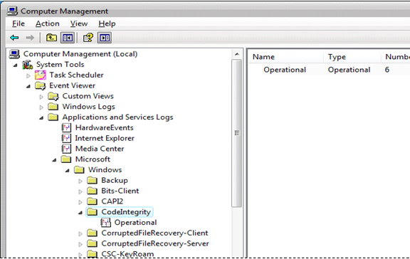
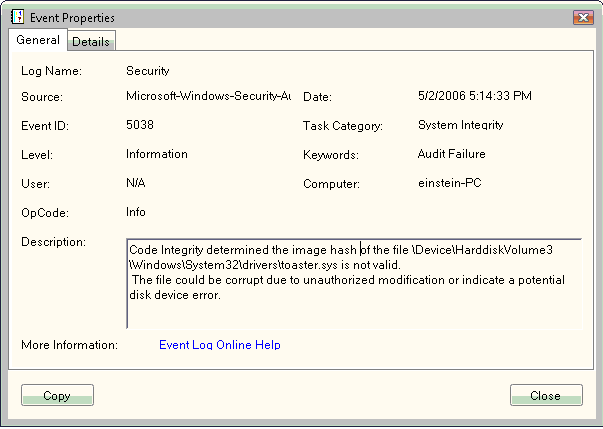

# Viewing Code Integrity Events

You can use the Event Viewer to view Code Integrity events. You can access the Event Viewer in the Computer Management Microsoft Management Console (MMC) or by running the *Eventvwr.exe* command from a command line.

To view Code Integrity events in the Event Viewer, expand the following sequence of subfolders under the **Event Viewer** folder in the left pane of the Computer Management MMC or the Event Viewer window:

1.  **Applications and Services Logs**

2.  **Microsoft**

3.  **Windows**

4.  **CodeIntegrity**

The following screen shot shows the result of expanding the **CodeIntegrity** subfolder under the **Event Viewer** folder.

For more information about a particular Code Integrity log entry, right-click the entry and then select **Event Properties** on the pop-up menu. The following screen shot shows the details about a Code Integrity event.

This event indicates that the Toaster driver (toaster.sys) could not be loaded because it was unsigned (or the toaster.sys image that is trying to load is not the same one that was digitally-signed by the publisher).

For a list of all Code Integrity event log messages, see [Code Integrity Event Log Messages](code-integrity-event-log-messages.md).

The System log events are viewable in the Event Viewer under the Windows Logs, System log view.

 

 

