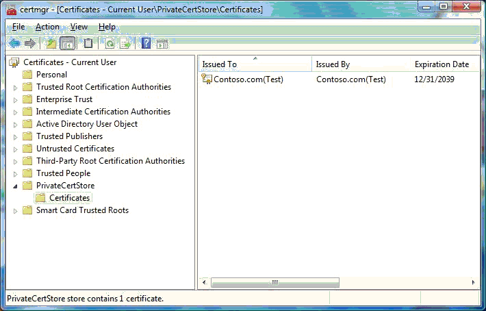
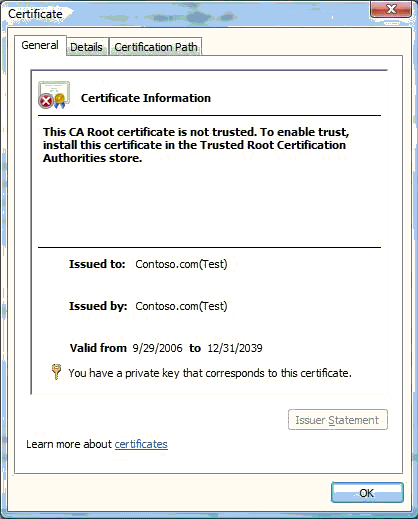

# Viewing Test Certificates

After the certificate is created and a copy is put in the certificate store, the Microsoft Management Console (MMC) Certificates snap-in can be used to view it. Do the following to view a certificate through the MMC **Certificates** snap-in:

1.  Click **Start** and then click Start Search.

2.  To start the Certificates snap-in, type Certmgr.msc and press the **Enter** key.

3.  In the left pane of the Certificates snap-in, expand the PrivateCertStore certificate store folder and double-click Certificates.

The following screen shot shows the Certificates snap-in view of the **PrivateCertStore** certificate store folder.

To view the details about the Contoso.com(Test) certificate, double-click the certificate in the right pane. The following screen shot shows the details about the certificate.

Notice that the Certificate dialog box states: "This CA Root certificate is not trusted. To enable trust, install this certificate in the Trusted Root Certification Authorities store." This is the expected behavior. The certificate cannot be verified because Windows does not trust the issuing authority, "Contoso.com(Test)" by default.

 

 

