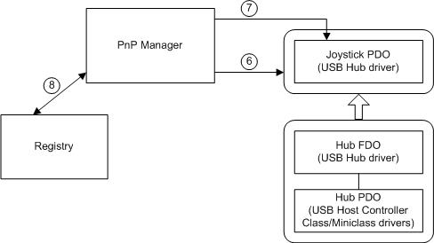

# Adding a PnP Device to a Running System

This section describes the sequence of events that occur when the system configures a PnP device that a user has added to a running machine. This discussion highlights the roles of the PnP manager, bus drivers, and function and filter drivers in enumerating and configuring a new device.

Most of this discussion is also relevant to configuring a PnP device that is present when the machine is booted. Specifically, devices whose drivers are marked SERVICE\_DEMAND\_START in an INF file are configured in essentially the same way whether the device is added dynamically or is present at boot time.

The following figure shows the first steps in configuring the device, starting from when the user plugs the hardware into the machine.

The following notes correspond to the circled numbers in the previous figure:

1.  A user plugs a PnP device into a free slot on a PnP bus.

    In this example, the user plugs a PnP USB joystick into the hub on a USB host controller. The USB hub is a PnP bus device because child devices can be attached to it.

2.  The function driver for the bus device determines that a new device is on its bus.

    How the driver determines this depends on the bus architecture. For some buses, the bus function driver receives hot-plug notification of new devices. If the bus does not support hot-plug notification, the user must take appropriate action in Control Panel to cause the bus to be enumerated.

    In this example, the USB bus supports hot-plug notification so the function driver for the USB bus is notified that its children have changed.

3.  The function driver for the bus device notifies the PnP manager that its set of child devices has changed.

    The function driver notifies the PnP manager by calling [**IoInvalidateDeviceRelations**](https://msdn.microsoft.com/library/windows/hardware/ff549353) with a *Type* of **BusRelations**.

4.  The PnP manager queries the bus's drivers for the current list of devices on the bus.

    The PnP manager sends an [**IRP\_MN\_QUERY\_DEVICE\_RELATIONS**](https://msdn.microsoft.com/library/windows/hardware/ff551670) request to the device stack for the bus. The **Parameters.QueryDeviceRelations.Type** value is **BusRelations**, indicating that the PnP manager is asking for the current list of devices present on the bus (*bus relations*).

    The PnP manager sends the IRP to the top driver in the device stack for the bus. According to the rules for PnP IRPs, each driver in the stack handles the IRP, if appropriate, and passes the IRP down to the next driver.

5.  The function driver for the bus device handles the IRP.

    See the reference page for [**IRP\_MN\_QUERY\_DEVICE\_RELATIONS**](https://msdn.microsoft.com/library/windows/hardware/ff551670) for detailed information about handling this IRP.

    In this example, the USB hub driver handles this IRP for the hub [*FDO*](https://msdn.microsoft.com/library/windows/hardware/ff556280#wdkgloss-fdo). The hub driver creates a [*PDO*](https://msdn.microsoft.com/library/windows/hardware/ff556325#wdkgloss-pdo) for the joystick device and includes a referenced pointer to the joystick PDO in its list of child devices returned with the IRP.

    When the USB hub's parent bus driver (the USB host controller class/miniclass driver pair) completes the IRP, the IRP travels back up the device stack by means of any [*IoCompletion*](https://msdn.microsoft.com/library/windows/hardware/ff548354) routines registered by the hub drivers.

Note that the bus function driver reports a change in its list of children by requesting that the PnP manager query for its list of child devices. The resulting **IRP\_MN\_QUERY\_DEVICE\_RELATIONS** request is seen by all the drivers for the bus device. Typically, the bus function driver is the only driver to handle the IRP and report children. In some device stacks, a bus filter driver is present and participates in constructing the list of bus relations. One example is ACPI, which attaches as a bus filter driver for ACPI devices. In some device stacks, nonbus filter drivers handle the **IRP\_MN\_QUERY\_DEVICE\_RELATIONS** request, but this is not typical.

At this point, the PnP manager has the current list of devices on the bus. The PnP manager then determines whether any devices are newly arrived or have been removed. In this example, there is one new device. The following figure shows the PnP manager creating a devnode for the new device and beginning to configure the device.

The following notes correspond to the circled numbers in the previous figure:

1.  The PnP manager creates devnodes for any new child devices on the bus.

    The PnP manager compares the list of bus relations returned in the **IRP\_MN\_QUERY\_DEVICE\_RELATIONS** IRP to the list of children for the bus currently recorded in the PnP device tree. The PnP manager creates a devnode for each new device and initiates removal processing for any devices that have been removed.

    In this example, there is one new device (a joystick), so the PnP manager creates a devnode for the joystick. At this point, the only driver that is configured for the joystick is the parent USB hub bus driver, which created the joystick's PDO. Any optional bus filter drivers would also be present in the device stack, but the example omits bus filter drivers for simplicity.

    The wide arrow between the two devnodes in the previous figure indicates that the joystick devnode is a child of the USB hub devnode.

2.  The PnP manager gathers information about the new device and begins configuring the device.

    The PnP manager sends a sequence of IRPs to the device stack to gather information about the device. At this point, the device stack consists of only the PDO created by the device's parent bus driver and filter DOs for any optional bus filter drivers. Therefore, the bus driver and bus filter drivers are the only drivers that respond to these IRPs. In this example, the only driver in the joystick device stack is the parent bus driver, the USB hub driver.

    The PnP manager gathers information about a new device by sending IRPs to the device stack. These IRPs include the following:

    -   [**IRP\_MN\_QUERY\_ID**](https://msdn.microsoft.com/library/windows/hardware/ff551679), a separate IRP for each of the following types of hardware IDs:

        **BusQueryDeviceID**

        **BusQueryInstanceID**

        **BusQueryHardwareIDs**

        **BusQueryCompatibleIDs**

        **BusQueryContainerID**

    -   [**IRP\_MN\_QUERY\_CAPABILITIES**](https://msdn.microsoft.com/library/windows/hardware/ff551664)

    -   [**IRP\_MN\_QUERY\_DEVICE\_TEXT**](https://msdn.microsoft.com/library/windows/hardware/ff551674), a separate IRP for each of the following items:

        **DeviceTextDescription**

        **DeviceTextLocationInformation**

    -   [**IRP\_MN\_QUERY\_BUS\_INFORMATION**](https://msdn.microsoft.com/library/windows/hardware/ff551654)
    -   [**IRP\_MN\_QUERY\_RESOURCES**](https://msdn.microsoft.com/library/windows/hardware/ff551710)
    -   [**IRP\_MN\_QUERY\_RESOURCE\_REQUIREMENTS**](https://msdn.microsoft.com/library/windows/hardware/ff551715)

    The PnP manager sends the IRPs listed above at this stage of processing a new PnP device, but not necessarily in the order listed, so you should not make assumptions about the order in which the IRPs are sent. Also, you should not assume that the PnP manager sends only the IRPs listed above.

    The PnP manager checks the registry to determine whether the device has been installed on this machine previously. The PnP manager checks for an &lt;*enumerator*&gt;\\&lt;*deviceID*&gt; subkey for the device under the **Enum** branch. In this example, the device is new and must be configured "from scratch."

3.  The PnP manager stores information about the device in the registry.

    The registry's **Enum** branch is reserved for use by operating system components and its layout is subject to change. Driver writers must use system routines to extract information related to drivers. Do not access the **Enum** branch directly from a driver. The following **Enum** information is listed for debugging purposes only.

    -   The PnP manager creates a subkey for the device under the key for the device's enumerator.

        The PnP manager creates a subkey named **HKLM\\System\\CurrentControlSet\\Enum\\**&lt;*enumerator*&gt;**\\**&lt;*deviceID*&gt;. It creates the &lt;*enumerator*&gt; subkey if it does not already exist.

        An *enumerator* is a component that discovers PnP devices based on a PnP hardware standard. The tasks of an enumerator are carried out by a PnP bus driver in partnership with the PnP manager. A device is typically enumerated by its parent bus driver, such as PCI or PCMCIA. Some devices are enumerated by a bus filter driver, such as ACPI.

    -   The PnP manager creates a subkey for this instance of the device.

        If **Capabilities.UniqueID** is returned as **TRUE** for **IRP\_MN\_QUERY\_CAPABILITIES**, the device's unique ID is unique across the system. If not, the PnP manager modifies the ID so that it is unique system-wide.

        The PnP manager creates a subkey named **HKLM\\System\\CurrentControlSet\\Enum\\**&lt;*enumerator*&gt;**\\**&lt;*deviceID*&gt;**\\**&lt;*instanceID*&gt;.

    -   The PnP manager writes information about the device to the subkey for the device instance.

        The PnP manager stores information, including the following, if it was supplied for the device:

        **DeviceDesc** — from [**IRP\_MN\_QUERY\_DEVICE\_TEXT**](https://msdn.microsoft.com/library/windows/hardware/ff551674)

        **Location** — from **IRP\_MN\_QUERY\_DEVICE\_TEXT**

        **Capabilities** — the flags from [**IRP\_MN\_QUERY\_CAPABILITIES**](https://msdn.microsoft.com/library/windows/hardware/ff551664)

        **UINumber** — from **IRP\_MN\_QUERY\_CAPABILITIES**

        **HardwareID** — from [**IRP\_MN\_QUERY\_ID**](https://msdn.microsoft.com/library/windows/hardware/ff551679)

        **CompatibleIDs** — from **IRP\_MN\_QUERY\_ID**

        **ContainerID** — from **IRP\_MN\_QUERY\_ID**

        **LogConf\\BootConfig** — from [**IRP\_MN\_QUERY\_RESOURCES**](https://msdn.microsoft.com/library/windows/hardware/ff551710)

        **LogConf\\BasicConfigVector** — from [**IRP\_MN\_QUERY\_RESOURCE\_REQUIREMENTS**](https://msdn.microsoft.com/library/windows/hardware/ff551715)

At this point, the PnP manager is ready to locate the function driver and filter drivers for the device, if any. (See the following figure.)

The following notes correspond to the numbered circles in the previous figure:

1.  The kernel-mode PnP manager coordinates with the user-mode PnP manager and user-mode Setup components to find the function and filter drivers for the device, if there are any.

    The kernel-mode PnP manager queues an event to the user-mode PnP manager, identifying a device that needs to be installed. Once a privileged user logs in, the user-mode components proceed with finding drivers. See the [device installation overview](https://msdn.microsoft.com/library/windows/hardware/ff549455) For information about Setup components and their role in installing a device.

2.  The user-mode Setup components direct the kernel-mode PnP manager to load the function and filter drivers.

    The user-mode components call back to kernel mode to get the drivers loaded, causing their [*AddDevice*](https://msdn.microsoft.com/library/windows/hardware/ff540521) routines to be called.

The following figure shows the PnP manager loading the drivers (if appropriate), calling their *AddDevice* routines, and directing the drivers to start the device.

The following notes correspond to the numbered circles in the previous figure:

1.  Lower-filter drivers

    Before the function driver attaches to the device stack, the PnP manager processes any lower-filter drivers. For each lower-filter driver, the PnP manager calls the driver's [**DriverEntry**](https://msdn.microsoft.com/library/windows/hardware/ff544113) routine if the driver is not yet loaded. Then the PnP manager calls the driver's *AddDevice* routine. In its *AddDevice* routine, the filter driver creates a filter device object (filter DO) and attaches it to the device stack ([**IoAttachDeviceToDeviceStack**](https://msdn.microsoft.com/library/windows/hardware/ff548300)). Once it attaches its device object to the device stack, the driver is engaged as a driver for the device.

    In the USB joystick example, there is one lower-filter driver for the device.

2.  Function driver

    After any lower filters are attached, the PnP manager processes the function driver. The PnP manager calls the function driver's **DriverEntry** routine if the driver is not yet loaded and calls the function driver's *AddDevice* routine. The function driver creates a function device object (FDO) and attaches it to the device stack.

    In this example, the function driver for the USB joystick is actually a pair of drivers: the HID class driver and the HID miniclass driver. The two drivers work together to serve as the function driver. The driver pair creates only one FDO and attaches it to the device stack.

3.  Upper-filter drivers

    After the function driver is attached, the PnP manager processes any upper-filter drivers.

    In this example, there is one upper-filter driver for the device.

4.  Assigning resources and starting the device

    The PnP manager assigns resources to the device, if needed, and issues an IRP to start the device.

    -   Assigning resources

        Earlier in the configuration process, the PnP manager gathered the hardware resource requirements for the device from the device's parent bus driver. After the full set of drivers is loaded for the device, the PnP manager sends an [**IRP\_MN\_FILTER\_RESOURCE\_REQUIREMENTS**](https://msdn.microsoft.com/library/windows/hardware/ff550874) request to the device stack. All drivers in the stack have the opportunity to handle this IRP and modify the device's resource requirements list, if necessary.

        The PnP manager assigns resources to the device, if the device requires any, based on the device's requirements and the resources currently available.

        The PnP manager might need to rearrange the resource assignments of existing devices to satisfy the needs of the new device. This reassignment of resources is called "rebalancing." The drivers for the existing devices receive a sequence of stop and start IRPs during a rebalance, but the rebalance must be transparent to users.

        In the example of the USB joystick, USB devices do not require hardware resources so the PnP manager sets the resource list to **NULL**.

    -   Starting the device (**IRP\_MN\_START\_DEVICE**)

        Once the PnP manager assigns resources to the device, it sends an [**IRP\_MN\_START\_DEVICE**](https://msdn.microsoft.com/library/windows/hardware/ff551749) IRP to the device stack to direct the drivers to start the device.

    After the device is started, the PnP manager sends three more IRPs to the drivers for the device:

    -   [**IRP\_MN\_QUERY\_CAPABILITIES**](https://msdn.microsoft.com/library/windows/hardware/ff551664)

        After the start IRP completes successfully, the PnP manager sends another **IRP\_MN\_QUERY\_CAPABILITIES** IRP to the device stack. All the drivers for the device have the option of handling the IRP. The PnP manager sends this IRP at this time, after all drivers are attached and the device is started, because the function or filter drivers might need to access the device to collect capability information.

    -   [**IRP\_MN\_QUERY\_PNP\_DEVICE\_STATE**](https://msdn.microsoft.com/library/windows/hardware/ff551698)

        This IRP gives a driver the opportunity to, for example, report that the device should not be displayed in user interfaces such as Device Manager and the Hotplug program. This is useful for devices that are present on a system but are not usable in the current configuration, such as a game port on a laptop that is not usable when the laptop is undocked.

    -   [**IRP\_MN\_QUERY\_DEVICE\_RELATIONS**](https://msdn.microsoft.com/library/windows/hardware/ff551670) for bus relations

        The PnP manager sends this IRP to determine whether the device has any child devices. If so, the PnP manager configures each child device.

 
## Using GUID_PNP_LOCATION_INTERFACE

The GUID_PNP_LOCATION_INTERFACE interface supplies the SPDRP_LOCATION_PATHS Plug and Play (PnP) device property for a device.

To implement this interface in your driver, handle the IRP_MN_QUERY_INTERFACE IRP with InterfaceType = GUID_PNP_LOCATION_INTERFACE. Your driver supplies a pointer to a PNP_LOCATION_INTERFACE structure that contains pointers to the individual routines of the interface. The [PnpGetLocationString routine](https://msdn.microsoft.com/library/windows/hardware/ff558811) provides the device-specific part of the device's SPDRP_LOCATION_PATHS property.

 

