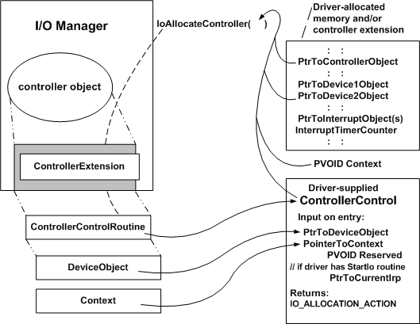

# Allocating Controller Objects for I/O Operations

## 

After a driver that uses a controller object has started its device, it is ready to process IRPs sent to its target device objects. Whenever an IRP requires the driver to program the physical device represented by the controller object for an I/O operation, the driver calls [**IoAllocateController**](https://msdn.microsoft.com/library/windows/hardware/ff548224). The following figure illustrates such a call.

As the previous figure shows, a driver must supply more than the *ControllerObject* pointer that was returned by [**IoCreateController**](https://msdn.microsoft.com/library/windows/hardware/ff548395) when it calls [**IoAllocateController**](https://msdn.microsoft.com/library/windows/hardware/ff548224). Along with this pointer, it must pass pointers to the device object representing the target of the current I/O request, to a driver-supplied [*ControllerControl*](https://msdn.microsoft.com/library/windows/hardware/ff542049) routine, and to whatever *Context* its *ControllerControl* routine will need to set up the device for the requested I/O operation.

**IoAllocateController** queues the driver-supplied *ControllerControl* routine if the device represented by the controller object is busy. Otherwise, the *ControllerControl* routine is called immediately with the input parameters shown in the previous figure. The input *Context* pointer to **IoAllocateController** is passed to the driver's *ControllerControl* routine when it is run.

Use the following guidelines to determine where to store context information:

-   The driver-supplied context area should not be in the controller extension unless the driver processes each IRP to completion before starting another operation on the physical controller. Otherwise, a context area in the controller extension could be overwritten by other driver routines or on receipt of a new IRP.

-   Even if the driver overlaps a device I/O operation for another device object, a context area in the device extension of the target device object cannot be overwritten.

-   If another I/O request is made for a particular device object and the driver has a [*StartIo*](https://msdn.microsoft.com/library/windows/hardware/ff563858) routine, a context area in its device extension also cannot be overwritten because the incoming IRP will be queued when the driver calls [**IoStartPacket**](https://msdn.microsoft.com/library/windows/hardware/ff550370) and the same IRP will remain in the device queue until the driver calls [**IoStartNextPacket**](https://msdn.microsoft.com/library/windows/hardware/ff550358) just before it completes the current IRP for that device object.

The I/O manager passes a pointer to the *DeviceObject*-&gt;**CurrentIrp** to a *ControllerControl* routine if the driver has a *StartIo* routine. If a driver manages its own queuing of IRPs instead of having a *StartIo* routine, the I/O manager cannot give the *ControllerControl* routine a pointer to the current IRP. When the driver calls **IoAllocateController**, it should pass the current IRP as part of the *Context*-accessible data.

The driver routine that calls **IoAllocateController** must be executing at IRQL = DISPATCH\_LEVEL when the call occurs. A driver that makes this call from its *StartIo* routine is already running at DISPATCH\_LEVEL.

The *ControllerControl* routine sets up the physical controller for the IRP's requested operation.

As shown in the previous figure, the *ControllerControl* routine returns a value of type [**IO\_ALLOCATION\_ACTION**](https://msdn.microsoft.com/library/windows/hardware/ff550534), which can be either of the following system-defined values:

-   If the *ControllerControl* routine can start another operation on the physical controller, it should return **DeallocateObject** so the driver can overlap the next requested I/O operation.

    For example, if the *ControllerControl* routine can program a disk controller for a seek operation on one disk, complete that IRP, and return **DeallocateObject**, the *ControllerControl* routine can be called again to program the disk controller for a transfer operation on the other disk if any transfer requests currently are queued to the other disk.

-   If the current IRP requires further processing by other driver routines, the *ControllerControl* routine must return **KeepObject**.

    For example, if the driver programs a disk controller for a transfer operation but cannot complete the IRP until the transfer is complete, the *ControllerControl* routine must return **KeepObject**.

When a *ControllerControl* routine returns **KeepObject**, usually the driver's ISR runs when the device interrupts, and its [*DpcForIsr*](https://msdn.microsoft.com/library/windows/hardware/ff544079) or [*CustomDpc*](https://msdn.microsoft.com/library/windows/hardware/ff542972) routine completes the I/O operation and the current IRP for the target device object.

Whenever the *ControllerControl* routine returns **KeepObject**, the routine that completes the IRP must call [**IoFreeController**](https://msdn.microsoft.com/library/windows/hardware/ff549104). Such a driver routine should call **IoFreeController** as soon as possible so that its next device I/O operation can be set up promptly.

 

 

--------------------
[Send comments about this topic to Microsoft](mailto:wsddocfb@microsoft.com?subject=Documentation%20feedback%20%5Bkernel\kernel%5D:%20Allocating%20Controller%20Objects%20for%20I/O%20Operations%20%20RELEASE:%20%286/14/2017%29&body=%0A%0APRIVACY%20STATEMENT%0A%0AWe%20use%20your%20feedback%20to%20improve%20the%20documentation.%20We%20don't%20use%20your%20email%20address%20for%20any%20other%20purpose,%20and%20we'll%20remove%20your%20email%20address%20from%20our%20system%20after%20the%20issue%20that%20you're%20reporting%20is%20fixed.%20While%20we're%20working%20to%20fix%20this%20issue,%20we%20might%20send%20you%20an%20email%20message%20to%20ask%20for%20more%20info.%20Later,%20we%20might%20also%20send%20you%20an%20email%20message%20to%20let%20you%20know%20that%20we've%20addressed%20your%20feedback.%0A%0AFor%20more%20info%20about%20Microsoft's%20privacy%20policy,%20see%20http://privacy.microsoft.com/default.aspx. "Send comments about this topic to Microsoft")

