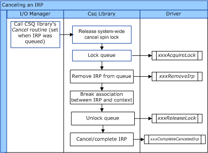
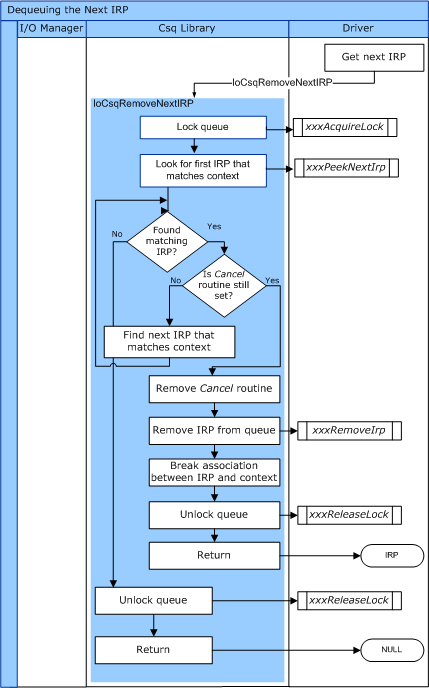
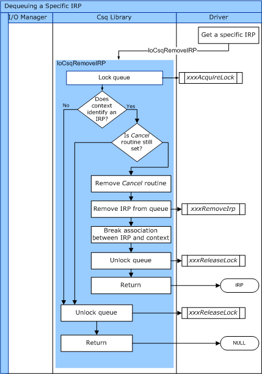
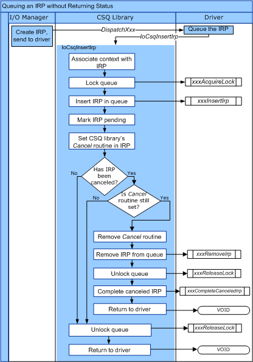
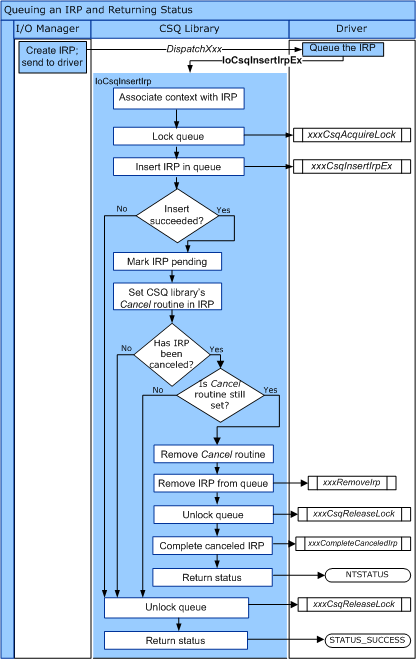

# Cancel-Safe IRP Queues


Drivers that implement their own IRP queuing should use the *cancel-safe IRP queue* framework. Cancel-safe IRP queues split IRP handling into two parts:

1. The driver provides a set of callback routines that implement standard operations on the driver's IRP queue. The provided operations include inserting and removing IRPs from the queue, and locking and unlocking the queue. See [Implementing the Cancel-Safe IRP Queue](#ddk-implementing-the-cancel-safe-irp-queue-kg).

2. Whenever the driver needs to actually insert or remove an IRP from the queue, it uses the system-provided **IoCsq*Xxx*** routines. These routines handle all synchronization and IRP canceling logic for the driver.

Drivers that use cancel-safe IRP queues do not implement [*Cancel*](/windows-hardware/drivers/ddi/wdm/nc-wdm-driver_cancel) routines to support IRP cancellation.

The framework ensures that drivers insert and remove IRPs from their queue atomically. It also ensures that IRP cancellation is implemented correctly. Drivers that do not use the framework must manually lock and unlock the queue before performing any insertions and deletions. They must also avoid the race conditions that can result when implementing a *Cancel* routine. (For a description of the race conditions that can arise, see [Synchronizing IRP Cancellation](synchronizing-irp-cancellation.md).)

The cancel-safe IRP queue framework is included with Windows XP and later versions of Windows. Drivers that must also work with Windows 2000 and Windows 98/Me can link to the Csq.lib library that is included in the Windows Driver Kit (WDK). The Csq.lib library provides an implementation of this framework.

The **IoCsq*Xxx*** routines are declared in the Windows XP and later versions of Wdm.h and Ntddk.h. Drivers that must also work with Windows 2000 and Windows 98/Me must include Csq.h for the declarations.

You can see a complete demonstration of how to use cancel-safe IRP queues in the \\src\\general\\cancel directory of the WDK. For more information about these queues, also see the [Flow of Control for Cancel-Safe IRP Queuing](https://go.microsoft.com/fwlink/p/?linkid=57844) white paper.

### <a href="" id="ddk-implementing-the-cancel-safe-irp-queue-kg"></a>Implementing the Cancel-Safe IRP Queue

To implement a cancel-safe IRP queue, drivers must provide the following routines:

-   Either of the following routines to insert IRPs into the queue: [*CsqInsertIrp*](/windows-hardware/drivers/ddi/wdm/nc-wdm-io_csq_insert_irp) or [*CsqInsertIrpEx*](/windows-hardware/drivers/ddi/wdm/nc-wdm-io_csq_insert_irp_ex). *CsqInsertIrpEx* is an extended version of *CsqInsertIrp*; the queue is implemented using one or the other.

-   A [*CsqRemoveIrp*](/windows-hardware/drivers/ddi/wdm/nc-wdm-io_csq_remove_irp) routine that removes the specified IRP from the queue.

-   A [*CsqPeekNextIrp*](/windows-hardware/drivers/ddi/wdm/nc-wdm-io_csq_peek_next_irp) routine that returns a pointer to the next IRP following the specified IRP in the queue. This is where the system passes the *PeekContext* value that it receives from [**IoCsqRemoveNextIrp**](/windows-hardware/drivers/ddi/wdm/nf-wdm-iocsqremovenextirp). The driver can interpret that value in any way.

-   Both of the following routines to allow the system to lock and unlock the IRP queue: [*CsqAcquireLock*](/windows-hardware/drivers/ddi/wdm/nc-wdm-io_csq_acquire_lock) and [*CsqReleaseLock*](/windows-hardware/drivers/ddi/wdm/nc-wdm-io_csq_release_lock).

-   A [*CsqCompleteCanceledIrp*](/windows-hardware/drivers/ddi/wdm/nc-wdm-io_csq_complete_canceled_irp) routine that completes a canceled IRP.

Pointers to the driver's routines are stored in the [**IO\_CSQ**](./eprocess.md) structure that describes the queue. The driver allocates the storage for the **IO\_CSQ** structure. The **IO\_CSQ** structure is guaranteed to remain a fixed size, so a driver can safely embed the structure inside its device extension.

The driver uses either [**IoCsqInitialize**](/windows-hardware/drivers/ddi/wdm/nf-wdm-iocsqinitialize) or [**IoCsqInitializeEx**](/windows-hardware/drivers/ddi/wdm/nf-wdm-iocsqinitializeex) to initialize the structure. Use **IoCsqInitialize** if the queue implements [*CsqInsertIrp*](/windows-hardware/drivers/ddi/wdm/nc-wdm-io_csq_insert_irp), or **IoCsqInitializeEx** if the queue implements *CsqInsertIrpEx*.

Drivers need only provide the essential functionality in each callback routine. For example, only the *CsqAcquireLock* and *CsqReleaseLock* routines implement lock handling. The system automatically calls these routines to lock and unlock the queue as necessary.

You can implement any type of IRP queuing mechanism in your driver, as long as the appropriate dispatch routines are provided. For example, the driver could implement the queue as a linked list, or as a priority queue.

[*CsqInsertIrpEx*](/windows-hardware/drivers/ddi/wdm/nc-wdm-io_csq_insert_irp_ex) provides a more flexible interface to the queue than does [*CsqInsertIrp*](/windows-hardware/drivers/ddi/wdm/nc-wdm-io_csq_insert_irp). The driver can use its return value to indicate the result of the operation; if it returns an error code, the insertion failed. A *CsqInsertIrp* routine does not return a value, so there is no simple way to indicate that an insertion failed. Also, *CsqInsertIrpEx* takes an additional driver-defined *InsertContext* parameter that can be used to specify additional driver-specific information to be used by the queue implementation.

Drivers can use *CsqInsertIrpEx* to implement more sophisticated IRP handling. For example, if there are no pending IRPs, the *CsqInsertIrpEx* routine can return an error code and the driver can process the IRP immediately. Similarly, if IRPs can no longer be queued, the *CsqInsertIrpEx* can return an error code to indicate that fact.

The driver is insulated from all IRP cancellation handling. The system provides a [*Cancel*](/windows-hardware/drivers/ddi/wdm/nc-wdm-driver_cancel) routine for IRPs in the queue. This routine calls [*CsqRemoveIrp*](/windows-hardware/drivers/ddi/wdm/nc-wdm-io_csq_remove_irp) to remove the IRP from the queue, and [*CsqCompleteCanceledIrp*](/windows-hardware/drivers/ddi/wdm/nc-wdm-io_csq_complete_canceled_irp) to complete the IRP cancellation.

The following diagram illustrates the flow of control for IRP cancellation.



A basic implementation of [*CsqCompleteCanceledIrp*](/windows-hardware/drivers/ddi/wdm/nc-wdm-io_csq_complete_canceled_irp) is as follows.

```cpp
VOID CsqCompleteCanceledIrp(PIO_CSQ Csq, PIRP Irp) {
  Irp->IoStatus.Status = STATUS_CANCELLED;
  Irp->IoStatus.Information = 0;

  IoCompleteRequest(Irp, IO_NO_INCREMENT);
}
```

Drivers can use any of the operating system's synchronization primitives to implement their [*CsqAcquireLock*](/windows-hardware/drivers/ddi/wdm/nc-wdm-io_csq_acquire_lock) and [*CsqReleaseLock*](/windows-hardware/drivers/ddi/wdm/nc-wdm-io_csq_release_lock) routines. Available synchronization primitives include [spin locks](./introduction-to-spin-locks.md) and [mutex objects](introduction-to-mutex-objects.md).

Here is an example of how a driver can implement locking using spin locks.

```cpp
/* 
  The driver has previously initialized the SpinLock variable with
  KeInitializeSpinLock.
 */

VOID CsqAcquireLock(PIO_CSQ IoCsq, PKIRQL PIrql)
{
    KeAcquireSpinLock(SpinLock, PIrql);
}

VOID CsqReleaseLock(PIO_CSQ IoCsq, KIRQL Irql)
{
    KeReleaseSpinLock(SpinLock, Irql);
}
```

The system passes a pointer to an IRQL variable to *CsqAcquireLock* and *CsqReleaseLock*. If the driver uses a spin lock to implement locking for the queue, the driver can use this variable to store the current IRQL when the queue is locked.

Drivers are not required to use spin locks. For example, the driver could use a mutex to lock the queue. For a description of the synchronization techniques that are available to drivers, see [Synchronization Techniques](introduction-to-kernel-dispatcher-objects.md).

### <a href="" id="ddk-using-the-cancel-safe-irp-queue-kg"></a>Using the Cancel-Safe IRP Queue

Drivers use the following system routines when queuing and dequeuing IRPs:

-   Either of the following to insert an IRP into the queue: [**IoCsqInsertIrp**](/windows-hardware/drivers/ddi/wdm/nf-wdm-iocsqinsertirp) or [**IoCsqInsertIrpEx**](/windows-hardware/drivers/ddi/wdm/nf-wdm-iocsqinsertirpex).

-   [**IoCsqRemoveNextIrp**](/windows-hardware/drivers/ddi/wdm/nf-wdm-iocsqremovenextirp) to remove the next IRP in the queue. The driver can optionally specify a key value.

The following diagram illustrates the flow of control for [**IoCsqRemoveNextIrp**](/windows-hardware/drivers/ddi/wdm/nf-wdm-iocsqremovenextirp).



-   [**IoCsqRemoveIrp**](/windows-hardware/drivers/ddi/wdm/nf-wdm-iocsqremoveirp) to remove the specified IRP from the queue.

The following diagram illustrates the flow of control for [**IoCsqRemoveIrp**](/windows-hardware/drivers/ddi/wdm/nf-wdm-iocsqremoveirp).



These routines, in turn, dispatch to driver-supplied routines.

The [**IoCsqInsertIrpEx**](/windows-hardware/drivers/ddi/wdm/nf-wdm-iocsqinsertirpex) routine provides access to the extended features of a *CsqInsertIrpEx* routine. It returns the status value that was returned by *CsqInsertIrpEx*. The caller can use this value to determine if the IRP was successfully queued or not. **IoCsqInsertIrpEx** also allows the caller to specify a value for the InsertContext parameter of *CsqInsertIrpEx*.

Note that both **IoCsqInsertIrp** and **IoCsqInsertIrpEx** can be called on any cancel-safe queue, whether the queue has a *CsqInsertIrp* routine or a *CsqInsertIrpEx* routine. **IoCsqInsertIrp** behaves the same in either case. If **IoCsqInsertIrpEx** is passed a queue that has a *CsqInsertIrp* routine, it behaves identically to **IoCsqInsertIrp**.

The following diagram illustrates the flow of control for [**IoCsqInsertIrp**](/windows-hardware/drivers/ddi/wdm/nf-wdm-iocsqinsertirp).



The following diagram illustrates the flow of control for [**IoCsqInsertIrpEx**](/windows-hardware/drivers/ddi/wdm/nf-wdm-iocsqinsertirpex).



There are several natural ways to use the **IoCsq*Xxx*** routines to queue and dequeue IRPs. For example, a driver could simply queue IRPs to be processed in the order in which they are received. The driver could queue an IRP as follows:

```cpp
    status = IoCsqInsertIrpEx(IoCsq, Irp, NULL, NULL);
```

If the driver is not required to distinguish between particular IRPs, it could then simply dequeue them in the order in which they were queued, as follows:

```cpp
    IoCsqRemoveNextIrp(IoCsq, NULL);
```

Alternatively, the driver could queue and dequeue specific IRPs. The routines use the opaque [**IO\_CSQ\_IRP\_CONTEXT**](./eprocess.md) structure to identify particular IRPs in the queue. The driver queues the IRP as follows:

```cpp
    IO_CSQ_IRP_CONTEXT ParticularIrpInQueue;
    IoCsqInsertIrp(IoCsq, Irp, &ParticularIrpInQueue);
```

The driver can then dequeue the same IRP by using the **IO\_CSQ\_IRP\_CONTEXT** value.

```cpp
    IoCsqRemoveIrp(IoCsq, Irp, &ParticularIrpInQueue);
```

The driver might also be required to remove IRPs from the queue based on a particular criterion. For example, the driver might associate a priority with each IRP, such that higher priority IRPs get dequeued first. The driver might pass a *PeekContext* value to [**IoCsqRemoveNextIrp**](/windows-hardware/drivers/ddi/wdm/nf-wdm-iocsqremovenextirp), which the system passes back to the driver when it requests the next IRP in the queue.

 

