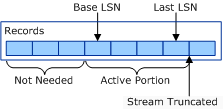
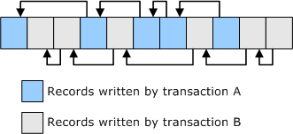
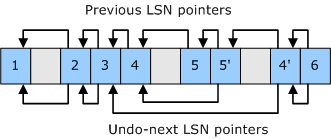

# CLFS Log Sequence Numbers

In the Common Log File System (CLFS), each log record in a given stream is uniquely identified by a log sequence number (LSN). When you write a record to a stream, you get back an LSN that identifies that record for future reference.

The LSNs created for a particular stream form a strictly increasing sequence. That is, the LSN assigned to a log record in a given stream is always greater than the LSNs assigned to log records previously written to that same stream. The following functions are available for comparing the LSNs of log records in a given stream.

[**ClfsLsnNull**](https://msdn.microsoft.com/library/windows/hardware/ff541609)

[**ClfsLsnEqual**](https://msdn.microsoft.com/library/windows/hardware/ff541590)

[**ClfsLsnGreater**](https://msdn.microsoft.com/library/windows/hardware/ff541595)

[**ClfsLsnLess**](https://msdn.microsoft.com/library/windows/hardware/ff541608)

The constants CLFS\_LSN\_NULL and CLFS\_LSN\_INVALID are the lower and upper boundaries for all valid LSNs. Any valid LSN is greater than or equal to CLFS\_LSN\_NULL. Also, any valid LSN is strictly less than CLFS\_LSN\_INVALID. Note that CLFS\_LSN\_NULL is a valid LSN, whereas CLFS\_LSN\_INVALID is not a valid LSN. Even so, you can compare CLFS\_LSN\_INVALID to other LSNs by using the functions in the previous list.

For each stream, CLFS keeps track of two special LSNs: the base LSN and the last LSN. Also, each individual log record has two special LSNs (the previous LSN and the undo-next LSN) that you can use to create chains of related log records. The following sections describe these special LSNs in detail.

### Base LSN

When a client writes the first record in a stream, CLFS sets the base LSN to the LSN of that first record. The base LSN remains unchanged until a client changes it. When the stream's clients no longer need the records prior to a certain point in the stream, they can update the base LSN by calling [**ClfsAdvanceLogBase**](https://msdn.microsoft.com/library/windows/hardware/ff540773) or [**ClfsWriteRestartArea**](https://msdn.microsoft.com/library/windows/hardware/ff541770). For example, if the clients no longer need the first five log records, they can set the base LSN to the LSN of the sixth record.

### Last LSN

As clients write records to a stream, CLFS adjusts the last LSN so that it is always the LSN of the last record written. If the clients no longer need the records after a certain point in the stream, they can update the last LSN by calling [**ClfsSetEndOfLog**](https://msdn.microsoft.com/library/windows/hardware/ff541753). For example, if the clients no longer need any records written after the tenth record, they can truncate the stream by setting the last LSN to the LSN of the tenth record.

### Active portion of a stream

The *active portion* of a stream is the portion of a stream that begins with the record pointed to by the base LSN and ends with the record pointed to by the last LSN. The following diagram illustrates how the base LSN and last LSN delineate the active portion of a stream.

**Note**   If a stream has an archive tail, the active portion of the stream begins at the record pointed to by the base LSN or the archive tail, whichever is smaller. For more information about archiving, see [CLFS Support for Archiving](clfs-support-for-archiving.md).

 

### Previous LSN

Suppose two active database transactions (transaction A and transaction B) are writing records to the same stream at the same time. Each time transaction A writes a record, it sets the record's previous LSN to the LSN of the previous log record written by transaction A. That forms a chain of log records, belonging to transaction A, that can be traversed in reverse order. The chain ends with the first log record written by transaction A, which has its previous LSN set to CLFS\_LSN\_INVALID. Similarly, transaction B creates its own chain of log records by setting the previous LSN of each log record it writes.

The arrows in the following diagram illustrate how the previous LSN of a log record points to the previous record in a chain that belongs to a particular transaction.

### Undo-next LSN

Suppose a transaction makes five updates to a data object in volatile memory, rolls back the fourth and fifth updates, and then makes a sixth update. As the transaction makes the updates, it writes log records 1, 2, 3, 4, 5, 5', 4', and 6. Log records 1 through 5 describe the changes made by updates 1 through 5. Record 5' describes the changes made during the rollback of update 5, and record 4' describes the changes made during the rollback of update 4. Finally, record 6 describes the changes made by update 6. Note that the numbers 1, 2, 3, 4, 5, 5', 4', and 6 are not the LSNs of the log records; they are just numbers used to name the log records for the purpose of this discussion.

Log records 5' and 4', which describe rollbacks, are called compensation log records (CLRs). The transaction sets the undo-next LSN of each CLR to the predecessor (among the records written by the transaction) of the log record whose update was just rolled back (undone). In this example, the undo-next LSN of record 5' is the LSN of record 4, and the undo-next LSN of record 4' is the LSN of record 3.

The ordinary log records (those that are not CLRs), have their undo-next LSNs set to the previous log record written by the transaction. That is, for an ordinary record, the undo-next LSN and previous LSN are the same.

Now suppose there is a system failure and, during restart recovery, the entire transaction must be rolled back. The recovery code reads log record 6. The data in record 6 indicates that record 6 is an ordinary record (not a CLR), so the recovery code rolls back update 6. Then the recovery code inspects the undo-next LSN of record 6 and finds that it points to record 4'. The data in record 4' indicates that it is a CLR, so the recovery code does not roll back update 4'. Instead, it inspects the undo-next LSN of record 4' and finds that it points to record 3. Record 3 is not a CLR, so the recovery code rolls back update 3. Updates 5 and 4 are not rolled back during recovery because they were already rolled back during ordinary forward processing. Finally the recovery code rolls back updates 2 and 1.

The arrows in the following diagram illustrate how the undo-next LSN provides a mechanism that recovery code can use to skip records whose updates have already been rolled back.

 

 

