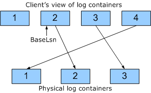

# CLFS Stable Storage

When you write a record to a Common Log File System (CLFS) stream, the record is placed in a log I/O block (in a marshalling area) in volatile memory. Periodically, CLFS flushes log I/O blocks from the marshalling area to stable storage such as a disk. On the stable storage device, the log consists of a set of containers, each of which is a contiguous extent on the physical medium. A collection of containers that forms the stable storage for a stream is called a *log*, or a *physical log*.

The following figure illustrates a container.

The preceding figure illustrates a container that holds three log I/O blocks. The first log I/O block contains three records, the second contains five records, and the third contains two records. As the figure suggests, the beginning of each log I/O block is always aligned with the beginning of a sector on the stable storage medium. Note that log I/O blocks on stable storage vary in size.

CLFS uses a set of three numbers to locate a record in a log.

-   The *container identifier* identifies the container that holds the record.

-   The *block offset* gives the byte offset, within the container, of the beginning of the log I/O block that holds the record.

-   The *record sequence* number identifies the record within the log I/O block.

The log sequence number (LSN) of a CLFS log record actually holds those three pieces of information: container identifier, block offset, and record sequence number. However, the LSNs given to log clients contain *logical container identifiers* that CLFS must map to physical container identifiers before it accesses the records on stable storage.

CLFS uses logical container identifiers to give clients the view that log records are being written to an ongoing sequence of containers, when in fact, the physical containers are being recycled.

Suppose a log has three containers, and a single client is writing CLFS records to the log. The following scenario shows how a container could be recycled.

1.  The client writes enough log records to fill all three containers.

2.  The client sets the log base (by calling [**ClfsAdvanceLogBase**](https://msdn.microsoft.com/library/windows/hardware/ff540773) or [**ClfsWriteRestartArea**](https://msdn.microsoft.com/library/windows/hardware/ff541770).) to one of the records in container 2. By doing that, the client is saying that it no longer needs the records in container 1.

3.  The client writes another record to the log and gets back the LSN of the newly written record. The logical container identifier in that LSN is 4. When records are flushed to stable storage, records that the client sees in logical container 4 will go to physical container 1.

The following figure illustrates the scenario; it shows how the client sequence of logical containers is mapped to physical containers on stable storage.

The logical container identifier, block offset, and record sequence number are stored in an LSN in such a way that the LSNs for a particular stream always form a strictly increasing sequence. That is, the LSN (with logical container identifier) of a log record written to a stream is always greater than the LSNs of the log records previously written to that same stream. LSNs, then, serve a dual purpose: 1) they give the clients of a stream an ordered sequence of record identifiers, and 2) they provide CLFS with the location of records on stable storage.

Given the LSN of a record, you can extract the logical container identifier, the block offset, and the record sequence number by calling the following functions.

[**ClfsLsnContainer**](https://msdn.microsoft.com/library/windows/hardware/ff541573)

[**ClfsLsnBlockOffset**](https://msdn.microsoft.com/library/windows/hardware/ff541569)

[**ClfsLsnRecordSequence**](https://msdn.microsoft.com/library/windows/hardware/ff541615)

The logical container identifier is a 32-bit number, so there are 2^32 possible logical container identifiers, and they are in the range 0x0 through 0xFFFFFFFF. A stream can have at most 2^32 logical containers.

The block offset is stored in 23 bits of the LSN, but **ClfsLsnBlockOffset** returns a 32-bit number that is aligned with the sector size of the stable storage medium. The block offset is always a multiple of 512. Also, the block offset is aligned with the sector size of the stable storage medium. For example, if the sector size is 1024 bytes, the block offset will be a multiple of 1024.

The record sequence number is a 9-bit number, so there are 2^9 (512) possible record sequence numbers, and they are in the range 0x0 through 0x1FF. A log I/O block can have at most 512 records.

 

 

