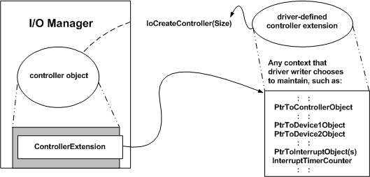

# Creating Controller Objects and Controller Extensions

## 

If a driver uses a controller object, it must call [**IoCreateController**](https://msdn.microsoft.com/library/windows/hardware/ff548395) after it has created device objects and its device is ready for I/O, typically after receiving a PnP [**IRP\_MN\_START\_DEVICE**](https://msdn.microsoft.com/library/windows/hardware/ff551749) request. The following figure illustrates the call.

Every controller object has an associated controller extension. As the previous figure shows, the caller of **IoCreateController** determines the *Size* of the controller extension. Its structure and contents are driver-defined.

In addition to whatever device-specific state information the driver maintains about the physical controller (or device with channels), the previous figure shows a representative set of driver-defined data for a controller extension.

The *PtrToControllerObject* pointer, returned by **IoCreateController**, must be passed in the driver's calls to [**IoAllocateController**](https://msdn.microsoft.com/library/windows/hardware/ff548224) and [**IoFreeController**](https://msdn.microsoft.com/library/windows/hardware/ff549104), described in [Allocating Controller Objects for I/O Operations](allocating-controller-objects-for-i-o-operations.md). The driver must store the returned controller object pointer in the device extensions of its driver-created device objects or in another driver-accessible resident storage area (nonpaged pool, allocated by the driver). If the driver is unloaded, it also must pass the controller object pointer to [**IoDeleteController**](https://msdn.microsoft.com/library/windows/hardware/ff549078).

Most drivers that set up controller objects find it convenient to store a pointer to the current target device object or device extension in the controller extension. Usually, such a driver stores the controller object pointer in every one of its device extensions so that it can use the *ControllerObject***-&gt;ControllerExtension** pointer to access driver-maintained, controller-specific state about I/O operations for every target device object.

If the physical controller represented by a controller object generates interrupts, a driver also can use the controller extension as storage for *PtrToInterruptObject* pointers returned by [**IoConnectInterrupt**](https://msdn.microsoft.com/library/windows/hardware/ff548371). For more information, see [Interrupt Service Routines](interrupt-service-routines.md).

**IoCreateController** allocates resident storage for the controller object and extension, which it initializes with zeros. If it cannot allocate the memory, **IoCreateController** returns a **NULL** pointer. If this occurs, the driver must fail device startup and should return STATUS\_INSUFFICIENT\_RESOURCES.

 

 

--------------------
[Send comments about this topic to Microsoft](mailto:wsddocfb@microsoft.com?subject=Documentation%20feedback%20%5Bkernel\kernel%5D:%20Creating%20Controller%20Objects%20and%20Controller%20Extensions%20%20RELEASE:%20%286/14/2017%29&body=%0A%0APRIVACY%20STATEMENT%0A%0AWe%20use%20your%20feedback%20to%20improve%20the%20documentation.%20We%20don't%20use%20your%20email%20address%20for%20any%20other%20purpose,%20and%20we'll%20remove%20your%20email%20address%20from%20our%20system%20after%20the%20issue%20that%20you're%20reporting%20is%20fixed.%20While%20we're%20working%20to%20fix%20this%20issue,%20we%20might%20send%20you%20an%20email%20message%20to%20ask%20for%20more%20info.%20Later,%20we%20might%20also%20send%20you%20an%20email%20message%20to%20let%20you%20know%20that%20we've%20addressed%20your%20feedback.%0A%0AFor%20more%20info%20about%20Microsoft's%20privacy%20policy,%20see%20http://privacy.microsoft.com/default.aspx. "Send comments about this topic to Microsoft")

