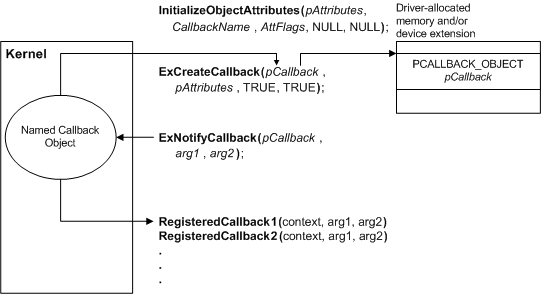

# Defining a Callback Object

A driver can create a callback object, through which other drivers can request notification of conditions defined by the creating driver. The following figure shows the steps involved in defining a callback object.

Before creating the object, the driver calls [**InitializeObjectAttributes**](https://msdn.microsoft.com/library/windows/hardware/ff547804) to set its attributes. A callback object must have a name, which cannot match the name of a system-defined callback; it can have whatever other attributes its creator deems appropriate, typically OBJ\_CASE\_INSENSITIVE. Next the driver calls [**ExCreateCallback**](https://msdn.microsoft.com/library/windows/hardware/ff544560), passing a pointer to the initialized attributes and a location at which to receive a handle to the callback object. It also passes two Booleans, indicating whether the system should create the callback object if such a named object does not already exist, and whether the object should allow more than one registered callback routine.

The driver defines the conditions for which it will call the registered callback routines. The conditions take the form of two arguments, each pointing to a parameter defined by the driver that creates the callback. You should document these conditions, along with the name of the callback object and the IRQL at which it requests notification, for clients of the driver.

When the callback condition occurs, the driver calls [**ExNotifyCallback**](https://msdn.microsoft.com/library/windows/hardware/ff545489), passing its handle to the callback object and the two arguments. The system then calls all callback routines registered for the callback object, in the order in which they were registered, passing the two arguments and a pointer to the context supplied when the routine was registered. The driver must call **ExNotifyCallback** at IRQL &lt;= DISPATCH\_LEVEL; the system calls the callback routines at the same IRQL at which the driver made this call.

After all operations have been completed with the callback object, the driver that created the callback should call [**ObDereferenceObject**](https://msdn.microsoft.com/library/windows/hardware/ff557724) to decrement its reference count and ensure that the object is deleted.

 

 

