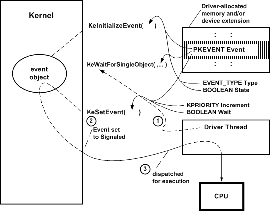

# Defining and Using an Event Object

Any driver that uses an event object must call [**KeInitializeEvent**](https://msdn.microsoft.com/library/windows/hardware/ff552137), [**IoCreateNotificationEvent**](https://msdn.microsoft.com/library/windows/hardware/ff549039), or [**IoCreateSynchronizationEvent**](https://msdn.microsoft.com/library/windows/hardware/ff549045) before it waits on, sets, clears, or resets the event. The following figure illustrates how a driver with a thread can use an event object for synchronization.

As the previous figure shows, such a driver must provide the storage for the event object, which must be resident. The driver can use the [device extension](device-extensions.md) of a driver-created device object, the controller extension if it uses a [controller object](using-controller-objects.md), or nonpaged pool allocated by the driver.

When the driver calls **KeInitializeEvent**, it must pass a pointer to the driver's resident storage for the event object. In addition, the caller must specify the initial state (signaled or not signaled) for the event object. The caller also must specify the event type, which can be either of the following:

-   **SynchronizationEvent**

    When a *synchronization event* is set to the Signaled state, a single thread that is waiting for the event to be reset to Not-Signaled becomes eligible for execution and the event's state is automatically reset to Not-Signaled.

    This type of event is sometimes called an *autoclearing event*, because its Signaled state is automatically reset each time a wait is satisfied.

-   **NotificationEvent**

    When a *notification event* is set to the Signaled state, all threads that were waiting for the event to be reset to Not-Signaled become eligible for execution and the event remains in the Signaled state until an explicit reset to Not-Signaled occurs: that is, there is a call to [**KeClearEvent**](https://msdn.microsoft.com/library/windows/hardware/ff551980) or [**KeResetEvent**](https://msdn.microsoft.com/library/windows/hardware/ff553176) with the given *Event* pointer.

Few device or intermediate drivers have a single driver-dedicated thread, let alone a set of threads that might synchronize their operations by waiting for an event that protects a shared resource.

Most drivers that use event objects to wait for the completion of an I/O operation set the input *Type* to **NotificationEvent** when they call **KeInitializeEvent**. An event object set up for IRPs that a driver creates with [**IoBuildSynchronousFsdRequest**](https://msdn.microsoft.com/library/windows/hardware/ff548330) or [**IoBuildDeviceIoControlRequest**](https://msdn.microsoft.com/library/windows/hardware/ff548318) is almost always initialized as a **NotificationEvent** because the caller will wait for the event for notification that its request has been satisfied by one or more lower-level drivers.

After the driver has initialized itself, its driver-dedicated thread, if any, and other routines can synchronize their operations on the event. For example, a driver with a thread that manages the queuing of IRPs, such as the system floppy controller driver, might synchronize IRP processing on an event, as shown in the previous figure:

1.  The thread, which has dequeued an IRP for processing on the device, calls [**KeWaitForSingleObject**](https://msdn.microsoft.com/library/windows/hardware/ff553350) with a pointer to the driver-supplied storage for the initialized event object.

2.  Other driver routines carry out device the I/O operations necessary to satisfy the IRP and, when these operations are complete, the driver's [*DpcForIsr*](https://msdn.microsoft.com/library/windows/hardware/ff544079) routine calls [**KeSetEvent**](https://msdn.microsoft.com/library/windows/hardware/ff553253) with a pointer to the event object, a driver-determined priority boost for the thread (*Increment*, as shown in the previous figure), and a Boolean *Wait* set to **FALSE**. Calling **KeSetEvent** sets the event object to the Signaled state, thereby changing the waiting thread's state to ready.

3.  The kernel dispatches the thread for execution as soon as a processor is available: that is, no other thread with a higher priority is currently in the ready state and there are no kernel-mode routines to be run at a higher IRQL.

    The thread now can complete the IRP if the *DpcForIsr* has not called **IoCompleteRequest** with the IRP already, and can dequeue another IRP to be processed on the device.

Calling **KeSetEvent** with the *Wait* parameter set to **TRUE** indicates the caller's intention to immediately call a [**KeWaitForSingleObject**](https://msdn.microsoft.com/library/windows/hardware/ff553350) or [**KeWaitForMultipleObjects**](https://msdn.microsoft.com/library/windows/hardware/ff553324) support routine on return from **KeSetEvent**.

**Consider the following guidelines for setting the***Wait***parameter toKeSetEvent:**

A pageable thread or pageable driver routine that runs at IRQL &lt; DISPATCH\_LEVEL should never call **KeSetEvent** with the *Wait* parameter set to **TRUE**. Such a call causes a fatal page fault if the caller happens to be paged out between the calls to **KeSetEvent** and **KeWaitForSingleObject** or **KeWaitForMultipleObjects**.

Any standard driver routine that runs at IRQL = DISPATCH\_LEVEL cannot wait for a nonzero interval on any dispatcher objects without bringing down the system. However, such a routine can call **KeSetEvent** while running at an IRQL less than or equal to DISPATCH\_LEVEL.

For a summary of the IRQLs at which standard driver routines run, see [Managing Hardware Priorities](managing-hardware-priorities.md).

**KeResetEvent** returns the previous state of a given *Event*: whether it was set to Signaled or not when the call to **KeResetEvent** occurred. **KeClearEvent** simply sets the state of the given *Event* to Not-Signaled.

**Consider the following guideline for when to call the preceding support routines:**

For better performance, every driver should call **KeClearEvent** unless the caller needs the information returned by **KeResetEvent** to determine what to do next.

 

 

