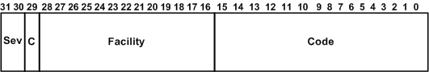

# Defining New NTSTATUS Values

Drivers can define custom IO\_ERR\_*XXX* constants to use as **ErrorCode** values when logging errors. Pairs of drivers that are written together can also define custom STATUS\_*XXX* values for [**IRP\_MJ\_INTERNAL\_DEVICE\_CONTROL**](https://msdn.microsoft.com/library/windows/hardware/ff550766) requests.

The following diagram shows the bit fields in a 32-bit NTSTATUS value.

The **Sev** field shown in the preceding diagram indicates the severity code, which must be one of the following system-defined values:

STATUS\_SEVERITY\_SUCCESS  
Indicates a successful NTSTATUS value, such as STATUS\_SUCCESS, or the value IO\_ERR\_RETRY\_SUCCEEDED in error log packets.

STATUS\_SEVERITY\_INFORMATIONAL  
Indicates an informational NTSTATUS value, such as STATUS\_SERIAL\_MORE\_WRITES.

STATUS\_SEVERITY\_WARNING  
Indicates a warning NTSTATUS value, such as STATUS\_DEVICE\_PAPER\_EMPTY.

STATUS\_SEVERITY\_ERROR  
Indicates an error NTSTATUS value, such as STATUS\_INSUFFICIENT\_RESOURCES for a **FinalStatus** value or IO\_ERR\_CONFIGURATION\_ERROR for an **ErrorCode** value in error log packets.

Most public IO\_ERR\_*XXX* constants belong to the STATUS\_SEVERITY\_ERROR category.

The **Facility** code specifies the facility that generated the error. For new IO\_ERR\_*XXX* values, drivers specify the FACILITY\_IO\_ERROR\_CODE value for **Facility**. For custom STATUS\_*XXX* values, the meaning of different values for **Facility** is driver-defined.

The **C** bit specifies if the value is customer-defined or Microsoft-defined. The bit is set for customer-defined values and clear for Microsoft-defined values.

Drivers can define new IO\_ERR\_*XXX* values to identify custom error messages in the system event log. For a description of how to define the NTSTATUS values and the error messages that they identify, see [Defining Custom Error Types](defining-custom-error-types.md).

Pairs of drivers can define driver-specific STATUS\_*XXX* values to communicate information about privately defined [**IRP\_MJ\_INTERNAL\_DEVICE\_CONTROL**](https://msdn.microsoft.com/library/windows/hardware/ff550766) requests from the lower to the higher driver of the pair.

The class driver must map any private STATUS\_*XXX* value to a system-defined NTSTATUS value when it completes an IRP if an existing higher-level driver's [*IoCompletion*](https://msdn.microsoft.com/library/windows/hardware/ff548354) routine might be called for that IRP.

For paired display and video miniport drivers, the video port driver does the mapping between public STATUS\_*XXX* values and the Win32-defined constants returned by video miniport drivers. For more information, see [Video Miniport Drivers in the Windows 2000 Display Driver Model](https://msdn.microsoft.com/library/windows/hardware/ff570509).

Drivers cannot use custom NTSTATUS values for IRPs that can be received in user mode, because only the system-defined values can be translated into Win32 error codes.

 

 

