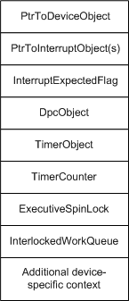

# Device Extensions

## 

For most intermediate and lowest-level drivers, the device extension is the most important data structure associated with a device object. Its internal structure is driver-defined, and it is typically used to:

-   Maintain device state information.

-   Provide storage for any kernel-defined objects or other system resources, such as spin locks, used by the driver.

-   Hold any data the driver must have resident and in system space to carry out its I/O operations.

Because most bus, function, and filter drivers (lowest-level and intermediate drivers) execute in an arbitrary thread context (that of whatever thread happens to be current), a device extension is each driver's primary place to maintain device state and all other device-specific data the driver needs. For example, any driver that implements a [*CustomTimerDpc*](https://msdn.microsoft.com/library/windows/hardware/ff542983) or [*CustomDpc*](https://msdn.microsoft.com/library/windows/hardware/ff542972) routine usually provides storage for the required kernel-defined timer and/or DPC objects in a device extension.

Every driver that has an ISR must provide storage for a pointer to a set of kernel-defined interrupt objects, and most device drivers store this pointer in a device extension. Each driver determines the size of the device extension when it creates a device object, and each driver defines the contents and structure of its own device extensions.

The I/O manager's [**IoCreateDevice**](https://msdn.microsoft.com/library/windows/hardware/ff548397) and [**IoCreateDeviceSecure**](https://msdn.microsoft.com/library/windows/hardware/ff548407) routines allocate memory for the device object and extension from the nonpaged memory pool.

Every standard driver routine that receives an IRP also receives a pointer to a device object representing the target device for the requested I/O operation. These driver routines can access the corresponding device extension through this pointer. Usually, a *DeviceObject* pointer is also an input parameter to a lowest-level driver's ISR.

The following figure shows a representative set of driver-defined data for the device extension of a lowest-level driver's device object. A higher-level driver would not provide storage for an interrupt object pointer returned by [**IoConnectInterrupt**](https://msdn.microsoft.com/library/windows/hardware/ff548371) and passed to [**KeSynchronizeExecution**](https://msdn.microsoft.com/library/windows/hardware/ff553302) and [**IoDisconnectInterrupt**](https://msdn.microsoft.com/library/windows/hardware/ff549089). However, a higher-level driver would provide storage for the timer and DPC objects shown in the following figure if the driver has a *CustomTimerDpc* routine. A higher-level driver also might provide storage for an executive spin lock and interlocked work queue.

In addition to providing storage for an interrupt object pointer, a lowest-level device driver must supply storage for an interrupt spin lock if its ISR handles interrupts for two or more devices on different vectors or if it has more than one ISR. For more information about registering an ISR, see [Registering an ISR](registering-an-isr.md).

Typically, drivers store pointers to their device objects in their device extensions, as shown in the figure. A driver might also keep a copy of the resource list for the device in the extension.

A higher-level driver typically stores a pointer to the next-lower driver's device object in its device extension. A higher-level driver must pass a pointer to the next-lower driver's device object to [**IoCallDriver**](https://msdn.microsoft.com/library/windows/hardware/ff548336), after it has set up the next-lower driver's I/O stack location in an IRP, as explained in [Handling IRPs](handling-irps.md).

Note also that any higher-level driver that allocates IRPs for lower-level drivers must specify how many stack locations the new IRPs should have. In particular, if a higher-level driver calls [**IoMakeAssociatedIrp**](https://msdn.microsoft.com/library/windows/hardware/ff549397), [**IoAllocateIrp**](https://msdn.microsoft.com/library/windows/hardware/ff548257), or [**IoInitializeIrp**](https://msdn.microsoft.com/library/windows/hardware/ff549315), it must access the target device object of the next-lower-level driver to read its **StackSize** value, in order to supply the correct *StackSize* as an argument to these support routines.

While a higher-level driver can read data from the next-lower-level driver's device object through the pointer returned by [**IoAttachDeviceToDeviceStack**](https://msdn.microsoft.com/library/windows/hardware/ff548300), such a driver must follow these implementation guidelines:

-   Never attempt to write data to the lower driver's device object.

    The only exceptions to this guideline are file systems, which set and clear DO\_VERIFY\_VOLUME in the **Flags** of lower-level removable-media drivers' device objects.

-   Never attempt to access the lower driver's device extension for the following reasons:

    -   There is no safe way to synchronize access to a single device extension between two drivers.
    -   A pair of drivers that implement such a backdoor communication scheme cannot be upgraded individually, cannot have an intermediate driver inserted between them without changing existing driver source, and cannot be recompiled and moved readily from one Windows platform to the next.

To preserve their interoperability with lower-level drivers from one Windows platform or version to the next, higher-level drivers either must reuse the IRPs given them or must create new IRPs, and they must use [**IoCallDriver**](https://msdn.microsoft.com/library/windows/hardware/ff548336) to communicate requests to lower-level drivers.

 

 

--------------------
[Send comments about this topic to Microsoft](mailto:wsddocfb@microsoft.com?subject=Documentation%20feedback%20%5Bkernel\kernel%5D:%20Device%20Extensions%20%20RELEASE:%20%286/14/2017%29&body=%0A%0APRIVACY%20STATEMENT%0A%0AWe%20use%20your%20feedback%20to%20improve%20the%20documentation.%20We%20don't%20use%20your%20email%20address%20for%20any%20other%20purpose,%20and%20we'll%20remove%20your%20email%20address%20from%20our%20system%20after%20the%20issue%20that%20you're%20reporting%20is%20fixed.%20While%20we're%20working%20to%20fix%20this%20issue,%20we%20might%20send%20you%20an%20email%20message%20to%20ask%20for%20more%20info.%20Later,%20we%20might%20also%20send%20you%20an%20email%20message%20to%20let%20you%20know%20that%20we've%20addressed%20your%20feedback.%0A%0AFor%20more%20info%20about%20Microsoft's%20privacy%20policy,%20see%20http://privacy.microsoft.com/default.aspx. "Send comments about this topic to Microsoft")

