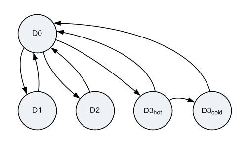

# Device Power States

## 

A device power state describes the power state of a device in a computer, independently of the other devices in the computer. Device power states are named D0, D1, D2, and D3. D0 is the fully on state, and D1, D2, and D3 are low-power states. The state number is inversely related to power consumption: higher numbered states use less power. Starting with Windows 8, the D3 state is divided into two substates, D3hot and D3cold.

Device power states are characterized by the following attributes:

-   Power consumption: How much power does the device use?

-   Device context: How much of its operational context does the device retain in this state?

-   Device driver behavior: What must the drivers for the device do to restore the device to the fully operational state?

-   Restore time: How long does it take to restore the device to the fully operational state? Most types of devices have modest restore times that differ little from one device class to the next. Only a few types of devices, such as GPUs, have very large hardware contexts that take significantly longer to restore.

-   Wake-up capability: Can the device request wake-up from this state? In general, if a device can request wake-up from a given power state (for example, D2), it can also request wake-up from any higher-powered state (D1).

The exact definitions of the power states are device-specific. Not all devices define all the states; many devices define only the D0 and D3 states. See the Device Class Power Management Reference Specification to find out which device power states are defined for a specific device and what the operational requirements are for each state. (The reference specifications are available at the [ACPI / Power Management](http://go.microsoft.com/fwlink/p/?linkid=57185) website.)

The power state of a device need not match the [system power state](system-power-states.md). For example, some devices can be in the off (D3) state even though the system is in the [system working state (S0)](system-working-state-s0.md).

The power state of a device might seem to be unrelated to the power state of the device's parent bus. For example, a USB device might be in the D2 (selective suspend) state when its parent host controller is in the D3 state. These two states appear to be inconsistent only because the definitions of the Dx states are different on USB and on the bus (typically PCI or PCI Express) that the USB host controller is connected to.

Note that some devices are capable of several different low power modes within a single device power state. Such a device can use these modes if its driver can automatically switch the device from one mode to another without changing the device power state. As a general rule, however, if there is no user-perceptible difference between the modes, the device should use only the lowest power mode. If a low power mode, such as a low-speed mode, adversely affects performance or is not transparent to software other than the device driver, the hardware should not automatically use it. See the Device Class Power Management Reference Specification for details.

A driver or the power manager can request a device power state transition, and all drivers must be prepared to handle IRPs that request such transitions. For more information, see the following topics:

[Sending IRP\_MN\_QUERY\_POWER or IRP\_MN\_SET\_POWER for Device Power States](sending-irp-mn-query-power-or-irp-mn-set-power-for-device-power-states.md)

[Handling IRP\_MN\_QUERY\_POWER for Device Power States](handling-irp-mn-query-power-for-device-power-states.md)

[Handling IRP\_MN\_SET\_POWER for Device Power States](handling-irp-mn-set-power-for-device-power-states.md)

## 

Like the system, a device can transition from the working state (D0) to any low-power state (D1, D2, or D3) and from any low-power state to the working state. The following diagram is a state graph that shows the valid device power state transitions.

This graph shows the subdivision of D3 into D3hot and D3cold. D3hot and D3cold are defined starting with Windows 8. All devices are required to support the D0 state and D3hot substate. The other states shown in the diagram are optional.

In the preceding graph, the transition from D3hot to D3cold is the only direct transition between device low-power states. All other transitions between low-power states require an intermediate transition to D0, which allows the device driver to configure the device hardware, as required, either to enter the next low-power state or to stay in D0. However, a device exits D3hot and enters D3cold when power to the device is shut off, which requires no intervention from the device driver. This driver does any necessary configuration of the device hardware before the device enters D3hot; no additional configuration is required to prepare the device for the transition from D3hot to D3cold. For more information, see [Supporting D3cold in a Driver](supporting-d3cold-in-a-driver.md).

 

 

