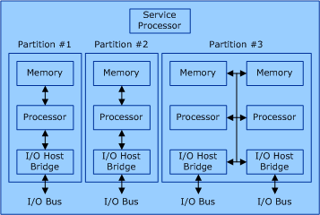

# Dynamic Hardware Partitioning Architecture

A hardware partitionable server can be configured into one or more isolated hardware partitions. A hardware partition consists of one or more partition units. A partition unit can be a processor, a memory module, or an I/O host bridge.

The following figure shows an example of a hardware partitionable server.

In the previous figure, the server has a total of 12 partition units: four memory modules, four processor modules, and four I/O host bridge modules. Each of these partition units is assigned to one of three hardware partitions. Each hardware partition is completely isolated from the other hardware partitions. The service processor is responsible for the configuration of the hardware partitions. It controls the mapping of the partition units to the hardware partitions and creates isolation between the hardware partitions.

Starting with Windows Server 2008, each partition unit is considered a Plug and Play (PnP) device. Because these devices are PnP, you can add them after the operating system has started.

For more information about how a device driver can register itself with the operating system to receive notification when partition units are dynamically added to the hardware partition, see [Driver Notification](driver-notification.md).

For more information about how an application can register itself with the operating system to receive notification when partition units are dynamically added to the hardware partition, see [Application Notification](application-notification.md).

 

 

