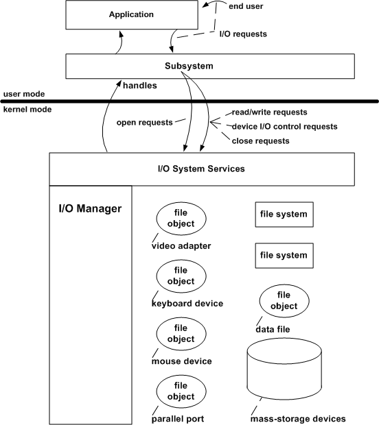

# End-User I/O Requests and File Objects

Kernel-mode drivers are hidden from end users by a protected subsystem that implements an already familiar programming interface, such as Windows or POSIX. Devices are visible to user-mode code, which includes protected subsystems, only as named file objects controlled by the I/O manager.

The following figure illustrates this relationship between an end user, a subsystem, and the I/O manager.

A protected subsystem, such as the Win32 subsystem, passes I/O requests to the appropriate kernel-mode driver through the I/O system services. The subsystem shown in the previous figure depends on support from the display, video adapter, keyboard, and mouse device drivers.

A protected subsystem insulates its end users and applications from having to know anything about kernel-mode components, including drivers. In turn, the I/O manager insulates protected subsystems from having to know anything about machine-specific device configurations or about drivers' implementations.

The I/O manager's layered approach also insulates most drivers from having to know anything about the following:

-   Whether an I/O request originated in any particular protected subsystem, such as Win32 or POSIX

-   Whether a given protected subsystem has particular kinds of user-mode drivers

-   What any protected subsystem's I/O model and interface to drivers is

The I/O manager supplies drivers with a single I/O model, a set of kernel-mode support routines that drivers can use to carry out I/O operations, and a consistent interface between the originator of an I/O request and the drivers that must respond to it.

As shown in the previous figure, a subsystem and its native applications can access a driver's device or a file on a mass-storage device only through file object handles supplied by the I/O manager. To open such a file object or to obtain a handle for I/O to a device or a data file, a subsystem calls the I/O system services with a request to open a named file. The named file can have a subsystem-specific alias (symbolic link) to the kernel-mode name for the file object.

The I/O manager, which exports these system services, is then responsible for locating or creating the file object that represents the device or data file and for locating the appropriate driver(s).

 

 

