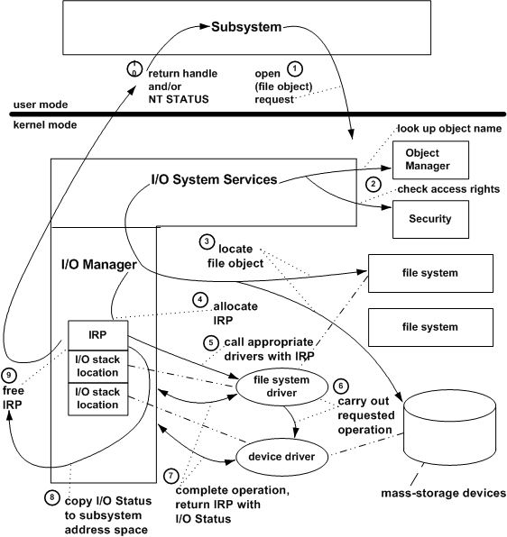

# Example I/O Request - An Overview

The following figure shows an overview of what happens when a subsystem opens a file object representing a data file on behalf of an application.

1.  The subsystem calls an I/O system service to open a named file.

2.  The I/O manager calls the object manager to look up the named file and to help it resolve any symbolic links for the file object. It also calls the security reference monitor to check that the subsystem has the correct access rights to open that file object.

3.  If the volume is not yet mounted, the I/O manager suspends the open request temporarily and calls one or more file systems until one of them recognizes the file object as something it has stored on one of the mass-storage devices the file system uses. When the file system has mounted the volume, the I/O manager resumes the request.

4.  The I/O manager allocates memory for and initializes an IRP for the open request. To drivers, an open is equivalent to a "create" request.

5.  The I/O manager calls the file system driver, passing it the IRP. The file system driver accesses its I/O stack location in the IRP to determine what operation it must carry out, checks parameters, determines if the requested file is in cache, and, if not, sets up the next-lower driver's I/O stack location in the IRP.

6.  Both drivers process the IRP and complete the requested I/O operation, calling kernel-mode support routines supplied by the I/O manager and by other system components (not shown in the previous figure).

7.  The drivers return the IRP to the I/O manager with the I/O status block set in the IRP to indicate whether the requested operation succeeded or why it failed.

8.  The I/O manager gets the I/O status from the IRP, so it can return status information through the protected subsystem to the original caller.

9.  The I/O manager frees the completed IRP.

10. The I/O manager returns a handle for the file object to the subsystem if the open operation was successful. If there was an error, it returns appropriate status to the subsystem.

After a subsystem successfully opens a file object that represents a data file, a device, or a volume, the subsystem uses the returned handle to identify the file object in subsequent requests for device I/O operations (usually read, write, or device I/O control requests). To make such a request, the subsystem calls I/O system services. The I/O manager routes these requests as IRPs sent to appropriate drivers.

 

 

