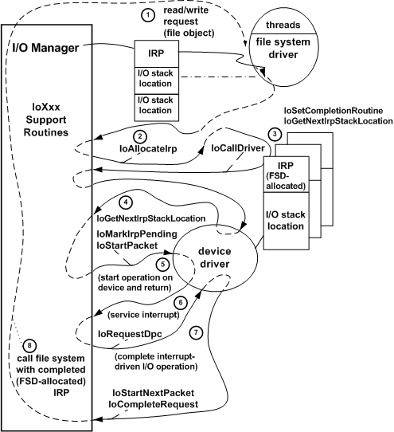

# Example I/O Request - The Details

## 

The figure illustrating opening a file object shows an IRP with two I/O stack locations, but an IRP can have any number of I/O stack locations, depending on how many layered drivers will handle a given request.

The following figure illustrates in more detail how the drivers in the [Opening a File Object](example-i-o-request---an-overview.md) figure use I/O support routines (**Io*Xxx*** routines) to process the IRP for a read or write request.

1. The I/O manager calls the file system driver (FSD) with the IRP it has allocated for the subsystem's read/write request. The FSD accesses its I/O stack location in the IRP to determine what operation it should carry out.

2. The FSD can break the original request into smaller requests (possibly for more than one device driver) by calling an I/O support routine ([**IoAllocateIrp**](https://msdn.microsoft.com/library/windows/hardware/ff548257)) one or more times to allocate additional IRPs. The additional IRPs are returned to the FSD with zero-filled I/O stack location(s) for lower-level driver(s). At its discretion, the FSD can reuse the original IRP, rather than allocating additional IRPs as shown in the previous figure, by setting up the next-lower driver's I/O stack location in the original IRP and passing it on to lower drivers.

3. For each driver-allocated IRP, the FSD in the previous figure calls an I/O support routine to register an FSD-supplied completion routine; in the completion routine, the FSD can determine whether lower drivers satisfied the request and can free each driver-allocated IRP when lower drivers have completed it. The I/O manager will call the FSD-supplied completion routine whether each driver-allocated IRP was completed successfully, completed with an error status, or canceled. A higher-level driver is responsible for freeing any IRPs it allocates and sets up on its own behalf for lower-level drivers. The I/O manager frees the IRPs that it allocates after all drivers have completed them.

   Next, the FSD calls an I/O support routine ([**IoGetNextIrpStackLocation**](https://msdn.microsoft.com/library/windows/hardware/ff549266)) to access the next-lower-level driver's I/O stack location in order to set up the request for the next-lower driver. (In the previous figure, the next lower driver happens to be the lowest-level driver.) The FSD then calls an I/O support routine ([**IoCallDriver**](https://msdn.microsoft.com/library/windows/hardware/ff548336)) to pass that IRP on to the next-lower driver.

4. When it is called with the IRP, the lowest-level driver checks its I/O stack location to determine what operation (indicated by the **IRP\_MJ\_*XXX*** function code) it should carry out on the target device. The target device is represented by the device object in its designated I/O stack location and is passed with the IRP to the driver. The lowest-level driver can assume that the I/O manager has routed the IRP to an entry point that the driver defined for the **IRP\_MJ\_*XXX*** operation (here [**IRP\_MJ\_READ**](https://msdn.microsoft.com/library/windows/hardware/ff550794) or [**IRP\_MJ\_WRITE**](https://msdn.microsoft.com/library/windows/hardware/ff550819)) and that the higher-level driver has checked the validity of other parameters for the request.

   If there were no higher-level driver, the lowest-level driver would check whether the input parameters for an **IRP\_MJ\_*XXX*** operation are valid. If they are, the driver usually calls I/O support routines to tell the I/O manager that a device operation is pending on the IRP and to either queue the IRP or pass it on to another driver-supplied routine that accesses the target device (here, a physical or logical device: the disk or a partition on the disk).

5. The I/O manager determines whether the driver is already busy processing another IRP for the target device, queues the IRP if it is, and returns. Otherwise, the I/O manager routes the IRP to a driver-supplied routine that starts the I/O operation on its device. (At this stage, both drivers in the previous figure and the I/O manager return control.)

6. When the device interrupts, the driver's interrupt service routine (ISR) does only as much work as it must to stop the device from interrupting and to save necessary context about the operation. The ISR then calls an I/O support routine ([**IoRequestDpc**](https://msdn.microsoft.com/library/windows/hardware/ff549657)) with the IRP to queue a driver-supplied DPC (Deferred Procedure Call) routine to complete the requested operation at a lower hardware priority than the ISR.

7. When the driver's DPC gets control, it uses the context (passed in the ISR's call to [**IoRequestDpc**](https://msdn.microsoft.com/library/windows/hardware/ff549657)) to complete the I/O operation. The DPC calls a support routine to dequeue the next IRP (if any) and to pass that IRP on to the driver-supplied routine that starts I/O operations on the device (see Step 5). The DPC then sets status about the just-completed operation in the IRP's I/O status block and returns it to the I/O manager with [**IoCompleteRequest**](https://msdn.microsoft.com/library/windows/hardware/ff548343).

8. The I/O manager zeros the lowest-level driver's I/O stack location in the IRP and calls the file system's registered completion routine (see Step 3) with the FSD-allocated IRP. This completion routine checks the I/O status block to determine whether to retry the request or to update any internal state maintained about the original request and to free its driver-allocated IRP. The file system can collect status information for all driver-allocated IRPs it sends to lower-level drivers so that it can set I/O status and complete the original IRP. When the file system has completed the original IRP, the I/O manager returns and NTSTATUS value to the original requester (the subsystem's native function) of the I/O operation.

Like the file system driver shown in the [Processing IRPs in Layered Drivers](#ddk-example-i-o-request---the-details-kg) figure, any new driver that is added to a chain of existing drivers can do all of the following:

-   Set its own completion routine into an IRP. The [*IoCompletion*](https://msdn.microsoft.com/library/windows/hardware/ff548354) routine checks the I/O status block to determine whether lower drivers completed the IRP successfully, canceled the IRP, and/or completed it with an error. The completion routine can also update any IRP-specific state the driver might have saved, release any operation-specific resources the driver might have allocated, and so forth, before completing the IRP. In addition, the completion routine can postpone IRP completion (by informing the I/O manager that more processing is required on the IRP), and can send another request to the next-lower-level driver before allowing the IRP to complete.

-   Set up the next-lower-level driver's I/O stack location in the IRPs it allocates and send requests to the next-lower-level driver.

-   Pass any incoming requests on to lower drivers by setting up the next-lower driver's I/O stack location in each IRP and calling [**IoCallDriver**](https://msdn.microsoft.com/library/windows/hardware/ff548336). (Note that for IRPs with major function code [**IRP\_MJ\_POWER**](https://msdn.microsoft.com/library/windows/hardware/ff550784), drivers must use [**PoCallDriver**](https://msdn.microsoft.com/library/windows/hardware/ff559654).)

Each driver-created device object represents a physical, logical, or virtual device for which a particular driver carries out I/O requests. For detailed information about creating and setting up a device object, see [Device Objects and Device Stacks](device-objects-and-device-stacks.md).

As the [Processing IRPs in Layered Drivers](#ddk-example-i-o-request---the-details-kg) figure also shows, most drivers process each IRP in stages through a driver-supplied set of system-defined *standard routines*, but drivers at different levels in a chain necessarily have different standard routines. For example, only lowest-level drivers handle interrupts from a physical device, so only a lowest-level driver would have an ISR and a DPC that completes interrupt-driven I/O operations. On the other hand, because such a driver knows that I/O is complete when it receives an interrupt from its device, it has no need for a completion routine. Only a higher-level driver would have one or more completion routines like the FSD in this figure.

 

 

