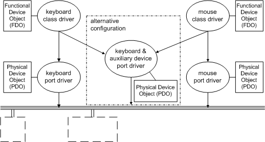

# Example WDM Device Objects

## 

The following figure illustrates the device objects that represent the keyboard and mouse devices shown previously in the figure illustrating [Keyboard and Mouse Hardware Configurations](sample-device-and-driver-configuration.md#keyboard-and-mouse-hardware-configurations). The keyboard and mouse drivers shown in the figure illustrating [Keyboard and Mouse Driver Layers](sample-device-and-driver-configuration.md#keyboard-and-mouse-driver-layers) create these device objects by calling an I/O support routine ([**IoCreateDevice**](https://msdn.microsoft.com/library/windows/hardware/ff548397)).

For the keyboard and mouse devices, both their respective port and class drivers create device objects. The port driver creates a physical device object (PDO) to represent the physical port. Each class driver creates its own functional device object (FDO) to represent the keyboard or mouse device as a target for I/O requests.

Each class driver calls an I/O support routine to get a pointer to the next-lower-level driver's device object, so the class driver can chain itself above that driver, which is the port driver. Then the class driver can send I/O requests down to the port driver for the target PDO representing its physical device.

An optional filter driver added to the configuration would create a filter device object (filter DO). Like the class driver, an optional filter driver chains itself to the next-lower driver in the device stack and sends I/O requests for the target PDO down to the next-lower driver.

As shown previously in the [Keyboard and Mouse Driver Layers](sample-device-and-driver-configuration.md#keyboard-and-mouse-driver-layers) figure, each port driver is a bus (lowest-level) driver, so every port driver of a device that generates interrupts must set up interrupt object(s) and register an ISR.

A dual-device port driver, like the i8042 driver for the keyboard and auxiliary device controller shown in the [Keyboard and Mouse Hardware Configurations](sample-device-and-driver-configuration.md#keyboard-and-mouse-hardware-configurations) figure, must set up device-specific [*interrupt objects*](https://msdn.microsoft.com/library/windows/hardware/ff556290#wdkgloss-interrupt-object) if each device uses a different interrupt vector. When writing such a driver, you can either implement separate ISRs for each device or implement a single ISR for both devices.

 

 

--------------------
[Send comments about this topic to Microsoft](mailto:wsddocfb@microsoft.com?subject=Documentation%20feedback%20%5Bkernel\kernel%5D:%20Example%20WDM%20Device%20Objects%20%20RELEASE:%20%286/14/2017%29&body=%0A%0APRIVACY%20STATEMENT%0A%0AWe%20use%20your%20feedback%20to%20improve%20the%20documentation.%20We%20don't%20use%20your%20email%20address%20for%20any%20other%20purpose,%20and%20we'll%20remove%20your%20email%20address%20from%20our%20system%20after%20the%20issue%20that%20you're%20reporting%20is%20fixed.%20While%20we're%20working%20to%20fix%20this%20issue,%20we%20might%20send%20you%20an%20email%20message%20to%20ask%20for%20more%20info.%20Later,%20we%20might%20also%20send%20you%20an%20email%20message%20to%20let%20you%20know%20that%20we've%20addressed%20your%20feedback.%0A%0AFor%20more%20info%20about%20Microsoft's%20privacy%20policy,%20see%20http://privacy.microsoft.com/default.aspx. "Send comments about this topic to Microsoft")

